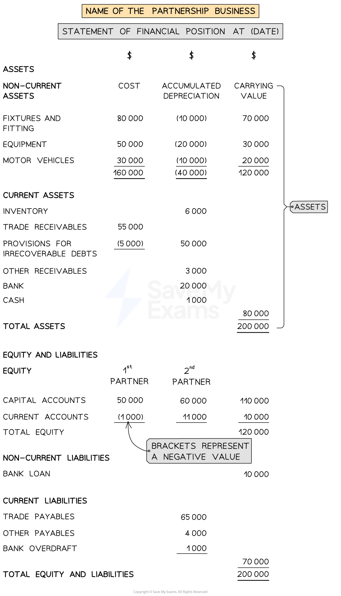

# Statement of Financial Position

## Statement of Financial Position for Partnerships

> **Spec point** — `spcpt_4HQKDs8RmbXshqGx`

## Statement of financial position for partnerships

### What is the layout of the statement of financial position of a partnership?

- The statement of financial position of a partnership is the **same **as that of a sole trader **with the exception** of the equity section

  - It first states the **total assets**
  
    - Non-current assets
    - Current assets
  - And then the **total equity and liabilities**
  
    - Equity
    - Non-current liabilities
    - Current liabilities
- The **equity section** of the statement of financial position shows the **balances **of each partner from their **capital accounts and current accounts** separately
- If the current account has a **debit **balance then:

  - Put brackets around the balance on the statement of financial position
  - Treat the number like a **negative **number

*Layout of a statement of financial position for a partnership*

> **Worked Example**
> Below is the capital and current account of Adi and Bilal at 31 December 2023. Prepare an extract of the statement of financial position at 31 December 2023 showing the equity section.
> 
> | **Adi and Bilal**  **Capital Accounts** |   |   |   |   |   |   |   |
> |---|---|---|---|---|---|---|---|
> |   |   | Adi | Bilal |   |   | Adi | Bilal |
> | Date | Details | \$ | \$ | Date | Details | \$ | \$ |
> |   |   |   |   | 2023  Jan 1 | Bal b/d | 20 000 | 12 000 |
> 
> | **Adi and Bilal**  **Current Accounts** |   |   |   |   |   |   |   |
> |---|---|---|---|---|---|---|---|
> |   |   | Adi | Bilal |   |   | Adi | Bilal |
> | Date | Details | \$ | \$ | Date | Details | \$ | \$ |
> | 2023 Dec 31 | Drawings | 3 000 | 6 000 | 2023 Jan 1 | Balance b/d | 5 000 | 1 000 |
> | Dec 31 | Interest on drawings | 300 | 600 | Dec 31 | Interest on capital | 1 000 | 600 |
> |   |   |   |   | Dec 31 | Salaries | 2 000 |   |
> |   |   |   |   | Dec 31 | Share of profit | 6 000 | 4 000 |
> 
> Answer
> 
> > *Balance the current accounts.*
> 
> | **Adi and Bilal**  **Current Accounts** |   |   |   |   |   |   |   |
> |---|---|---|---|---|---|---|---|
> |   |   | Adi | Bilal |   |   | Adi | Bilal |
> |   |   | \$ | \$ |   |   | \$ | \$ |
> | 2023 Dec 31 | Drawings | 3 000 | 6 000 | 2023 Jan 1 | Balance b/d | 5 000 | 1 000 |
> | Dec 31 | Interest on drawings | 300 | 600 | Dec 31 | Interest on capital | 1 000 | 600 |
> | *Dec 31* | *Balance c/d* | *10 700* |   | Dec 31 | Salaries | 2 000 |   |
> |   |   |   |   | Dec 31 | Share of profit | 6 000 | 4 000 |
> |   |   | <u>       </u> | <u>       </u> | *Dec 31* | *Balance c/d* | *<u>       </u>* | *<u>1 000</u>* |
> |   |   | *<u>14 000</u>* | *<u>6 600</u>* |   |   | *<u>14 000</u>* | *<u>6 600</u>* |
> | *2024*  *Jan 1* | * *  *Balance b/d* |   | * *  *1 000* | *2024*  *Jan 1* | * *  *Balance b/d* | * *  *10 700* |   |
> 
> > *Enter the balances into the statement of financial position. Notice that Bilal has a debit balance in his current account, therefore this will be a negative value.*
> 
> | **Final answer:** **Adi and Bilal**  **Final answer:** **Statement of Financial Position (extract) at 31 December 2023** |   |   |   |
> |---|---|---|---|
> |   | **Final answer:** **\$** | **Final answer:** **\$** | **Final answer:** **\$** |
> | **Final answer:** **Equity** | **Final answer:** **Adi** | **Final answer:** **Bilal** |   |
> | **Final answer:** **Capital accounts** | **Final answer:** **20 000** | **Final answer:** **12 000 ** | **Final answer:** **32 000** |
> | **Final answer:** **Current accounts** | **Final answer:** **10 700** | **Final answer:** **(1 000)** | **Final answer:** **9 700** |
> | **Final answer:** **Total equity** |   |   | **Final answer:** **41 700** |
