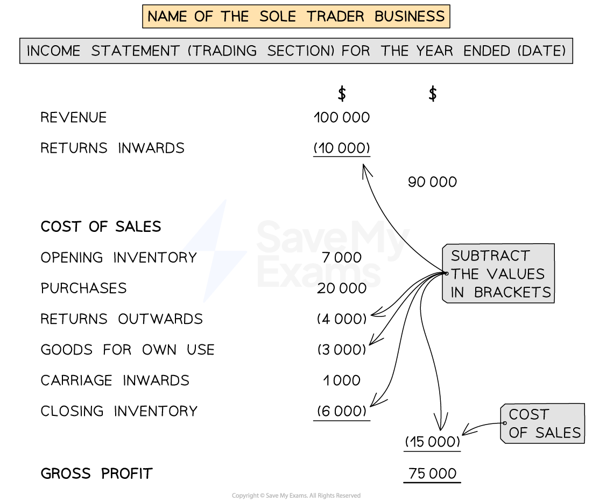
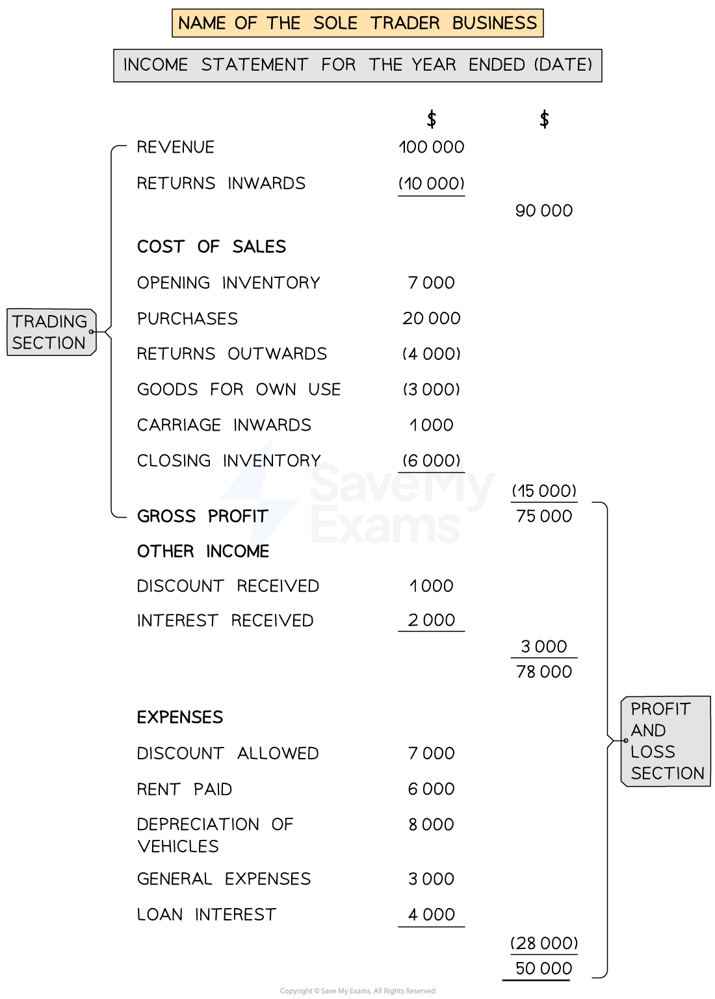
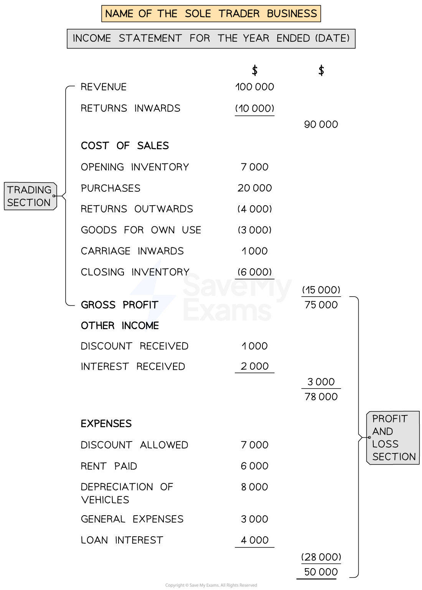

# Income Statement

## Income Statement for Sole Traders

> **Spec point** — `spcpt_TvyfYwBdrjBRvq25`

## Income statement for sole traders

### What is the purpose of an income statement for a sole trader?

- It is a statement prepared for a trading period to show the **gross profit** and the **profit for the year**

  - A financial year** does not necessarily follow the calendar year **from January to December
  
    - For example, if a business commences trading on 1 July 2023 then the first financial year would run from 1 July 2023 to 30 June 2024
- The income statement consists of two parts

  - The **trading section** shows the calculation of the **gross profit**
  - The **profit and loss section** shows the calculation of the **profit for the year**
- The income statement is part of the **double entry system of bookkeeping**

  - **Debit **entries to the income statement **decrease **profit
  
    - These are usually the **expenses**
  - **Credit **entries to the income statement **increase **profit
  
    - These are usually the **sources of income**
- An income statement can sometimes be **created like an account** with a debit side and a credit side

  - This is called the **horizontal format**
  - The **balancing figure** will be the **profit or loss**
  
    - **Profit **if it is on the **debit **side
    - **Loss **if it is on the **credit **side
- However, most businesses produce income statements as a **statement **using the **vertical format**

### How do I complete the trading section of an income statement?

- **STEP 1**
Calculate the **total revenue** and put the value in the right column

  - Revenue
  - Less *returns inwards*
  
    - Put brackets around this value as it is being subtracted
- **STEP 2**
Calculate the **cost of sales** and put the value in the right column

  - Opening inventory
  - Add net purchases
  
    - Purchases
    - Less *returns outwards*
    - Less goods for own use
    - Add *carriage inwards*
  - Less closing inventory
- **STEP 3**
Calculate the **gross profit** and put the value in the right column

  - Revenue
  - Less cost of sales

*The layout of the trading section of an income statement*

> **Exam Hint**
> In general, the right column is used for the subtotals. The left column is used to list the values that are being added or subtracted to calculate the subtotal for a section.

### How do I complete the profit and loss section of an income statement?

- **STEP 1**
Start with the **gross profit** in the right column
- **STEP 2**
Total up any **other incomes** which increase the profit for the year such as

  - Discount received
  - Other income received
  - Recovery of irrecoverable debts
  - Profit on sale of non-current asset
- **STEP 3**
Total up any **other expenses** which decrease the profit for the year such as

  - Discount allowed
  - *Carriage outwards*
  - Irrecoverable debts written off
  - Depreciation of non-current assets
  - Loss on sale of non-current assets
  - *Sundry expenses*
  - Other expenses
- **STEP 4**
Calculate the **profit or loss for the year**

  - Gross profit
  - Add other income
  - Less expenses
- If the **final value** is a **negative**

  - Put brackets around the value
  - This means it is a loss not a profit
  
    - E.g. (500) represents a loss of \$500

*The layout of the income statement*

> **Exam Hint**
> The items for the other income can be listed in the left columns. However, if you prefer you can put them in the right column and add them to the gross profit without stating the subtotal for other income. Whereas the subtotal for the expenses should be stated as this is a useful value for a business to see.

### How is the income statement of a trading business created?

- The income statement of a **trading business contains both the**

  - Trading section
  - Profit and loss section
- The **gross profit** links the two sections together

  - You do not need to state this value twice

*The layout of the income statement*

> **Exam Hint**
> The exam might give you the information in a trial balance along with additional information underneath. Identify items from the trial balance that would appear on the income statement.  You might find it helpful to annotate with *IS *to differentiate from those which would appear on the statement of financial position.

> **Worked Example**
> The following trial balance has been extracted by the book-keeper of Ali Baba, a wholesaler of school supplies, at 31 December 2023.
> 
> | ** ** | **Debit**  **\$** | **Credit**  **\$** |
> |---|---|---|
> | Trade receivables | 25 325 |   |
> | Trade payables |   | 20 684 |
> | Capital |   | 40 000 |
> | Bank |   | 2 083 |
> | Rent and rates | 11 862 |   |
> | Electricity | 3 054 |   |
> | Telephone | 2 695 |   |
> | Salaries | 56 891 |   |
> | Vehicles | 23 250 |   |
> | Office equipment | 8 500 |   |
> | Vehicle expenses | 13 855 |   |
> | Drawings | 16 275 |   |
> | Discount allowed | 478 |   |
> | Discount received |   | 591 |
> | Purchases | 139 960 |   |
> | Revenue (Sales) |   | 258 258 |
> | Inventory at 1 January 2023 | <u>19 471 </u> | <u>                     </u> |
> |   | <u>321 616 </u> | <u>321 616 </u> |
> 
> **Additional information: **
> 
> - Inventory at 31 December 2023 is valued at  \$15 075
> - The vehicles and office equipment were purchased during the year and Ali Baba does not charge depreciation in the year of purchase
> 
> Prepare an income statement for Ali Baba for the year ended 31 December 2023.
> 
> Answer
> 
> > *Identify which items appear on the income statement by labelling them as **IS**. Add an extra row for the closing inventory.*
> 
> | ** ** | **Debit**  **\$** | **Credit**  **\$** | **Income statement?** |
> |---|---|---|---|
> | Trade receivables | 25 325 |   |   |
> | Trade payables |   | 20 684 |   |
> | Capital |   | 40 000 |   |
> | Bank |   | 2 083 |   |
> | Rent and rates | 11 862 |   | *IS* |
> | Electricity | 3 054 |   | *IS* |
> | Telephone | 2 695 |   | *IS* |
> | Salaries | 56 891 |   | *IS* |
> | Vehicles | 23 250 |   |   |
> | Office equipment | 8 500 |   |   |
> | Vehicle expenses | 13 855 |   | *IS* |
> | Drawings | 16 275 |   |   |
> | Discount allowed | 478 |   | *IS* |
> | Discount received |   | 591 | *IS* |
> | Purchases | 139 960 |   | *IS* |
> | Revenue (Sales) |   | 258 258 | *IS* |
> | Inventory at 1 January 2023 | <u>19 471 </u> | <u>                     </u> | *IS* |
> |   | <u>321 616 </u> | <u>321 616 </u> |   |
> | *Inventory at 31 December 2023* |   | *15 075* | *IS* |
> 
> > *Complete the income statement using the formula to help:*
> 
> - *Complete the trading section to find the gross profit*
> 
>   - *Revenue (sales)*
>   - *Minus cost of sales*
>   
>     - *Opening inventory*
>     - *Plus purchases*
>     - *Minus closing inventory*
> - *Complete the profit and loss section to find the profit for the year*
> 
>   - *Gross profit*
>   - *Plus other income*
>   - *Minus expenses*
> 
> | **Final answer:** **Ali Baba **  **Final answer:** **Income Statement for the year ended 31 December 2023 ** |   |   |
> |---|---|---|
> |   | **Final answer:** **\$** | **Final answer:** **\$** |
> | **Final answer:** **Revenue ** | **Final answer:** ** ** | **Final answer:** **258 258 ** |
> | **Final answer:** **Cost of sales** | **Final answer:** ** ** | **Final answer:** ** ** |
> | **Final answer:** **Opening inventory ** | **Final answer:** **19 471 ** | **Final answer:** ** ** |
> | **Final answer:** **Purchases ** | **Final answer:** **139 960 ** | **Final answer:** ** ** |
> | **Final answer:** **Closing inventory ** | **Final answer:** **(15 075)** | **Final answer:** ** ** |
> |   |   | **Final answer:** **(144 356)****  ** |
> | **Final answer:** **Gross Profit ** | **Final answer:** ** ** | **Final answer:** **113 902 ** |
> | **Final answer:** **Other income ** | **Final answer:** ** ** | **Final answer:** ** ** |
> | **Final answer:** **Discount received ** | **Final answer:** ** ** | **Final answer:** **591 ** |
> | **Final answer:** ** ** | **Final answer:** ** ** | **Final answer:** **114 493 ** |
> | **Final answer:** **Expenses ** | **Final answer:** ** ** | **Final answer:** ** ** |
> | **Final answer:** **Discount allowed ** | **Final answer:** **478 ** | **Final answer:** ** ** |
> | **Final answer:** **Rent and rates ** | **Final answer:** **11 862 ** | **Final answer:** ** ** |
> | **Final answer:** **Electricity ** | **Final answer:** **3 054 ** | **Final answer:** ** ** |
> | **Final answer:** **Telephone ** | **Final answer:** **2 695 ** | **Final answer:** ** ** |
> | **Final answer:** **Salaries ** | **Final answer:** **56 891 ** | **Final answer:** ** ** |
> | **Final answer:** **Vehicle expenses ** | **Final answer:** **13 855 ** |   |
> |   |   | **(88 835**) |
> | **Final answer:** **Profit for the year** | **Final answer:** ** ** | **Final answer:** **25 658**** ** |

## Income Statement for Service Businesses

> **Spec point** — `spcpt_yQnNfCWc3d9BrwrQ`

## Income statement for service businesses

### How is the income statement of a service business created?

- The income statement of a **service business does not have a trading section**

  - Because they do not buy or sell goods
  - Therefore there will **not be a gross profit**
- The income statement for a service business **only contains the profit and loss section**

  - Therefore the income statement will start with the income received

### How do I complete an income statement for a service business?

- **STEP 1**
Total up any **income **such as:

  - Commission
  - Rent
  - Other income received
- **STEP 2**
Total up any **expenses** such as:

  - Wages
  - General expenses
  - Operating expenses
- **STEP 3**
Calculate the **profit or loss for the year**

  - The total income minus the total expenses

> **Worked Example**
> Sherwin operates a taxi service and has provided the following information at the end of the financial year on 31 October 2023. Prepare the income statement for Sherwin’s Taxi Service for that period.
> 
> |   | \$ |
> |---|---|
> | General expenses | 9 250 |
> | Insurance | 3 200 |
> | Printing and stationery | 1 560 |
> | Income from taxi fares | 85 250 |
> | Motor expenses | 15 750 |
> | Loan interest | 1 200 |
> 
> Answer
> 
> 1. *Start with the income*
> 2. *Subtract the expenses*
> 3. *Calculate the profit for the year*
> 
> | **Final answer:** **Sherwin’s Taxi Service**  **Final answer:** **Income Statement for the year ended 31 October 2023** |   |   |
> |---|---|---|
> |   | **Final answer:** **\$** | **Final answer:** **\$** |
> | **Final answer:** **Income from taxi fares** |   | **Final answer:** **85 250** |
> | **Final answer:** **Expenses** |   |   |
> | **Final answer:** **General expenses** | **Final answer:** **9 250** |   |
> | **Final answer:** **Insurance** | **Final answer:** **3 200** |   |
> | **Final answer:** **Printing and stationery** | **Final answer:** **1 560** |   |
> | **Final answer:** **Motor expenses** | **Final answer:** **15 750** |   |
> | **Final answer:** **Loan interest** | **1**<u> </u>**200** |   |
> |   |   | **Final answer:** **(30 960)** |
> | **Final answer:** **Profit for the year** |   | **Final answer:** **54 290** |
