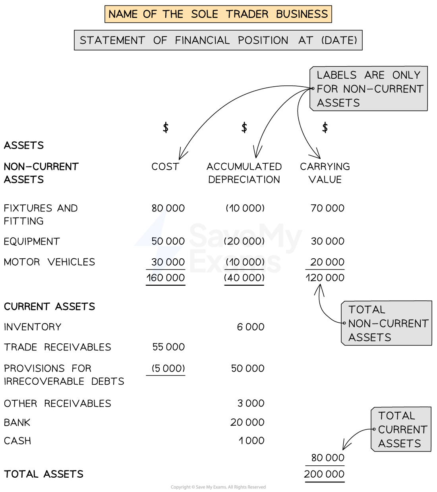
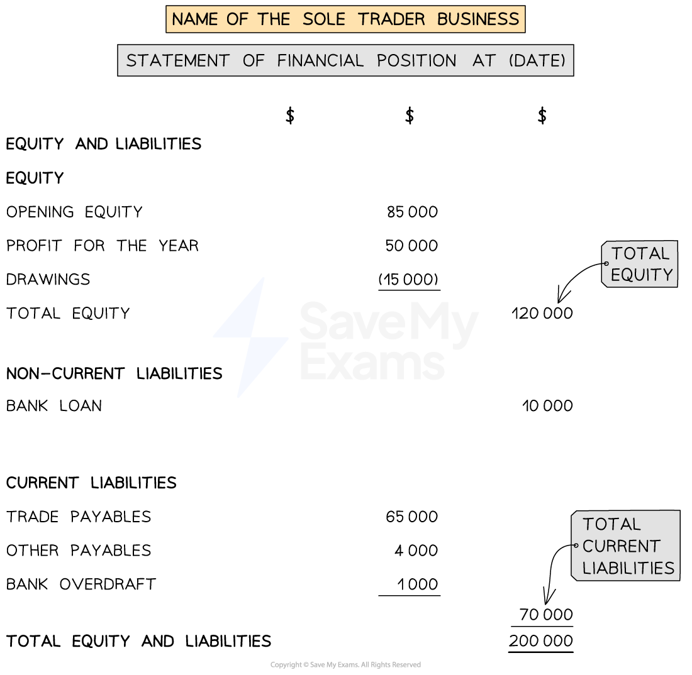

# Statement of Financial Position

## Statement of Financial Position for Sole Traders

> **Spec point** — `spcpt_ywTCzRPPpWBHX4JQ`

## Statement of financial position for sole traders

### What is the statement of financial position?

- The **statement of financial position** is one of the financial statements of a sole trader business
- It shows the position of the business in terms of its ***assets***, ***liabilities*** and ***equity ***at a **particular date  **

  - It provides a **snapshot** of the business on a particular date
- The statement of financial position is split into **two halves**

  - The **assets **are listed in the first half
  - The **equity **and **liabilities **are listed in the second half
  - The **totals **for each half will be **equal**
- The statement of financial position is prepared in **exactly the same way** for a trading and a service business
- The **figures **used to prepare the statement of financial position will be taken from the **trial balance** or **list of balances**

  - Additional information will be given after the trial balance
  - This is where the valuation of the closing inventory is given
- The statement of the financial position is prepared after the** income statement**

  - The profit or loss for the year will increase or decrease the equity
- The statement of financial position is **not part of the double entry system**

  - The balances of the accounts are stated on the statement
  - They are not transferred to the statement

*Layout of the assets section of the statement of financial position*

### What is the layout for the assets section?

- The ***non-current assets*** are listed **first**

  - **Three values** are stated for each non-current asset in separate columns in the following order:
  
    - **Cost**
    - **Accumulated depreciation**
    - **Carrying value**
  - The **total **for each column is calculated
  
    - The total for the carrying value column is the total value for the non-current assets
- The ***current assets*** are listed after the non-current assets

  - The values for the current assets are listed in the middle column
  
    - If there is a **provision for irrecoverable debts** then the far left column is used to **subtract **its balance **from the trade receivables**
    - The total is put in the far right column
- The **total assets value** is found by adding the total non-current assets and the total current assets
- It is conventional to list the assets within each section in **order of their *****liquidity***

  - Starting with the least liquid assets

*Layout of the assets section of the statement of financial position*

> **Exam Hint**
> For the inventory value, make sure you use the value of the closing inventory.

### How do I complete the equity and liabilities section?

- **Firstly**, calculate the **equity **in the far right column

  - Start with the opening equity from the beginning of the financial year
  - Add any additional equity introduced during the year
  - Add (or subtract) the profit (or loss) for the year
  - Subtract any drawings
  - This gives the total equity at that date
- **Secondly**, list the ***non-current liabilities***

  - If there is just one item then put it in the far right column
  - Otherwise, list them in the middle column and put the total in the far right column
- **Thirdly**, list the ***current liabilities***

  - List them in the middle column and put the total in the far right column
- **Finally**, calculate the **total equity and liabilities** by adding together:

  - The equity
  - The total non-current liabilities
  - The total current liabilities

*Layout of the equity and liabilities section of the statement of financial position*

> **Exam Hint**
> If you are given the information in a trial balance, identify the items that would appear on the statement of financial position.  You might find it helpful to annotate with *SoFP *to differentiate from those which would appear on the income statement.

> **Worked Example**
> The following trial balance has been extracted by the book-keeper of Bilal Aba at 31 December 2023.
> 
> | ** ** | **Debit**  **\$** | **Credit**  **\$** |
> |---|---|---|
> | Trade receivables | 73 217 |   |
> | Trade payables |   | 19 745 |
> | Equity at 1 January 2023 |   | 58 466 |
> | Bank |   | 550 |
> | Cash | 400 |   |
> | Bank loan |   | 10 000 |
> | Loan interest | 500 |   |
> | Rent and rates | 4 862 |   |
> | Salaries | 33 872 |   |
> | Machinery | 8 000 |   |
> | Drawings | 12 715 |   |
> | Purchases | 141 195 |   |
> | Revenue (Sales) |   | 205 471 |
> | Inventory at 1 January 2023 | <u>19 471 </u> | <u>                     </u> |
> |   | <u>294 232</u> | <u>294 232 </u> |
> 
> **Additional information: **
> 
> - Inventory at 31 December 2023 is valued at  \$4 060
> - The machinery was purchased during the year and the depreciation charge is \$600
> - The profit for the year, after including depreciation, is \$9 031
> 
> Prepare a statement of financial position for Bilal Aba at 31 December 2023.
> 
> Answer
> 
> > *Identify which items appear on the statement of financial position by labelling them as **SoFP**. Add extra rows for the closing inventory, provision for depreciation, and profit for the year.*
> 
> | ** ** | **Debit**  **\$** | **Credit**  **\$** | **Statement of financial position?** |
> |---|---|---|---|
> | Trade receivables | 73 217 |   | *SoFP* |
> | Trade payables |   | 19 745 | *SoFP* |
> | Equity at 1 January 2023 |   | 58 466 | *SoFP* |
> | Bank |   | 550 | *SoFP* |
> | Cash | 400 |   | *SoFP* |
> | 5 year loan |   | 10 000 | *SoFP* |
> | Loan interest | 500 |   |   |
> | Rent and rates | 4 862 |   |   |
> | Salaries | 33 872 |   |   |
> | Machinery | 8 000 |   | *SoFP* |
> | Drawings | 12 715 |   | *SoFP* |
> | Purchases | 141 195 |   |   |
> | Revenue (Sales) |   | 205 471 |   |
> | Inventory at 1 January 2023 | <u>19 471 </u> | <u>                     </u> |   |
> |   | <u>294 232</u> | <u>294 232 </u> |   |
> | *Inventory at 31 December 2023* |   | *4 060* | *SoFP* |
> | *Provision for depreciation of machinery* |   | *600* | *SoFP* |
> | *Profit for the year* |   | *9 031* | *SoFP* |
> 
> > *Complete the statement of financial position.*
> 
> - *Assets*
> 
>   - *Non-current assets*
>   - *Current assets*
> - *Equity and liabilities*
> 
>   - *Equity*
>   - *Non-current liabilities*
>   - *Current liabilities*
> 
> > *Note that the bank has a credit balance so this means it is overdrawn.*
> 
> | **Final answer:** **Bilal Aba**  **Final answer:** **Statement of Financial Position at 31 December 2023 ** |   |   |   |
> |---|---|---|---|
> |   | **Final answer:** **\$** | **Final answer:** **\$** | **Final answer:** **\$** |
> | **Final answer:** **Assets** |   |   |   |
> | **Final answer:** **Non-current assets** | **Final answer:** **Cost** | **Final answer:** **Accumulated depreciation** | **Final answer:** **Carrying value** |
> | **Final answer:** **Machinery** | **Final answer:** **8 000** | **Final answer:** **600** | **Final answer:** **7 400** |
> | **Final answer:** **Current assets** |   |   |   |
> | **Final answer:** **Inventory** |   | **Final answer:** **4 060** |   |
> | **Final answer:** **Trade receivables** |   | **Final answer:** **73 217** |   |
> | **Final answer:** **Cash** |   | **Final answer:** **400** |   |
> |   |   |   | **Final answer:** **77 677** |
> | **Final answer:** **Total assets** |   |   | **Final answer:** **85 077** |
> |   |   |   |   |
> | **Final answer:** **Equity and liabilities** |   |   |   |
> | **Final answer:** **Equity** |   |   |   |
> | **Final answer:** **Opening equity** |   | **Final answer:** **58 466 ** |   |
> | **Final answer:** **Profit for the year** |   | **Final answer:** **9 031** |   |
> | **Final answer:** **Drawings** |   | **Final answer:** **(12 715)** |   |
> | **Final answer:** **Total equity** |   |   | **Final answer:** **54 782** |
> | **Final answer:** **Non-current liabilities** |   |   |   |
> | **Final answer:** **Loan** |   |   | **Final answer:** **10 000** |
> | **Final answer:** **Current liabilities** |   |   |   |
> | **Final answer:** **Trade payables** |   | **Final answer:** **19 745** |   |
> | **Final answer:** **Bank overdraft** |   | **Final answer:** **550** |   |
> |   |   |   | **Final answer:** **20 295** |
> | **Final answer:** **Total equity and liabilities** |   |   | **Final answer:** **85 077** |
