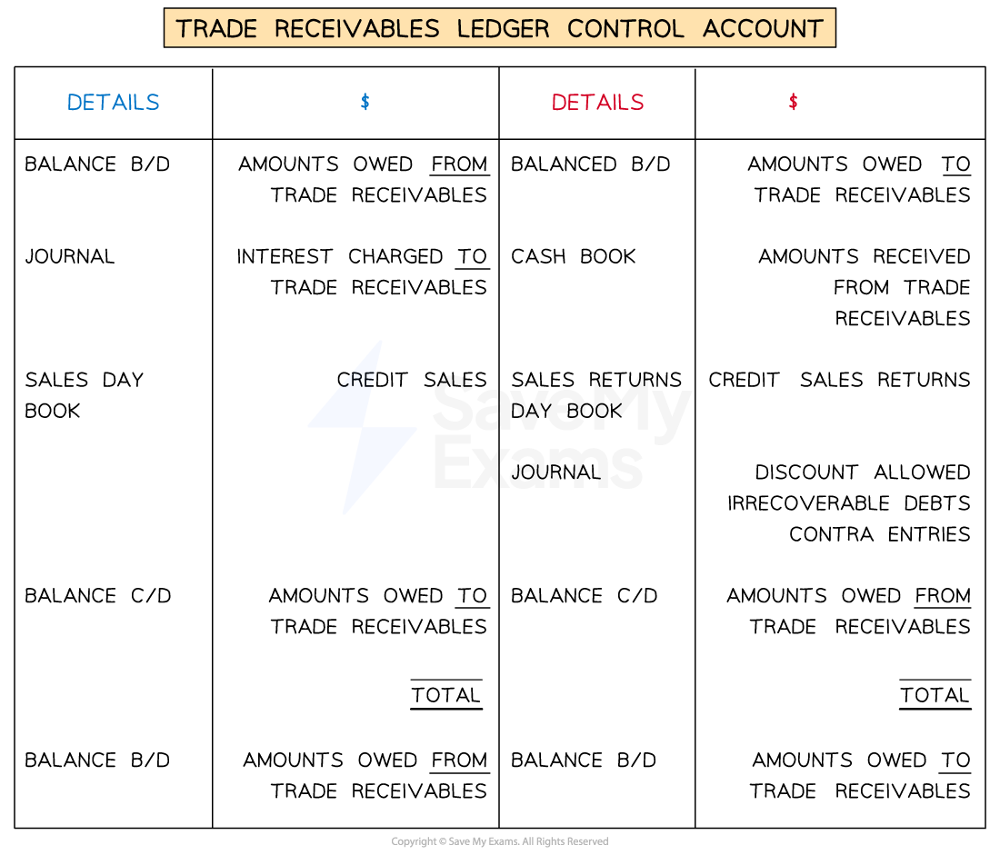
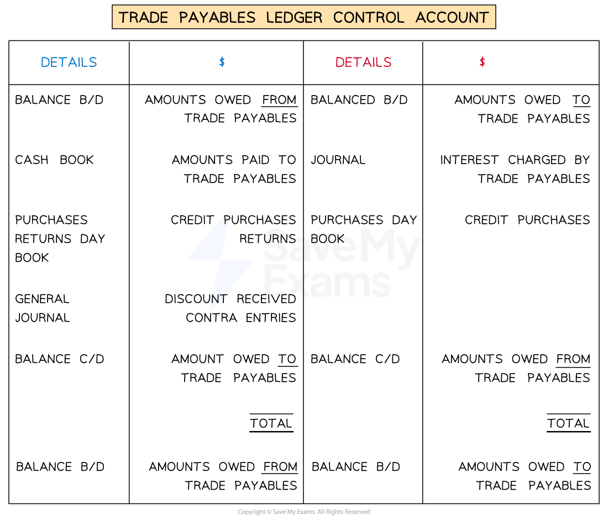
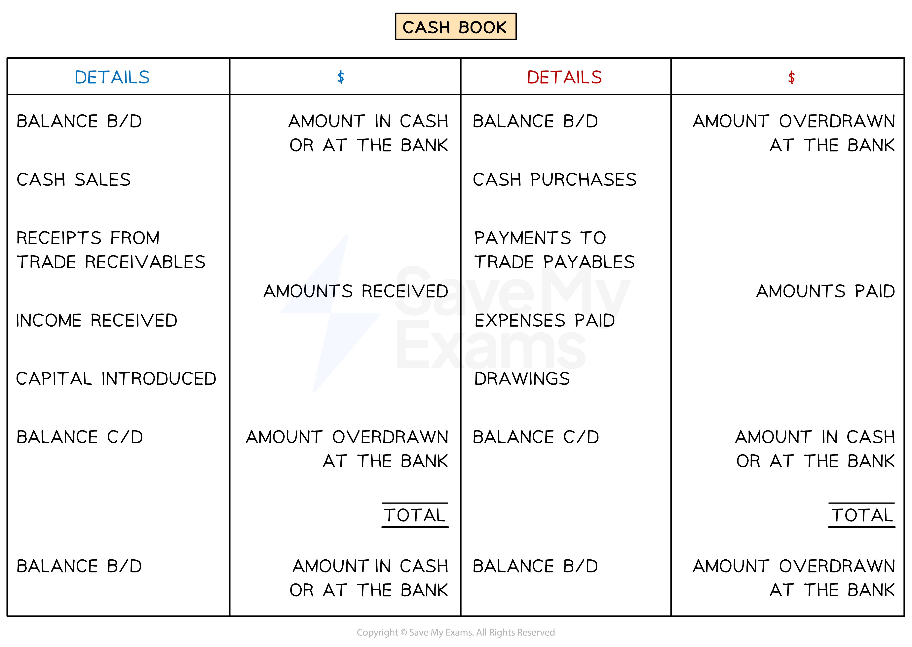

# Calculating Values using Control Accounts

## Calculating Values using Control Accounts

> **Spec point** — `spcpt_qPf9kGZPB83sXXSY`

## Calculating values using control accounts

### How can I use a ledger account to find a missing value?

- If you are **missing just one value** from an account then you can find it
- **STEP 1**
Draw up the ledger account
- **STEP 2**
Fill in the **known values**
- **STEP 3**
Find the **balancing figure** for the account

  - This is the missing value

### What information can I find using a trade receivables ledger control account?

- You can use a **trade receivables ledger control account** to find the following information:

  - The **trade receivables **balance at the **start **of the financial year
  - The **trade receivables **balance at the **end **of the financial year
  - **Credit sales**
  - **Credit sales returns**
  - **Receipts **from trade receivables during the year
  - **Discount allowed** to trade receivables
  - **Irrecoverable debts** written off

*Layout of a trade receivables ledger control account*

> **Exam Hint**
> Exam questions commonly ask you to find the value of the credit sales.
> 
> Credit sales 
> = closing trade receivables 
> - opening trade receivables
> + payments from credit customers
> + cash discounts allowed
> + credit sales returns
> + irrecoverable debts written off
> + contra entries
> - interested charged to credit customers

### What information can I find using a trade payables ledger control account?

- You can use a **trade payables ledger control account** to find the following information:

  - The **trade payables **balance at the **start **of the financial year
  - The **trade payables **balance at the **end **of the financial year
  - **Credit purchases**
  - **Credit purchases returns**
  - **Payments **to trade payables during the year
  - **Discount received **from trade payables

*Layout of a trade payables ledger control account*

> **Exam Hint**
> Exam questions commonly ask you to find the value of the credit purchases.
> 
> Credit purchases
> = closing trade payables
> - opening trade payables
> + payments to credit suppliers
> + cash discounts received
> + credit purchases returns
> + contra entries
> - interested charged by credit suppliers

### What information can I find using a cash book?

- You can use a **cash book** to find the following information:

  - Amounts **paid **by the business
  
    - Cash purchases
    - Expenses
    - Payments to trade payables
    - Drawings
  - Amounts **received **by the business
  
    - Cash sales
    - Income
    - Receipts from trade receivables
    - Capital introduced

*Layout of a cash book*

> **Exam Hint**
> Remember sales and purchases can be made on a credit or cash basis.
> 
> Total sales = Credit sales + Cash sales
> 
> Total purchases = Credit purchases + Cash purchases

> **Worked Example**
> Mini is a sole trader who does not keep full accounting records. Mini provided the following information.
> 
> |   | **1 January 2023**  **\$** | **31 December 2023**  **\$** |
> |---|---|---|
> | Shop fittings | 9 000 | 9 000 |
> | Inventory | 35 600 | 39 800 |
> | Trade receivables | 19 200 | 18 400 |
> | Bank | 6 000 | 9 600 |
> | Trade payables | 20 800 | 16 000 |
> | Expenses owing | 300 | 420 |
> 
> Receipts and payment summary for the year ended 31 December 2023:
> 
> |   | \$ |
> |---|---|
> | Receipts from trade receivables | 117 500 |
> | Payments to trade payables | 72 600 |
> | Drawings | 33 500 |
> | General expenses | 30 600 |
> | Purchase of shop fittings | 3 000 |
> | Cash sales | 38 000 |
> | Cash purchases | 12 200 |
> 
> No cash discount was allowed or received during the year.
> 
> Prepare the trading section of the income statement for Mini for the year ended 31 December 2023.
> 
> Answer
> 
> > *Find the credit sales by using a trade receivables ledger control account. The credit sales will be the balancing figure.*
> 
> | ***Date*** | ***Details*** | ***\$*** | ***Date*** | ***Details*** | ***\$*** |
> |---|---|---|---|---|---|
> | *2023*  *Jan 1* | * *  *Balance b/d* | * *  *19 200* | *2023*  *Dec 31* | * *  *Bank (receipts)* | * *  *117 500* |
> | *Dec 31* | *Sales* | *<u>116 700</u>* | *Dec 31* | *Balance c/d* | *<u>18 400</u>* |
> |   |   | *<u>135 900</u>* |   |   | *<u>135 900</u>* |
> | *2024*  *Jan 1* | * *  *Balance b/d* | * *  *18 400* |   |   |   |
> 
> > *Find the total sales by adding the credit sales to the cash sales.*
> 
> *Total sales = \$116 700 + \$38 000 = \$154 700*
> 
> > *Find the credit purchases by using a trade payables ledger control account. The credit purchases will be the balancing figure.*
> 
> | ***Date*** | ***Details*** | ***\$*** | ***Date*** | ***Details*** | ***\$*** |
> |---|---|---|---|---|---|
> | *2023*  *Dec 31* | * *  *Bank (payments)* | * *  *72 600* | *2023*  *Jan 1* | *Balance b/d* | * *  *20 800* |
> | *Dec 31* | *Balance c/d* | *<u>16 000</u>* | *Dec 31* | *Purchases* | *<u>67 800</u>* |
> |   |   | *<u>88 600</u>* |   |   | *<u>88 600</u>* |
> |   |   |   | *2024*  *Jan 1* | * *  *Balance b/d* | * *  *16 000* |
> 
> > *Find the total purchases by adding the credit purchases to the cash purchases.*
> 
> *Total purchases = \$67 800 + \$12 200 = \$80 000*
> 
> > *Prepare the trading section of the income statement using the usual format.*
> 
> | **Final answer:** **Mini **  **Final answer:** **Income Statement for the year ended 31 December 2023** |   |   |
> |---|---|---|
> |   | **Final answer:** **\$** | **Final answer:** **\$** |
> | **Final answer:** **Revenue** |   | **Final answer:** **154 700** |
> | **Final answer:** **Cost of sales** |   |   |
> | **Final answer:** **Opening inventory** | **Final answer:** **35 600** |   |
> | **Final answer:** **Purchases** | **Final answer:** **80 000** |   |
> | **Final answer:** **Closing inventory** | **Final answer:** **(39 800)** |   |
> |   |   | **Final answer:** **(75 800)** |
> | **Final answer:** **Gross profit** |   | **Final answer:** **78 900** |
