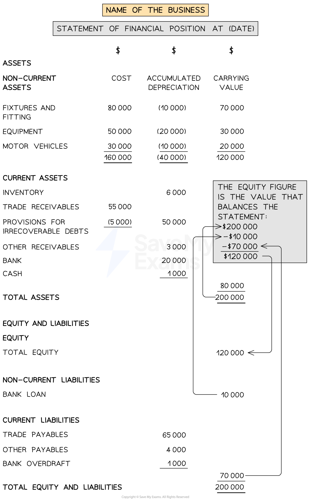
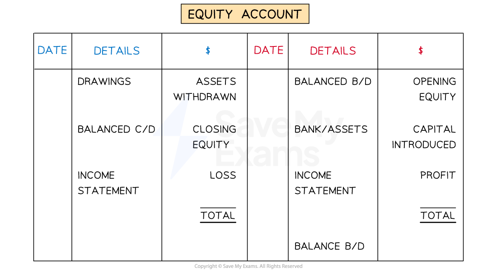

# Statement of Affairs

## Statement of Affairs

> **Spec point** — `spcpt_pxtv3ZCkSN4CzZqX`

## Statement of affairs

### What is a statement of affairs?

- A **statement of affairs** is **similar **to a **statement of financial position**

  - The difference is that the business has **not used a full set of accounting records**
  - Therefore the business** cannot complete an income statement** to find the profit or loss
- It is prepared to find the** missing equity **figure at the start or the end of the financial year
- It is prepared from the **assets **and **liabilities **of the business
- The **equity **can be found using a rearrangement of the **accounting equation**

  - Equity = Assets - Liabilities

### How do I prepare a statement of affairs?

- **STEP 1**
List all the **assets **and **calculate **the **total assets**

  - Non-current assets
  - Current assets
- **STEP 2**
Write down the **value **for the **total equity and liabilities**

  - It is the same as the total assets
  - Leave the **equity **value blank for now
- **STEP 3**
List all the **liabilities**

  - Non-current liabilities
  - Current liabilities
- **STEP 4**
Find the **missing equity **value

  - Subtract the total liabilities from the total assets

*Layout of a statement of affairs*

> **Worked Example**
> Murray operates a local retail store. Murray does not keep full accounting records. Murrary provided the following information about his assets and liabilities at 1 January 2023:
> 
> |   | \$ |
> |---|---|
> | Shop fittings (net book value) | 9 000 |
> | Inventory | 35 600 |
> | Trade receivables | 19 200 |
> | Bank | 6 000 |
> | Trade payables | 20  800 |
> | Expenses owing | 300 |
> 
> Prepare a statement of affairs to calculate Murray's equity at 1 January 2023.
> 
> Answer
> 
> - *Expenses owing is a liability*
> - *Complete the assets section*
> 
>   - *The total below is \$69 800*
> - *The total for the equity and liabilities section will be the same*
> - *Complete the liabilities section*
> 
>   - *Expenses owing is an accrued expense which is a liability*
>   - *The total below is \$21 100*
> - *Subtract the liabilities from the assets to find the missing equity value*
> 
>   - *\$69 800 - \$21 100 = \$48 700*
> 
> | **Final answer:** **Murray**  **Final answer:** **Statement of Affairs at 1 January 2023** |   |   |
> |---|---|---|
> |   | **Final answer:** **\$** | **Final answer:** **\$** |
> | **Final answer:** **Non-current assets** |   |   |
> | **Final answer:** **Shop fittings at book value** |   | **Final answer:** **9 000** |
> |   |   |   |
> | **Final answer:** **Current assets** |   |   |
> | **Final answer:** **Inventory** | **Final answer:** **35 600** |   |
> | **Final answer:** **Trade receivables** | **Final answer:** **19 200** |   |
> | **Final answer:** **Bank** | **Final answer:** **6 000** |   |
> |   |   | **Final answer:** **60 800** |
> | **Final answer:** **Total assets** |   | **Final answer:** **69 800** |
> |   |   |   |
> | **Final answer:** **Equity and liabilities** |   |   |
> | **Final answer:** **Equity** |   | **Final answer:** **48 700** |
> |   |   |   |
> | **Final answer:** **Current liabilities** |   |   |
> | **Final answer:** **Trade payables** | **Final answer:** **20  800 ** |   |
> |   | **Final answer:** **300 ** |   |
> |   |   | **Final answer:** **21 100** |
> | **Final answer:** **Total equity and liabilities** |   | **Final answer:** **69 800** |

### How can I use a statement of affairs to calculate the profit or loss for the year?

- You can use a statement of affairs to **calculate **the **opening or closing equity value**
- This can then be used to **calculate **the **profit or loss for the year**
- **Closing equity **is calculated using:

  - Closing equity = Opening equity + Capital introduced - Drawings + Profit (or - Loss)
- You can **rearrange **this to find the **profit or loss**:

  - Profit or loss = Closing equity - Opening equity + Drawings - Capital introduced
  - A positive value indicates a profit, a negative value indicates a loss
- Alternatively, you can draw up the **equity ledger account **and find the value that balances the account

  - If the balancing value is on the **debit **side then it represents a **loss**
  - If the balancing value is on the **credit **side then it represents a **profit**

*The layout of the equity account when finding the profit or loss*

> **Worked Example**
> On 1 January 2023, Murray's equity balance was \$48 700. During the year, Murray introduced \$10 000 capital to the business and took out \$5 000 drawings. The equity account had a balance of \$80 500 at 31 December 2023.
> 
> Calculate the profit or loss for the year ended 31 December 2023.
> 
> Answer
> 
> > *Use the formula.*
> 
> |   | *\$* |
> |---|---|
> | *Closing equity* | *80 500* |
> | *Less: Opening equity* | *(48 700)* |
> | *Add: Drawings* | *5 000* |
> | *Less: Capital introduced* | *<u>(10 000)</u>* |
> | *Profit for the year* | *<u>26 800</u>* |
> 
> > *Alternatively, draw up the equity account. It can be a rough sketch.*
> 
> | *Details* | *\$* | *Details* | *\$* |
> |---|---|---|---|
> | *Drawings* | *5 000* | *Balance b/d* | *48 700* |
> | *Balance c/d* | *80 500* | *Capital introduced* | *10 000* |
> |   | *<u>         </u>* | *Income statement (profit)* | *<u>26 800</u>* |
> |   | *<u>85 500</u>* |   | *<u>85 500</u>* |
> |   |   | *Balance b/d* | *80 500* |
> 
> **Final answer:** **The profit for the year was \$26 800.**
