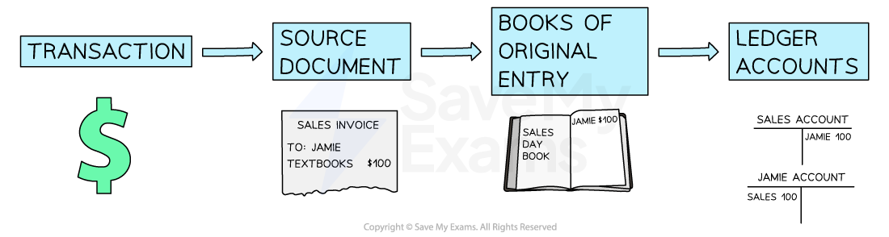

# The Day Books

## Purpose of Books of Original Entry

> **Spec point** — `spcpt_wTtjvcBJJyWs2BDC`

## Purpose of books of original entry

### What are books of original entry?

- **Books of original entry** are used to **record the details** of a **transaction**

  - Other terminology for these books includes
  
    - Subsidiary books
    - Books of prime entry
- Information is **taken from the business documents** and entered into the books of original entry
- The details are **then transferred** from the books of original entry **to the ledger accounts**
- The seven books of original entry are:

  - Sales day book
  - Purchases day book
  - Sales returns day book
  - Purchases returns day book
  - Cash book
  - Petty cash book
  - Journal

*The accounting process*

### What are the advantages of using books of original entry?

- **Books of original entry **are another stage which can be used to **check for errors**

  - They can help in the **preparation of control accounts** to check the accuracy of the ledger accounts
- Each book of original entry collects the **same type of transaction**

  - The books allow **managers** to see the** totals** for different types of transactions easily
  - Therefore, there are** fewer entries** in some of the ledger accounts
- Bigger businesses may have **multiple bookkeepers**

  - Different bookkeepers can be **responsible for different books** of original entry without any risk of work being duplicated or missed

## Sales Day Book

> **Spec point** — `spcpt_6qWNZJ4sgthd3p5Y`

## Sales day book

### What is the sales day book?

- The **sales day book **is a record of all **credit sales**

  - **Cash sales** are **not recorded** in the sales day book
  
    - They are recorded directly into the **cash book**
- It contains:

  - The dates of sales
  - The names of the credit customers
  - The amounts for each of the sales
  
    - The amounts should be **after trade discounts** have been applied to the list prices
- The bookkeeper uses the **sales invoices** to enter the information into the sales day book
- The **totals** are transferred to the **ledger accounts** at regular intervals

  - **Credit** the **sales account** with the total
  
    - Call this entry “Sales day book”
  - **Debit** the individual **trade receivables accounts**

> **Exam Hint**
> If a sales day book is used, only one entry is made to the sales account at the end of a given period rather than separate entries for each individual sale.
> 
> If a question does not mention a sales day book, enter the individual transactions into the sales account and label them with the names of the trade receivables.

## Sales Returns Day Book

> **Spec point** — `spcpt_7dkqsbPJqT3Yjhrm`

## Sales returns day book

### What is the sales returns day book?

- The **sales returns day book **is a record of all the **returns from credit customers**
- It contains:

  - The dates of the returns
  - The names of the credit customers
  - The amounts for each of the returns
- The bookkeeper uses the **credit notes** that were **issued** to enter the information into the sales returns day book
- The **totals** are transferred to the **ledger accounts** at regular intervals

  - **Debit** the **sales returns account** with the total
  
    - Call this entry “Sales returns day book”
  - **Credit** the individual **trade receivables accounts**

> **Exam Hint**
> If a sales returns day book is used, only one entry is made to the sales returns account at the end of a given period rather than separate entries for each individual return.

## Purchases Day Book

> **Spec point** — `spcpt_XBsYFjgjNYfh3PfX`

## Purchases day book

### What is the purchases day book?

- The **purchases day book **is a record of all **credit purchases**

  - **Cash purchases** are **not recorded **in the purchases day book
  
    - They are recorded directly into the **cash book**
  - **Purchases of** **non-current assets** are **not recorded** in the purchases day book
  
    - They are recorded in the **journal**
- It contains:

  - The dates of the purchases
  - The names of the credit suppliers
  - The amounts for each of the purchases
- The bookkeeper uses the **purchase invoices** to enter the information into the purchases day book
- The **totals** are transferred to the **ledger accounts** at regular intervals

  - **Debit** the **purchases account** with the total
  
    - Call this entry “Purchases day book”
  - **Credit** the individual **trade payables accounts**

> **Exam Hint**
> If a purchases day book is used, only one entry is made to the purchases account at the end of a given period rather than separate entries for each individual purchase.
> 
> If a question does not mention a purchases day book, enter the individual transactions into the purchases account and label them with the names of the trade payables.

## Purchases Returns Day Book

> **Spec point** — `spcpt_CrB8jX6rX6Z72rNW`

## Purchases returns day book

### What is the purchases returns day book?

- The **purchases returns day book **is a record of all the returns to credit suppliers
- It contains:

  - The dates of the returns
  - The names of the credit suppliers
  - The amounts for each of the returns
- The bookkeeper uses the **credit notes** that were **received** to enter the information into the purchases returns day book
- The **totals** are transferred to the **ledger accounts** at regular intervals

  - **Credit** the **purchases returns account **with the total
  
    - Call this entry “Purchases returns day book”
  - **Debit** the individual **trade payables accounts**

> **Exam Hint**
> If a purchases returns day book is used, only one entry is made to the purchases returns account at the end of a given period rather than separate entries for each individual return.

> **Worked Example**
> Jeff is a sole trader. In February 2024, the following transactions took place.
> 
> | Feb 1 | Bought goods on credit from Samson, \$500 |
> |---|---|
> | 3 | Bought goods on credit from Helina with a 10% trade discount, list price \$300 |
> | 6 | Returned goods to Samson, \$50 |
> | 7 | Paid \$250 to Samson by credit transfer |
> | 10 | Bought goods using cash from Jimmy, \$70 |
> | 15 | Bought goods on credit from Samson, \$400 |
> | 18 | Sold goods on credit to Jasper, \$180 |
> | 28 | Returned goods to Samson, \$100 |
> 
> Prepare the purchases day book and the purchases returns day book for February 2024. Total the day books on 29 February 2024, and indicate the ledger account to which the total would be posted.
> 
> Answer
> 
> | Feb 1 | > *Purchases day book: \$500 Samson* |
> |---|---|
> | 3 | *Find the discount given by Helina:* *10% x \$300 = \$30*  *Find the amount Jeff owes Helina: **\$300 - \$30 = \$270*  > *Purchases day book: \$270 Helina* |
> | 6 | > *Purchases returns day book: \$50 Samson* |
> | 7 | > *Neither day book: it is a payment, not a purchase or return* *This would go in the cash book* |
> | 10 | > *Neither day book: it is a cash purchase* *This would go in the cash book* |
> | 15 | > *Purchases day book: \$400 Samson* |
> | 18 | > *Neither day book: it is a credit sale* *This would go in the sales day book* |
> | 28 | > *Purchases returns day book: \$100 Samson* |
> 
> **Final answer:** **Purchases Day Book**
> 
> | **Final answer:** **Date** | **Final answer:** **Details** | **Final answer:** **\$** |
> |---|---|---|
> | **Final answer:** **Feb 1** | **Final answer:** **Samson** | **Final answer:** **500** |
> | **Final answer:** **Feb 3** | **Final answer:** **Helina** | **Final answer:** **270** |
> | **Final answer:** **Feb 15** | **Final answer:** **Samson** | **Final answer:** **400** |
> | **Final answer:** **Feb 29** | **Final answer:** **Transfer to purchases account** | **Final answer:** **1 170** |
> 
> **Final answer:** **Purchases Returns Day Book**
> 
> | **Final answer:** **Date** | **Final answer:** **Details** | **Final answer:** **\$** |
> |---|---|---|
> | **Final answer:** **Feb 6** | **Final answer:** **Samson** | **Final answer:** **50** |
> | **Final answer:** **Feb 28** | **Final answer:** **Samson** | **Final answer:** **100** |
> | **Final answer:** **Feb 29** | **Final answer:** **Transfer to purchases returns account** | **Final answer:** **150** |
