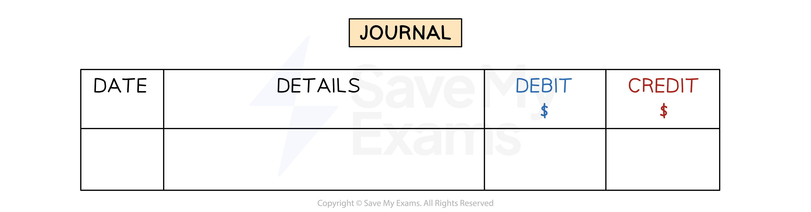

# The Journal

## The Journal

> **Spec point** — `spcpt_X45ypSkbRF3NhYbY`

## The journal

### What is the journal?

- The **journal** is also referred to as the **general journal**
- The journal is used to record all transactions that do **not go into the other books** of original entry, such as:

  - Opening balances when a business is first created
  - Introducing capital
  - Taking drawings
  - Purchasing a non-current asset
  - Selling a non-current asset
  - Correcting errors
  - Transferring balances to the income statement

*The layout of the general journal*

### How do I make a journal entry for a transaction?

- **STEP 1**
Enter the **date**
- **STEP 2**
Enter the **name of the account(s)** that need to be **debited** in the **details column**

  - It is conventional to enter the debit accounts before the credit accounts
- **STEP 3**
Enter the **corresponding values** in the **debit column**
- **STEP 4**
Enter the **name of the account(s)** that need to be **credited** in the **details column**

  - It is conventional to leave an indent for the credit entries
- **STEP 5**
Enter the **corresponding values** in the **credit column**

  - Make sure the total debit amount is equal to the total credit amount
- **STEP 6**
Write a **narrative** for the journal entry

  - This is a brief explanation of the transaction
  - This is especially useful for non-regular transactions and for correction of errors

> **Exam Hint**
> Read the question carefully to see whether a narrative is required. If in doubt, you should include a narrative.

> **Worked Example**
> On 1 February 2024, John starts an online tutoring business. He takes out a bank loan for \$5000 and uses it to purchase a computer for \$4000. He puts the remaining money in a business bank account along with \$2000 of his own money.
> 
> Prepare the general journal entry to record the opening assets and liabilities at 1 February. A narrative is required.
> 
> Answer
> 
> - *Money in bank from loan*
> 
>   - *\$5 000 - \$4 000 = \$1 000*
> - *Total money in the bank*
> 
>   - *\$1 000 + \$2 000 = \$3 000*
> - *Equity is the difference between assets and liabilities*
> 
>   - *\$4* *000 + \$3* *000 - \$5* *000 = \$2* *000 *
> 
> **Journal**
> 
> | **Date** | **Details** | **Debit**  **\$** | **Credit**  **\$** |
> |---|---|---|---|
> | **Final answer:** **2024** **Feb 1** | **Final answer:** **Computer** | **Final answer:** **4 000** |   |
> |   | **Final answer:** **Bank** | **Final answer:** **3 000** |   |
> |   | **Bank loan** |   | **Final answer:** **5 000** |
> |   | **Equity** | **Final answer:** **                 ** | **Final answer:** **2 000** |
> |   |   | **Final answer:** **7 000** | **Final answer:** **7 000** |
> |   | **Final answer:** **Opening balances for assets, liabilities and equity** |   |   |
