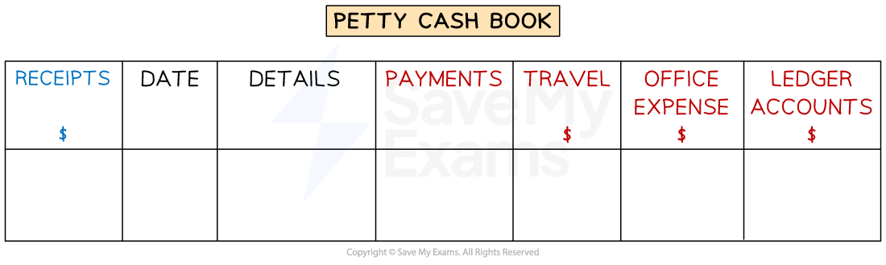

# The Petty Cash Book

## The Petty Cash Book

> **Spec point** — `spcpt_n7MRgBWR5kvpRWTY`

## The petty cash book

### What is a petty cash book?

- A **petty cash book** is used to record transactions involving **small amounts of cash**

  - The business will decide what they classify as small amounts of cash
  - Exam questions commonly tell you to class transactions for anything up to \$100 or \$75 as petty cash transactions
- A** petty cash voucher **is used to **record the transaction** when money is taken from the petty cash account

  - It should state the amount and details

### What is the layout of a petty cash book?

- There is a **date column** and a **details column**

  - These commonly appear once in the **middle**
- The **receipts** column on the **debit side** states the **total amount received** for each transaction
- The **payments **column on the **credit side** states the **total amount paid **for each transaction
- There are **analysis columns** on the **credit side** to separate payments into different categories

  - There are columns for the **expense accounts** and a column for the **payables ledger accounts**

*The layout of a petty cash book*

### How do I enter transactions into the petty cash book?

- The **opening balance** is on the **debit side**
- The **debit side** shows the **cash receipts**

  - Small cash receipts from **trade receivables**
  - Money transferred from the cash or bank account to **top up the petty cash account**
- The** credit side** shows the cash payments

  - Small cash payments for **expenses**
  - Small cash payments to **trade payables**
- When you enter a transaction onto the **credit side**

  - You need to enter it in the appropriate **analysis column(s)**
  - Put the total for that transaction in the **total paid** **column**

### How do I balance the petty cash book?

- Find the **total** for each column on the **credit side**
- Underline the **totals** for the **analysis columns**

  - These balances then get **transferred** to the relevant ledger accounts
  
    - You can transfer the **total for each expense column** rather than transfer each transaction separately
    - The entries for **ledger accounts** will need to be entered into the** individual ledger accounts**
- Find the **difference** between the **total paid** and the **total received**

  - Put this entry as **balance c/d** on the side with the smaller total
  
    - This will usually be the credit side
- Complete the **balancing process** for these two columns

  - Find the totals for the total received and total paid columns
  - Bring down the balance to the start of the next month
  
    - The balance brought down will always be on the **debit side**

> **Worked Example**
> Nazim is a sole trader. Nazim makes all payments of less than \$75 by petty cash. Nazim ensures that there is exactly \$150 in the petty cash account at the start of each month.
> 
> Below are the cash transactions for January 2024.
> 
> | January 5 | Paid taxi fare, \$23 |
> |---|---|
> | 8 | Paid cash, \$45, to Jamie, a trade payable |
> | 13 | Paid \$25 for stationery |
> | 17 | Received cash, \$67, from Hawa, a trade receivable |
> | 25 | Paid train fare, \$51 |
> | 30 | Paid cash, \$17, to Melody, a trade payable |
> 
> Enter these transactions into Nazim’s petty cash book. Balance the account and bring down the balance on 1 February 2024.
> 
> | **Receipts**  **\$** | **Date** | **Details** | **Payments**  **\$** | **Travel**  **\$** | **Office expenses**  **\$** | **Ledger accounts**  **\$** |
> |---|---|---|---|---|---|---|
> | 150 | 2024 Jan 1 | Balance b/d |   |   |   |   |
> 
> Answer
> 
> - *Total received*
> 
>   - *\$150 + \$67 = \$217*
> - *Total paid*
> 
>   - *\$23 + \$45 + \$25 + \$51 + \$17 = \$161*
> - *The difference*
> 
>   - *\$217 - \$161 = \$56*
> 
> | **Receipts**  **\$** | **Date** | **Details** | **Payments**  **\$** | **Travel**  **\$** | **Office expenses**  **\$** | **Ledger accounts**  **\$** |
> |---|---|---|---|---|---|---|
> | 150 | 2024 Jan 1 | Balance b/d |   |   |   |   |
> |   | **Final answer:** **Jan 5** | **Final answer:** **Taxi fare** | **Final answer:** **23** | **Final answer:** **23** |   |   |
> |   | **Final answer:** **Jan 8** | **Final answer:** **Jamie** | **Final answer:** **45** |   |   | **Final answer:** **45** |
> |   | **Final answer:** **Jan 13** | **Final answer:** **Stationery** | **Final answer:** **25** |   | **Final answer:** **25** |   |
> | **Final answer:** **67** | **Final answer:** **Jan 17** | **Final answer:** **Hawa** |   |   |   |   |
> |   | **Final answer:** **Jan 25** | **Final answer:** **Train fare** | **Final answer:** **51** | **Final answer:** **51** |   |   |
> |   | **Final answer:** **Jan 30** | **Final answer:** **Melody** | **Final answer:** **17** | **Final answer:** **               ** | **Final answer:** **                ** | **Final answer:** **17** |
> |   |   |   | **Final answer:** **161** | **Final answer:** **74** | **Final answer:** **25** | **Final answer:** **62** |
> | <u>         </u> | **Final answer:** **Jan 31** | **Final answer:** **Balance c/d** | **Final answer:** **56** |   |   |   |
> | **Final answer:** **217** |   |   | **Final answer:** **217** |   |   |   |
> | **Final answer:** **56** | **Final answer:** **Feb 1** | **Final answer:** **Balance b/d** |   |   |   |   |

## The Imprest System

> **Spec point** — `spcpt_2Z3gY378wcRv9qqB`

## The imprest system

### What is the imprest system?

- The **imprest system** is used by businesses to ensure that the money in the **petty cash account** is equal** to a set amount**

  - This amount is known as the **imprest amount**
  - This is usually done at the start of each week or month
- If the petty cash account is **less than the imprest amount** at the start of a period

  - Then it will be **topped up** using the cash or bank account
- If the petty cash account is **higher than** the imprest amount at the start of a period

  - Then the **excess can be deposited** into the cash or bank account
- The** imprest amount **will **always be equal **to:

  - The **current balance** of the petty cash account
  - **Plus** the **total value of petty cash vouchers** for the current period
  - **Minus** the** total amount** of petty cash **received**

### What are the advantages of using an imprest system?

- It sets a **limit** on the amount of cash which can be spent
- It helps **managers monitor** the amount of petty cash that is being spent
- It **limits the amount** of cash that could be **mislaid or** **stolen**

> **Exam Hint**
> Read the question carefully to see whether you are asked to restore the imprest or not. Also, check when the imprest is restored.

> **Worked Example**
> Mark maintains a petty cash account using the imprest system. The imprest amount, \$200, is restored on the first day of every month.
> 
> During January 2024, Mark receives \$50 from trade receivables, and the total of the petty cash vouchers for payments is \$120.
> 
> Calculate how much cash is needed to restore the imprest on 1 February 2024.
> 
> Answer
> 
> - *Find the net amount that left the petty cash account*
> 
>   - *\$120 - \$50 = \$70*
> 
> **Final answer:** **\$70 is needed to restore the imprest**
