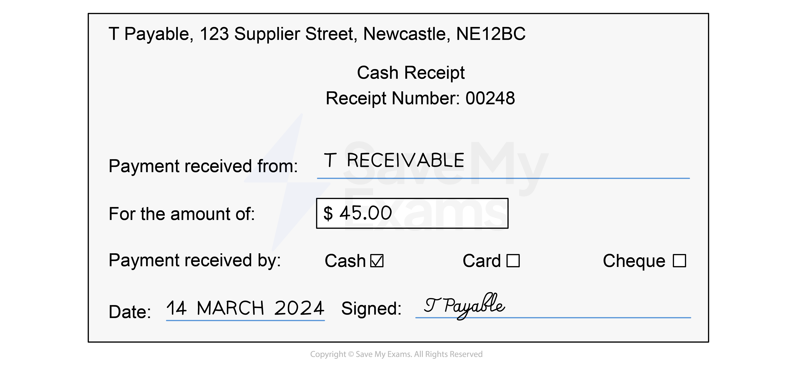
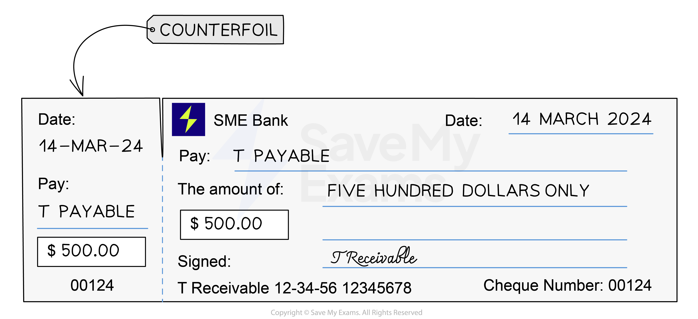
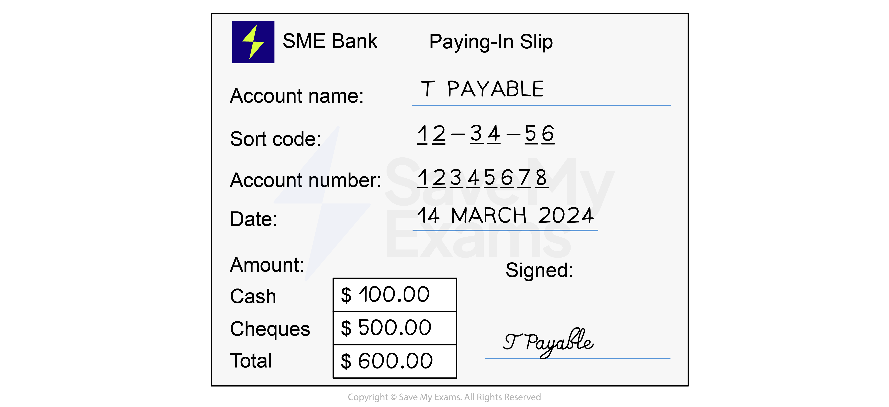
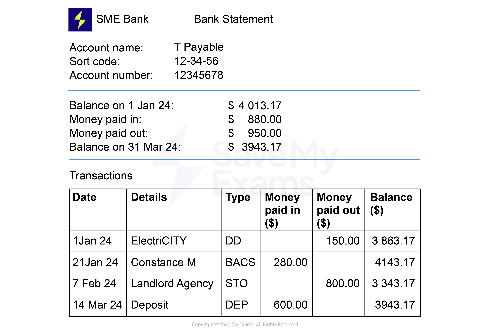

# Business Documents for Cash Transactions

## Receipts

> **Spec point** — `spcpt_nmGy2VPqQgJC5mp9`

## Receipts

### What is a receipt?

- A **receipt** is used as a **record** of a **cash payment**
- A **supplier issues** a receipt to a customer when they pay for goods using **physical cash**

  - Sometimes a receipt is issued when the customer pays using money in their bank account
  
    - Other business documents may also be used to record these transactions

*Example of a cash receipt*

## Cheques & Cheque Counterfoils

> **Spec point** — `spcpt_MMpfj7YbBCtV9PTR`

## Cheques & cheque counterfoils

### What is a cheque?

- A **cheque** is a form of payment
- It is **written by the customer** and **given to the supplier**
- The supplier takes the** cheques** they receive** to the bank** and **deposits them** into the business bank account
- A cheque will contain:

  - The details of the customer’s bank account
  - The name of the supplier
  - The amount to be paid
  - The date on which the cheque is written
  - The customer’s signature
- The supplier will use the cheque as the **business document** for payments

  - When the customer pays by cheque

### What is a cheque counterfoil?

- **Cheques** are attached to **counterfoils** in a chequebook
- When a customer writes a cheque they also fill in some basic details on the counterfoil

  - The name of the person who is being paid
  - The amount to be paid
  - The date that the cheque is written
- The **customer tears off the cheque** and hands it to a supplier as payment
- The customer **keeps the cheque counterfoil**

  - This is used as a **record** of the payment

*Example of a cheque with a counterfoil*

## Petty Cash Vouchers

> **Spec point** — `spcpt_WjK8k99kkvsD4TgJ`

## Petty cash vouchers

### What is a petty cash voucher?

- A **petty cash voucher **is a document used when paying for **small valued purchases **using petty cash

  - This is usually done when a cheque would not be appropriate due to the low value
- The customer pays the supplier using** money from the petty cash till **and records the details on a voucher
- The information from the vouchers is then **transferred **to the **petty cash book**

## Paying-In Slips

> **Spec point** — `spcpt_jGWn9WvWJqZKXrpx`

## Paying-in slips

### What is a paying-in slip?

- A **paying-in slip **is a document used when depositing cash and/or cheques into a bank account
- The paying-in slip is kept by the business as a **record** of the deposit
- It contains:

  - The total amount from **cash**
  - The total amount from **cheques**
  - The **total amount** being deposited
  - The **date**

*Example of a paying-in slip*

## Bank statements

> **Spec point** — `spcpt_NB5vmp8y8dWsYfTH`

## Bank statements

### What is a bank statement?

- A **bank statement **is issued regularly by a bank
- It details all the bank transactions within a given period

  - It shows **money that goes in and out** of the business' bank account
- It shows the **opening** and** closing balances** for that period
- A bank statement is used as a business document to identify and reconcile:

  - Payments by credit transfer
  - Payments by telephone transfer
  - Payments by direct debit
  - Payments by standing order
  - Bank charges and interest

### What is a direct debit?

- A **direct debit **is used by a business to make **recurring bank transfer payments** to a person or another business
- The direct debit is **set up by the person** or business** receiving the payments**

  - The business that makes the payment needs to agree to the terms
- The payments can **change**

  - The **dates** of the payments
  - The **amounts** of the payments

### What is a standing order?

- A **standing order **is used by a business to make **recurring bank transfer payments** to a person or another business
- The standing order is **set up by the business** **making the payments**
- The payments are **fixed**

  - The **dates** are **determined in advance**
  
    - It could be the same day each month
  - The **amounts** are the **same for each payment**

*Example of bank statement*

## A Summary of Business Documents for Transactions

> **Spec point** — `spcpt_kkYHCjZ35mWvZfS8`

## A summary of business documents for transactions

| **Transaction** | **Business document for the customer** | **Business document for the supplier** |
|---|---|---|
| The customer buys goods on credit from the supplier | Purchases invoice | Sales invoice |
| The customer returns goods to the supplier | Credit note received | Credit note issued |
| The customer pays a supplier using cash | Receipt | Receipt |
| The customer pays a supplier using petty cash | Petty cash voucher | Receipt |
| The customer pays a supplier using a cheque | Cheque counterfoil | Cheque |
| The customer pays the supplier by credit transfer | Remittance advice | Remittance advice |
| The customer pays the supplier by direct debit or standing order | Bank statement | Bank statement |
| The supplier deposits the cash and cheques into their bank | None | Paying-in slip |
