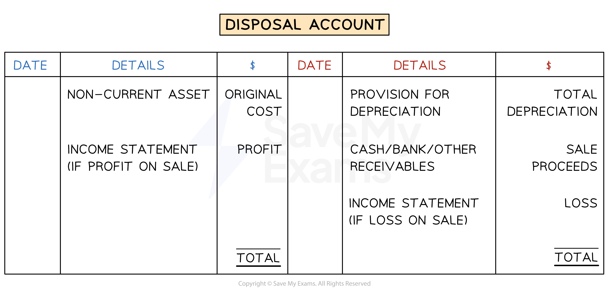

# Disposal of Non-Current Assets

## Profit or Loss on a Sale of a Non-Current Asset

> **Spec point** — `spcpt_m6yNSZkV5FRMgdkc`

## Profit or loss on a sale of a non-current asset

### Can a business sell a non-current asset?

- A **non-current asset** can be **sold **when the business no longer needs it

  - This is referred to as the** disposal of a non-current asset**
- The sale of the non-current asset could be a **cash sale or credit sale**

  - If it is a **credit sale** then a **nomial ledger account** is created for the person or business buying the asset
  - This account is referred to as **an other receivables account** to avoid confusion with trade receivables accounts
- The **money received** from the sale is called the **proceeds of the sale**

  - This is a ***capital receipt***
- A non-current asset can also be used as a **part-exchange** for a new non-current asset

  - The business and the supplier of the new asset will **agree on the value** of the old asset
  - The business will **give the old asset to the supplier**
  - The **supplier will reduce the cost** of the new asset by the value of the old asset

> **Exam Hint**
> Do not include the sale of a non-current asset in the sales account! The sales account is just for the sale of goods. The sale of a non-current asset will be detailed in a disposal account.

### How do I calculate the profit or loss on a sale of a non-current asset?

- **STEP 1**
Calculate the **carrying value** of the non-current asset

  - The **cost** of the asset **minus** the **accumulated depreciation**
- **STEP 2**
Calculate the **difference between the proceeds** of the sale and the** carrying value**
- **STEP 3**
Determine if a **profit or loss** has been made

  - If the **proceeds** of the sale are **greater than** the **carrying value** then it is a **profit**
  
    - This means **too much depreciation** has been charged
  - If the **proceeds **of the sale are** smaller** than the **carrying value** then it is a** loss**
  
    - This means **not enough depreciation** has been charged

> **Exam Hint**
> Check whether the question says there is a depreciation charge for the non-current asset in the year of sale. If there is then calculate that year’s depreciation and include it in the provision for depreciation account before working out the carrying value.

> **Worked Example**
> Sufiya buys equipment for \$30 000 on 1 March 2020 at the start of her financial year. She charges depreciation at 20% per annum using the straight line method.
> 
> Sufiya sells the equipment for \$13 000 on 14 February 2024. She charges a full year’s depreciation in the year the equipment is purchased and none in the year it is sold.
> 
> Calculate the gain or loss on disposal of the equipment.
> 
> Answer
> 
> - *STEP 1 - Calculate the carrying value*
> 
>   - *Calculate the yearly depreciation charge*
>   
>     - *20% ✕ \$30 000 = \$6 000*
>   - *Calculate the accumulated depreciation*
>   
>     - *Sufiya charges depreciation for three years from 1 March 2020 until 28 February 2023*
>     - *No depreciation is charged in the year of sale*
>     - *3 ✕ \$6 000 = \$18 000*
>   - *Calculate the carrying value*
>   
>     - *\$30 000 - \$18 000 = \$12 000*
> - *STEP 2 - Calculate the difference between the sale proceeds and the carrying value*
> 
>   - *\$13 000 - \$12 000 = \$1 000*
> - *STEP 3 - The sale proceeds are higher than the carrying value therefore it is a profit*
> 
> **Final answer:** **Profit of \$1 000**

## Disposal Account

> **Spec point** — `spcpt_Hh68wcJtr34C83kT`

## Disposal account

### What is a disposal account?

- A **disposal account** is used to show the **calculation of the profit or loss** on a sale of a non-current asset
- The **profit or loss** is **transferred to the income statement**

  - The account will then have a **zero balance**

### How do I record the sale of a non-current asset in the ledger accounts?

- The** book of original entry** is the **journal**
- Deal with **each transaction** one at a time
- **STEP 1**
**Reduce** the **non-current asset** account by the **original value**

  - **Credit** the **non-current asset** account
  
    - Because the value of the assets is decreasing
  - **Debit** the **disposal** account
- **STEP 2**
**Reduce** the **provision of depreciation** account by the **accumulated depreciation** of the non-current asset

  - **Debit** the **provision for depreciation** account
  - **Credit** the **disposal** account
- **STEP 3**
**Increase** the **cash, bank or other receivables** account

  - **Debit **the **relevant asset **account
  
    - Cash, if received
    - Bank, if money is received by cheque or bank transfer
    - Other receivables account if it was sold on credit
  - **Credit** the **disposal **account
- **STEP 4**
**Include** the **profit or loss** of the sale

  - If a **profit** is made, then this is an **income** for the business
  
    - **Credit** the **income statement**
    - **Debit** the **disposal **account
  - If a **loss **is made, then this is an **expense **to the business
  
    - **Debit **the **income statement**
    - **Credit **the **disposal** account

*The layout of a disposal account*

> **Exam Hint**
> The disposals account should balance. If it does not balance, then check for any mistakes. Some students calculate the profit or loss by completing steps 1 to 3 and then finding the amount needed to balance the disposal account. If you use this method, be extra careful that you put the entries on the correct side.

> **Worked Example**
> Riz owes an embroidery business and owns machinery. Riz purchased an additional machine on 1 March 2022 for \$30 000. Riz depreciates machinery using the straight line method using the assumption that machinery fully depreciates after five years. Riz charges depreciation at the end of each month. Riz sells this additional machinery on 31 December 2023 and receives a cheque for \$17 500. No other non-current assets were sold in the financial year ending 29 February 2024.
> 
> Prepare the disposal account for machinery for the year ended 29 February 2024.
> 
> Answer
> 
> - *Calculate the yearly depreciation charge*
> 
>   - *\$30 000 ÷ 5 = \$6 000*
> - *Calculate the monthly depreciation charge*
> 
>   - *\$6 000 ÷ 12 = \$500*
> - *Calculate the number of months that Riz owned the machinery*
> 
>   - *1 March 2022 to 31 December 2023 is 22 months.*
> - *Calculate the accumulated depreciation of the machinery*
> 
>   - *22 ✕ \$500 = \$11 000*
> - *Calculate the carrying value at 31 December 2023*
> 
>   - *\$30 000 - \$11 000 = \$19 000*
> - *Calculate the loss on the sale*
> 
>   - *\$19 000 - \$17 500 = \$1 500*
> - *The sale proceeds are less than the carrying value so it was a loss*
> 
> > *Fill in the disposal account*
> 
> 1. *Enter the original cost on the debit side*
> 2. *Enter the accumulated depreciation on the credit side*
> 3. *Enter the sale proceeds on the credit side*
> 4. *Enter the loss on the credit side*
> 
> **Final answer:** **Riz**
> **Disposal Account**
> 
> | **Final answer:** **Date** | **Final answer:** **Details** | **Final answer:** **\$** | **Final answer:** **Date** | **Final answer:** **Details** | **Final answer:** **\$** |
> |---|---|---|---|---|---|
> | **Final answer:** **2023**  **Final answer:** **Dec 31** | **Final answer:** **Machinery** | **Final answer:** **30 000** | **Final answer:** **2023**  **Final answer:** **Dec 31** | **Final answer:** **Provision for depreciation** | **Final answer:** **11 000** |
> |   |   |   | **Final answer:** **Dec 31** | **Final answer:** **Bank** | **Final answer:** **17 500** |
> |   |   | <u>                  </u> | **Final answer:** **2024**  **Final answer:** **Feb 29** | **Final answer:** **Income statement** | **Final answer:** **1 500** |
> |   |   | **Final answer:** **30 000** |   |   | **Final answer:** **30 000** |
