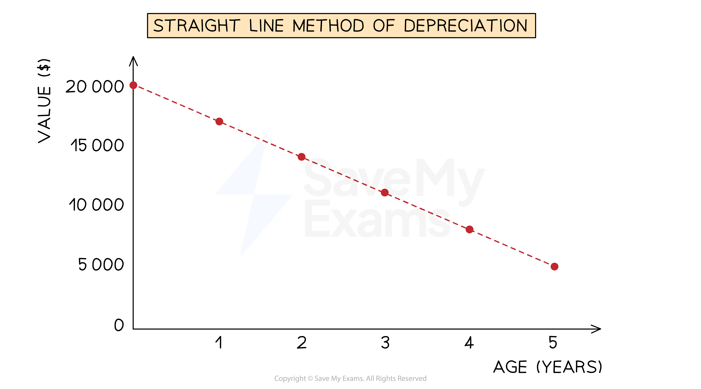
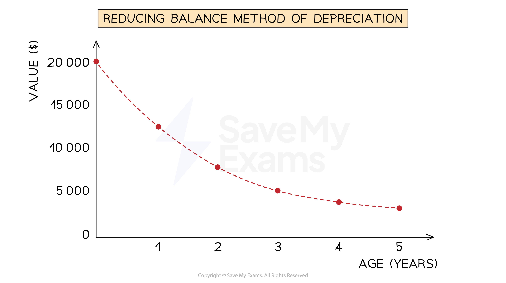

# Methods of Depreciation

## Straight Line Depreciation

> **Spec point** — `spcpt_9NJSTHxs5YmXCmss`

## Straight line depreciation

### What is the straight line method of depreciation?

- The **straight line method** of depreciation assumes that a non-current asset **loses value at a constant rate **over its useful life

  - This means that the expense for its depreciation is the **same each year**
  - The carrying value can reach \$0
  
    - This is when the asset is **fully depreciated**
- You could be given the **depreciation rate** as a **percentage of its original value**

  - E.g. depreciation could be charged at 20% of its original cost
- Or you could be expected to calculate the depreciation using:

  - The **number of years** that the non-current asset will be used
  - The **expected value** of the non-current asset at the **end of its working life**
  
    - This value could be \$0
    - The expected value is also called the** residual value **or the** disposal value**
- This method is usually used when the asset will be **equally valuable for each year** of its use

  - For example, fixtures and fittings, equipment, etc

*Example of an asset which cost $20 000, being charged depreciation  at 15% per annum using the straight line method*

### How do I calculate depreciation using the straight line method?

- If you **are given the percentage for the depreciation**

  - Find the **percentage **of the **original amount**
  - This will be the yearly depreciation charge
- If you **are not given the percentage**

  - Calculate the **expected loss in value during the expected life** of the non-current asset
  
    - The **original value minus the expected value** at the end of its life
  - **Divide** the **loss** by the **number of years** it will be used
  - This will be the yearly depreciation charge

$\mathrm{Depreciation}=\frac{\mathrm{original} \mathrm{value}-\mathrm{expected} \mathrm{value}}{\mathrm{number} \mathrm{of} \mathrm{years}}$

> **Exam Hint**
> The straight line method is similar to **simple interest** calculations used in maths.

> **Worked Example**
> Abi purchases machinery for \$18 000. Machinery is depreciated at 15% per annum using the straight line method.
> 
> Calculate the carrying value of the machinery after 3 years.
> 
> Answer
> 
> - *Calculate the yearly expense due to depreciation*
> 
>   - *15% ✕ \$18 000 = \$2 700*
> - *Calculate the total depreciation after 3 years*
> 
>   - *3 ✕ \$2 700 = \$8 100*
> - *Subtract the depreciation from the original value*
> 
>   - *\$18 000 - \$8 100 =* **\$9 900**

> **Worked Example**
> Taiki purchases a vehicle for \$30 000. He expects to use the vehicle for 3 years, after which he estimates that it will have a value of \$12 000.
> 
> Calculate the yearly expense due to the depreciation of the vehicle.
> 
> Answer
> 
> - *Calculate the loss in value over the 3 years*
> 
>   - *\$30 000 - \$12 000 = \$18 000*
> - *Divide this by the number of years*
> 
>   - *\$18 000 ÷ 3 =*** \$6 000**

## Reducing Balance Depreciation

> **Spec point** — `spcpt_vw8BWYrvKCf6MsqQ`

## Reducing balance depreciation

### What is the reducing balance method of depreciation?

- The **reducing balance method **of depreciation assumes that the non-current asset **loses value** at a **rate proportional** to its** current value**

  - This means that the **expense for its depreciation** gets **smaller each year** as the **current value decreases**
- You will be **told the percentage** of the current value to use for depreciation
- This method is usually used when a **non-current asset initially loses value at a fast rate**

*Example of an asset, which cost $20 000, being charged depreciation at 30% per annum using the reducing balance method*

### How do I calculate depreciation using the reducing balance method?

- Find the **percentage of the current carrying value**

  - This will be the depreciation charge for that year
- If you need to calculate the depreciation for **multiple years,** then calculate **one year at a time**

  - Find the depreciation charge for one year using the **carrying value at that start of the year**
  - **Subtract** this amount from the carrying value at the start of the year to find the **new carrying value**
  - Find the depreciation charge for the next year using the carrying value at the start of **that year**
  - Continue this process
- If you just need to find the **current carrying value** then you can use some maths skills

  - **Subtract** the percentage from **100%**
  - Write this as a **decimal**
  - Raise this to the power of the **number of years**
  - **Multiply** this by the** original value**

> **Exam Hint**
> The reducing balance method is similar to **compound interest** calculations used in maths.
> 
> Amounts should always be given to the nearest dollar in exams.

> **Worked Example**
> Abi purchases a vehicle for \$16 000. Machinery is depreciated at 25% per annum using the reducing balance method.
> 
> Calculate the carrying value of the machinery after 3 years.
> 
> Answer
> 
> > *Find the depreciation charged in each year by finding the percentage of the carrying value at that time.*
> *Subtract that year’s depreciation from the carrying value to find the carrying value at the end of the year.*
> 
> | *End of year* | *Depreciation charge* | *Carrying value* |
> |---|---|---|
> | *0* | *-* | *\$16 000* |
> | *1* | *25% ✕ \$16 000 = \$4 000* | *\$16 000 - \$4 000 = \$12 000* |
> | *2* | *25% ✕ \$12 000 = \$3 000* | *\$12 000 - \$3 000 = \$9 000* |
> | *3* | *25% ✕ \$9 000 = \$2 250* | *\$9 000 - \$2 250 = ***\$6 750** |
> 
> > *Alternatively:*
> 
> - *Subtract the percentage from 100%*
> 
>   - *100% - 25% = 75%*
> - *Write this as a decimal*
> 
>   - *75% = 0.75*
> - *Raise this to the power of the number of years*
> 
>   - *0.75**3*
> - *Multiply this by the original value*
> 
>   - *\$16 000 ✕ 0.75**3** =* **\$6 750**
