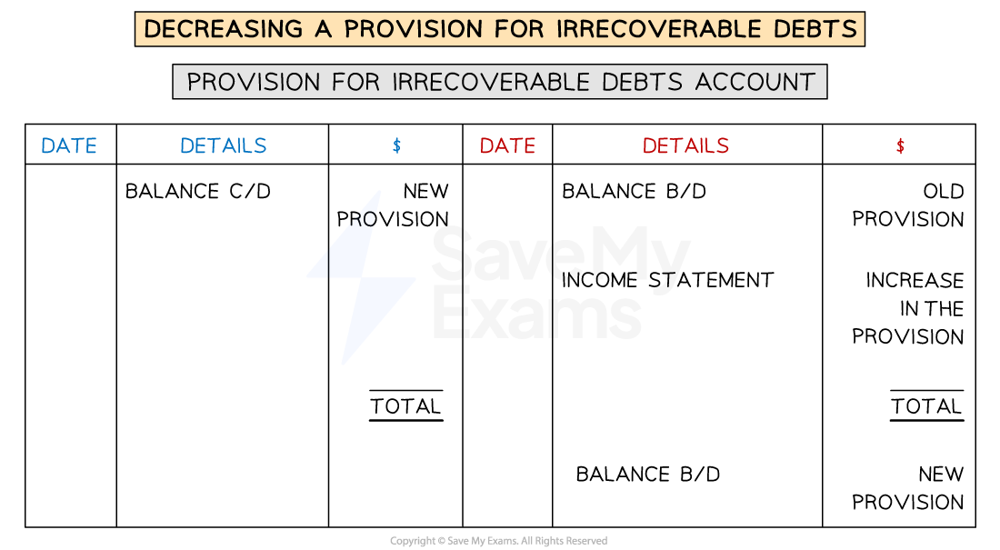
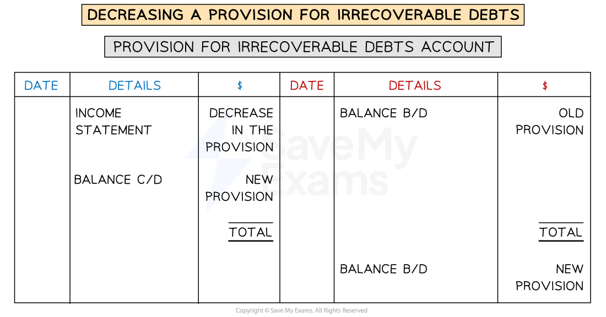

# Provision for Irrecoverable Debts

## Provision for Irrecoverable Debts

> **Spec point** — `spcpt_cJWs853zHnxj675h`

## Provision for irrecoverable debts

### What is a provision for irrecoverable debts?

- A **provision for irrecoverable debts** is an **estimation **for the the **amount of sales** in a given financial period which will result in **irrecoverable debts**
- The amount for the provision for irrecoverable debts can be **determined using different methods**

  - It could be a **fixed percentage** of the **trade receivables** at the end of a financial period
  - It could be a **fixed amount** based on data from previous years
  - It could factor in **how long debts have been outstanding**
  - It could be based on **which individuals are unlikely to settle their debts**
- A business should use the **same method** for accounting for **irrecoverable **debts each year

  - This adheres to the **accounting conceptof consistency**
- A provision for irrecoverable debts is **similar **to a **provision for depreciation** of a non-current asset

  - The provision for irrecoverable debts **estimates **a reduction in an asset
  
    - The asset is the amount owed by trade receivables
  - However, the reduction is kept in a **provision account** which is separate from the asset accounts

### Why do businesses set up a provision for irrecoverable debts?

- Businesses use a provision for irrecoverable debts to adhere to the **accounting concepts**:

  - **Prudence**
  - **Accruals**
- The conceptof **prudence** is applied because:

  - The **assets **are **not overstated**
  
    - The provision reduces the trade receivables by a realistic amount
  - The **profit** for the year is **not overstated**
  
    - The potential losses are factored into the expenses
- The concept of **accruals **is applied because:

  - An **estimate **of **irrecoverable debts** is made **based on sales in a given period**
  - This **estimate **is then treated as an **expense **for the **same period** as the original sales

### How do I set up a provision for irrecoverable debts?

- The provision is **set up at the end of the financial period**
- The business **estimates **the amount of sales in that period that will result in **irrecoverable debts**

  - This is normally a percentage of the trade receivables at the end of the financial period
- This amount is **debited** to the **income statement** as an expense

  - A **credit** entry is made in the **provision for irrecoverable debts** account
- The **balance **of a provision for irrecoverable debts account will be on the **credit side** because it represents a **reduction in an asset**

> **Exam Hint**
> No entries are made in any account in the sales ledger for the provision of irrecoverable debts. Entries are made in these accounts when debts are actually written off.

> **Worked Example**
> On 31 March 2024, Josef is owed \$42 000 by credit customers. Josef decides to create a provision for irrecoverable debts, set at 5% of trade receivables.
> 
> Prepare journal entries for the creation of a provision for irrecoverable debts account on 31 March 2024. A narrative is not required.
> 
> **Journal**
> 
> | **Date** | **Details** | **Debit**  **\$** | **Credit**  **\$** |
> |---|---|---|---|
> |   |   |   |   |
> |   |   |   |   |
> 
> Answer
> 
> - *Calculate the provision for irrecoverable debts*
> 
>   - *5% ✕ \$42 000 = \$2 100*
> - *Start with the account to be debited*
> 
>   - *The income statement.*
> - *Then include the account to be credited*
> 
>   - *The provision for irrecoverable debts account.*
> 
> **Journal**
> 
> | **Date** | **Details** | **Debit**  **\$** | **Credit**  **\$** |
> |---|---|---|---|
> | **Final answer:** **2024**  **Final answer:** **Mar 31** | **Final answer:** ** **  **Final answer:** **Income statement** | **Final answer:** **2 100** |   |
> |   | ** **     **Provision for irrecoverable debts** |   | **Final answer:** **2 100** |

## Adjustments to a Provision for Irrecoverable Debts

> **Spec point** — `spcpt_FyK5y2PZnts5qy2C`

## Adjustments to a provision for irrecoverable debts

### How do I update a provision for irrecoverable debts at the end of a financial period?

- The provision for irrecoverable debts is **reviewed at the end of each year** and the amount might be updated
- At the end of the financial period

  - **Calculate** the **new provision** for irrecoverable debts
  - This will be the **opening balance** of the provision for irrecoverable debts account for the **next financial period**
  
    - Enter it on the **credit side **
  - Enter the **corresponding closing balance **on the **debit side** of the provision for irrecoverable debts account for the** current financial period**
  - **Calculate** the **difference** and enter it on the appropriate side to make the account balance
  
    - This value will be **transferred to the income statement**
- If the provision for irrecoverable debts **increases**:

  - The **difference **will be on the **credit **side
  - This will be **debited **to the **income statement** as an **expense**
- If the provision for irrecoverable debts **decreases**:

  - The **difference **will be on the **debit **side
  - This will be **credited **to the **income statement** as an **income**

### How does a provision for irrecoverable debts affect the financial statements?

- At the end of a financial period, the **balance **from the provision for irrecoverable debts account appears on the **statement of financial position**

  - It is listed under trade receivables
  - The balance is **subtracted **from the balance for **trade receivables**
- The **difference** in the provision between the start of the year and the end of the year appears on the **income statement**

  - If the provision has **increased, **it appears with the other **expenses**
  - If the provision has **decreased,** it appears with the other **income**

> **Exam Hint**
> When a provision for irrecoverable debts is first created, the whole amount is charged as an expense to the income statement, this is because the provision has increased from \$0.

> **Worked Example**
> Ricardo keeps a provision for irrecoverable debts at a rate of 3% of trade receivables. On 1 March 2023, the balance of the provision for irrecoverable debts was \$1 530. On 29 February 2024, the trade receivables were \$49 500, of which \$1 000 should be written off as irrecoverable debts.
> 
> (a) Prepare the provision for irrecoverable debts account for Ricardo. Balance the account on 29 February 2024 and bring down the balance on 1 March 2024.
> 
> (b) State how the provision for irrecoverable debts affects the profit for the year ended 29 February 2024.
> 
> Answer
> 
> - *Subtract the irrecoverable debts from the trade receivables*
> 
>   - *\$49 500 - \$1 000 = \$48 500*
> - *Calculate the new provision for irrecoverable debts*
> 
>   - *3% ✕ \$48 500 = 1 455*
> - *Calculate the change in the provision*
> 
>   - *\$1 530 - \$1 455 = \$75*
> 
> (a) *Enter the details into the provision for irrecoverable debts account. Remember, the balance b/d is on the credit side.*
> 
> **Final answer:** **Ricardo**
> **Provision for Irrecoverable Debts Account**
> 
> | **Final answer:** **Date** | **Final answer:** **Details** | **Final answer:** **\$** | **Final answer:** **Date** | **Final answer:** **Details** | **Final answer:** **\$** |
> |---|---|---|---|---|---|
> | **Final answer:** **2024**  **Final answer:** **Feb 29** | **Final answer:** **Income statement** | **Final answer:** **75** | **Final answer:** **2023**  **Final answer:** **Mar 1** | **Final answer:** **Balance b/d** | **Final answer:** **1 530** |
> | **Final answer:** **Feb 29** | **Final answer:** **Balance c/d** | **Final answer:** **1 455** |   |   | <u>            </u> |
> |   |   | **Final answer:** **1 530** |   |   | **Final answer:** **1 530** |
> |   |   |   | **Final answer:** **2024**  **Final answer:** **Feb 29** | **Final answer:** **Balance b/d** | **Final answer:** **1 455** |
> 
> (b) *The provision for irrecoverable debts has decreased. This will be credited to the income statement and treated as an income.*
> 
> **Final answer:** **The provision for irrecoverable debts increases the profit for the year by \$75.**
