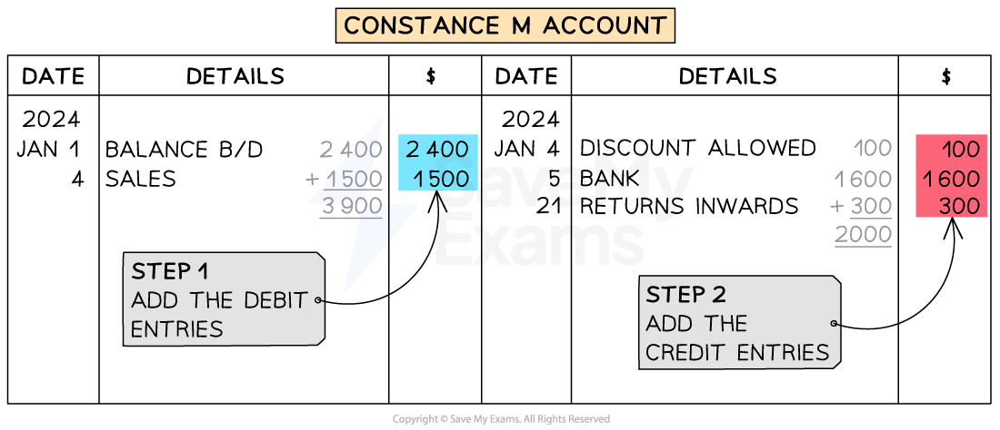
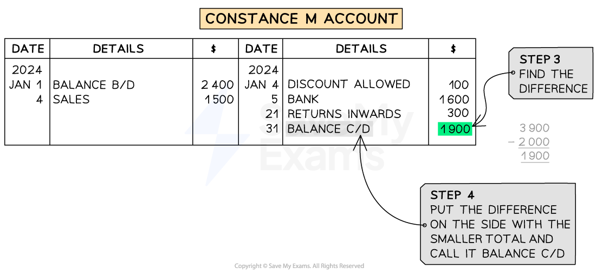
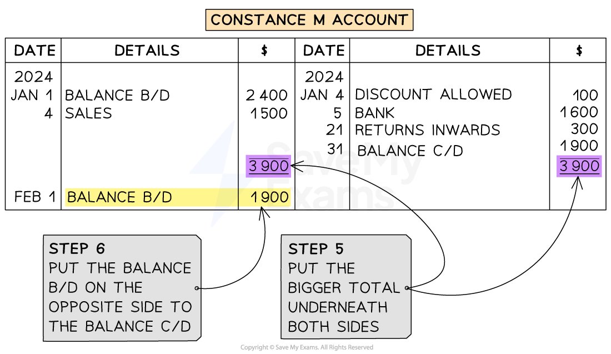

# Balancing Accounts

## Balancing Accounts

> **Spec point** — `spcpt_V2Ngr7Qct5whDwj2`

## Balancing accounts

### Why do businesses balance their accounts?

- Businesses **balance** their accounts at **regular intervals**

  - Usually at the end of a month
- Balancing accounts helps to:

  - Keep the accounts **accurate**
  - See the **current balance** of an account
  - Allow managers to **monitor progress**

### How do I balance a ledger account?

- **STEP 1**
**Add up **the entries on the **debit** side
- **STEP 2**
**Add up** the entries on the **credit** side
- **STEP 3**
Find the **difference** between the two totals
- **STEP 4**
Put an entry with the difference on the **side which has the smaller total**

  - Put the date as the last day of that period
  
    - Usually the last day of the month
  - Call this entry **balance c/d**
  
    - c/d stands for carried down
- **STEP 5**
Write the **new totals** on each side of the account

  - The totals should be in line with each other
  - Put a single line above the totals
  - Put a bold or double line underneath the totals
- **STEP 6**
Put an entry of **equal value** to the balance c/d but on the **other side** after the totals

  - Put the date as the first day of the next period
  
    - Usually the first day of the month
  - Call this entry** balance b/d**
  
    - b/d stands for brought down

#### Example of balancing a trade receivable account

> **Worked Example**
> Milo is a sole trader. Milo buys goods on credit from SME Goods. The transactions during February 2024 are shown below in the SME Goods account in the purchases ledger. Balance the account on 29 February 2024.
> 
> **SME Goods Account**
> 
> | **Date** | **Details** | **\$** | **Date** | **Details** | **\$** |
> |---|---|---|---|---|---|
> | 2024  Feb 1 | Balance b/d | 200 | 2024  Feb 2 | Purchases | 800 |
> | Feb 8 | Purchases returns | 100 | Feb 19 | Purchases | 1 500 |
> | Feb 16 | Bank | 650 | Feb 27 | Purchases | 700 |
> | Feb 16 | Discount received | 50 |   |   |   |
> | Feb 29 | Bank | 800 |   |   |   |
> 
> Answer
> 
> - *The total of the debit entries is \$1* *800*
> *The total of the credit entries is \$3* *000*
> - *The difference is \$1* *200*
> 
>   - *This goes on the debit side as that side has a smaller total*
> 
> **SME Goods Account**
> 
> | **Date** | **Details** | **\$** | **Date** | **Details** | **\$** |
> |---|---|---|---|---|---|
> | 2024  Feb 1 | Balance b/d | 200 | 2024  Feb 2 | Purchases | 800 |
> | Feb 8 | Purchases returns | 100 | Feb 19 | Purchases | 1 500 |
> | Feb 16 | Bank | 650 | Feb 27 | Purchases | 700 |
> | Feb 16 | Discount received | 50 |   |   |   |
> | Feb 28 | Bank | 800 |   |   |   |
> | **Final answer:** **Feb 29** | **Final answer:** **Balance c/d** | **Final answer:** **1 200** |   |   | <u>                 </u> |
> |   |   | **Final answer:** **3 000** |   |   | **Final answer:** **3 000** |
> |   |   |   | **Final answer:** **Mar 1** | **Final answer:** **Balance b/d** | **Final answer:** **1 200** |
