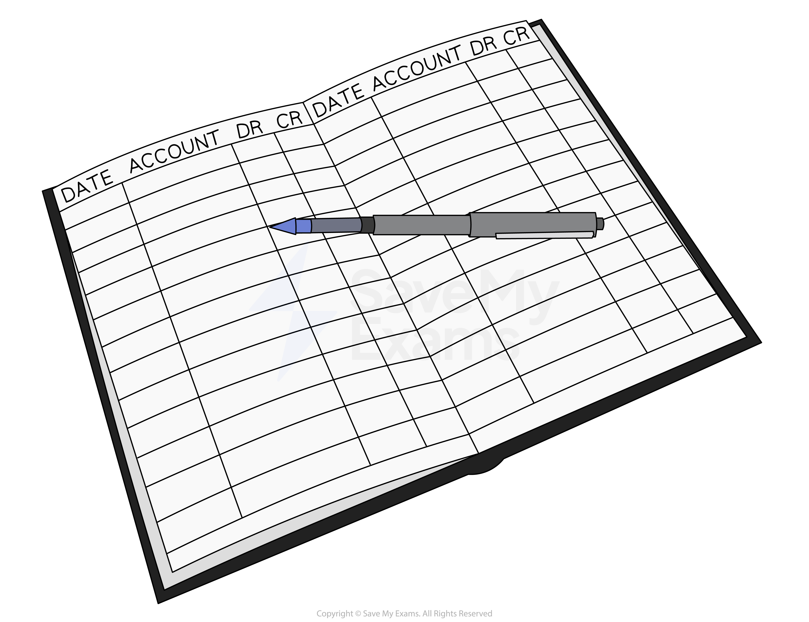

# Ledgers

## The Ledger

> **Spec point** — `spcpt_PJj4SzyjRZYgDq99`

## The ledger

### What is the ledger?

- The** ledger** is a** collection** of **all the accounts** for a business

  - It could be a **book** where each account is on a new page
  - It could be a **spreadsheet **file where each account is on a new sheet

- The accounts in the ledger are referred to as **ledger accounts**
- The ledger is divided into **three separate ledgers**

  - The receivables ledger
  - The payables ledger
  - The nominal (general) ledger

### Why is the ledger divided into three sections?

- Dividing the ledger means that the **work can be shared** amongst several people
- It is **easier **to** find **and **check information**

  - The same types of accounts are kept together
- It can help to **reduce **the possibility of **fraud**

  - If different people work with different ledgers then missing or incorrect information will be easier to find

## Receivables, Payables & Nominal Ledgers

> **Spec point** — `spcpt_MKTZbMZ4Gm44SwKn`

## Receivables, payables & nominal Ledgers

### What is the sales ledger?

- The **receivables ledger** is a collection of the accounts for **all of the credit customers**

  - These are the **trade receivables** accounts
- The **sales account** itself does **not** go into the receivables ledger

  - It goes in the nominal ledger

### What is the payables ledger?

- The **payables ledger** is a collection of the accounts for **all of the credit suppliers**

  - These are the **trade payables **accounts
- The **purchases account** itself does **not** go into the payables ledger

  - It goes in the nominal ledger

### What is the nominal (general) ledger?

- The **nominal ledger** is a collection of** all accounts** of a business **except** for the accounts for **credit customers** and **credit suppliers**

  - It is also known as the **general ledger**
- The most **common accounts** in the nominal ledger are:

  - Sales account
  - Purchases account
  - *Returns inwards* account
  - *Returns outwards* account
  - *Carriage inwards* account
  - *Carriage outwards* account
  - *Discount allowed* account
  - *Discount received* account
  - An account for each other expense
  - An account for each other income
  - Cash and bank accounts
  - *Equity* account
  - *Drawings* account
  - Inventory account
  - An account for each type of non-current asset
  - An account for each liability
