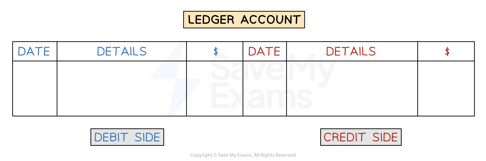
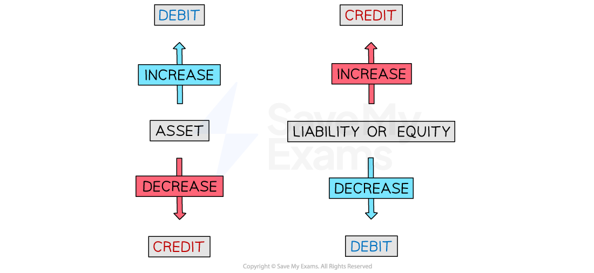

# The Double Entry System

## The Double Entry System

> **Spec point** — `spcpt_7DQ5qKjvmcKjgn2d`

## The double entry system

### What is the double entry system?

- The **double entry system** is used by bookkeepers

  - The double entry system is used to **improve the accuracy** of **financial statements**
- The double entry system is closely linked to the **accounting equation**

  - **Assets = Liabilities + Equity**
- The equation is **always balanced**
- Each **transaction** causes **both sides** of the equation to:

  - **increase**
  - or** decrease**
  - or** remain the same**
- Each **transaction** is entered into **two accounts**

  - One is called a **debit entry**
  - One is called a **credit entry**

### What is the layout of a ledger account?

- Each account will be split into** two sides**

  - The** debit** entries appear on the** left**
  
    - This side is sometimes labelled as **Dr**
  - The** credit** entries appear on the **right**
  
    - This side is sometimes labelled as **Cr**
- When you make an entry you need to **include**:

  - The **date** of the transaction
  - The **details** of the transaction
  
    - This is normally the name of the other account involved
  - The **value** of the transaction

*Example of a ledger account*

### What are the advantages of maintaining double entry records?

- It is **straightforward** to **prepare financial statements**
- It can help give an **accurate calculation** of the **profit or loss**
- It **reduces **the** possibility of fraud**
- It gives **easy access** to **information** for the **bank **or **other lenders**

## Debits & Credits

> **Spec point** — `spcpt_srTknwNn78jknxwg`

## Debits & credits

### What is a debit entry?

- A **debit** entry is mainly used for:

  - **Increasing** the value of an** asset**
  
    - The **left-hand side** of the accounting equation **increases**
  - **Decreasing** the value of a** liability **or the** equity**
  
    - The **right-hand side** of the accounting equation **decreases**

### What is a credit entry?

- A **credit **entry is mainly used for:

  - **Increasing** the value of a **liability **or the** equity**
  
    - The **right-hand side** of the accounting equation **increases**
  - **Decreasing** the value of an **asset**
  
    - The **left-hand side** of the accounting equation **decreases**

### Which accounts should I debit?

- Debit** **an** asset account** when its value is **increasing**

  - You receive cash
  
    - Debit the cash account
  - A customer buys goods on credit
  
    - Debit their trade receivables account
- Debit a** liability account** when its value is **decreasing**

  - You make a repayment on a bank loan
  
    - Debit the bank loan account
  - You pay an invoice to a credit supplier
  
    - Debit their trade payables account
- Debit other accounts when the transaction **decreases **the **equity**

  - You take out assets for personal use
  
    - Debit the drawings account
  - You pay an expense which decreases the profit
  
    - Debit the relevant expense account
    - Such as purchases, rent paid, discount allowed, etc

### Which accounts should I credit?

- Credit a **liability** **account** when its value is **increasing**

  - You take out a bank loan
  
    - Credit the bank loan account
  - You buy goods on credit from a supplier
  
    - Credit their trade payables account
- Credit an **asset account** when its value is **decreasing**

  - You pay rent by bank transfer
  
    - Credit the bank account
  - A credit customer pays their invoice
  
    - Credit their trade receivables account
- Credit other accounts when the transaction **increases **the **equity**

  - You put more personal assets (such as money) into the business
  
    - Credit the capital account
  - You receive income which increases the profit
  
    - Credit the relevant income account
    - Such as sales, rent received, discount received, etc

### How do I decide whether an account should be debited or credited?

- **STEP 1**
Identify the **asset**, **liability **or** equity**

  - Usually this is cash, trade receivables or trade payables
- **STEP 2**
Determine whether its value is** increasing** or **decreasing**
- **STEP 3**
**Debit **or **credit **that account

  - **Debit **the account if:
  
    - It is an **asset** account and its value is **increasing**
    - It is a **liability** or the **equity **account and its value is **decreasing**
  - **Credit** the account if:
  
    - It is an **asset** account and its value is **decreasing**
    - It is a **liability** or the **equity **account and its value is **increasing**
- **STEP 4**
Put an **equal** entry on the **opposite side** for the second account

*Debit and credit entries achieve specific purposes depending on the type of account*

### Do I debit or credit accounts for expenses & incomes?

- When you pay an** expense** you will** debit** that account

  - This is because expenses decrease the profit
  
    - The equity will decrease
  - The other part of the double entry is to **credit **the **cash **or **bank **account
  
    - Your cash is decreasing
- When you receive an **income** you will **credit** that account

  - This is because income increases the profit
  
    - The equity will increase
  - The other part of the double entry is to **debit **the **cash **or **bank **account
  
    - Your cash is increasing

### Do I debit or credit accounts for drawings & capital?

- When the** owner takes out money or goods** from the business** for themselves** you will **debit** the **drawings account**

  - This is because taking drawings decreases the equity
  - The other part of the double entry is to **credit** the **cash **or **bank **account
  
    - The company’s cash is decreasing
- When the **owner adds their own money **to the business you will **credit** the **capital account**

  - This is because introducing money increases the equity
  - The other part of the double entry is to **debit **the **cash **or **bank **account
  
    - The company’s cash is increasing

> **Exam Hint**
> To remember which side of an account to record a transaction, you can use the acronym DEAD CLIC.
> 
> - The transaction is on the **d**ebit side for** e**xpense, **a**sset, and **d**rawings accounts if the account is increasing.
> - The transaction is on the **c**redit side for** l**iability,** i**ncome, and **c**apital (equity) accounts if the account is increasing.
> - If the account is decreasing then the transaction is recorded on the opposite side!
> 
> 

> **Worked Example**
> Hina is a sole trader.
> 
> Complete the table below to show the accounts that Hina should debit and credit for each of the following transactions.
> 
> | **Transaction** | **Account to be debited** | **Account to be credited** |
> |---|---|---|
> | Hina sells goods on credit to Priya |   |   |
> | Hina receives a cash payment from Priya |   |   |
> | Hina pays an electricity bill by cheque |   |   |
> | Hina buys goods on credit from Dida |   |   |
> | Hina repays some of a bank loan by bank transfer |   |   |
> | Hina takes ownership of a company vehicle for her own use |   |   |
> | Hina puts some of her own money into the business bank account |   |   |
> 
> Answer
> 
> | **Transaction** | **Account to be debited** | **Account to be credited** |
> |---|---|---|
> | Hina sells goods on credit to Priya   | **Final answer:** **Priya**  > *Hina is owed cash from Priya.* *Priya is an asset that is increasing.* | **Final answer:** **Sales**  > *Sales is an income.* |
> | Hina receives a cash payment from Priya   | **Final answer:** **Cash**  > *Hina receives cash.*  > *Cash is an asset that is increasing.* | **Final answer:** **Priya**  > *Hina is owed less money from Priya.*  > *Priya is an asset that is decreasing.* |
> | Hina pays an electricity bill by bank transfer   | **Final answer:** **Electricity**  > *Electricity is an expense.* | **Final answer:** **Bank**  > *The cheque will use money from the bank.*  > *The bank is an asset that is decreasing.* |
> | Hina buys goods on credit from Dida   | **Final answer:** **Purchases**  > *Purchases is an expense.* | **Final answer:** **Dida**  > *Hina owes money to Dida.* *Dida is a liability that is increasing* |
> | Hina repays some of a bank loan by bank transfer   | **Final answer:** **Bank loan**  > *The amount Hina owes less on her bank loan.* *The bank loan is a liability that is decreasing.* | **Final answer:** **Bank**  > *Hina is using money from the bank.* *The bank is an asset that is decreasing.* |
> | Hina takes ownership of a company vehicle for her own use   | **Final answer:** **Drawings**  > *Hina is taking an asset from the business.* | **Final answer:** **Vehicles**  > *The company owns fewer vehicles.* *Vehicles are an asset that is decreasing.* |
> | Hina puts some of her own money into the business bank account   | **Final answer:** **Bank**  > *The business is receiving money.*  > *The bank is an asset that is increasing.* | **Final answer:** **Equity**  > *The equity of the business is increasing* |
