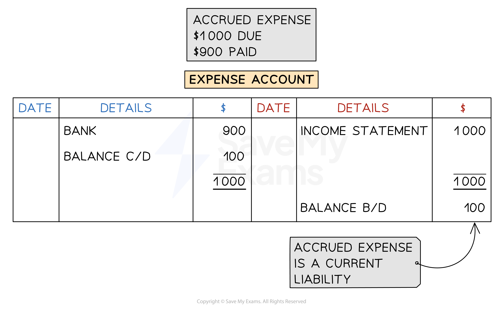
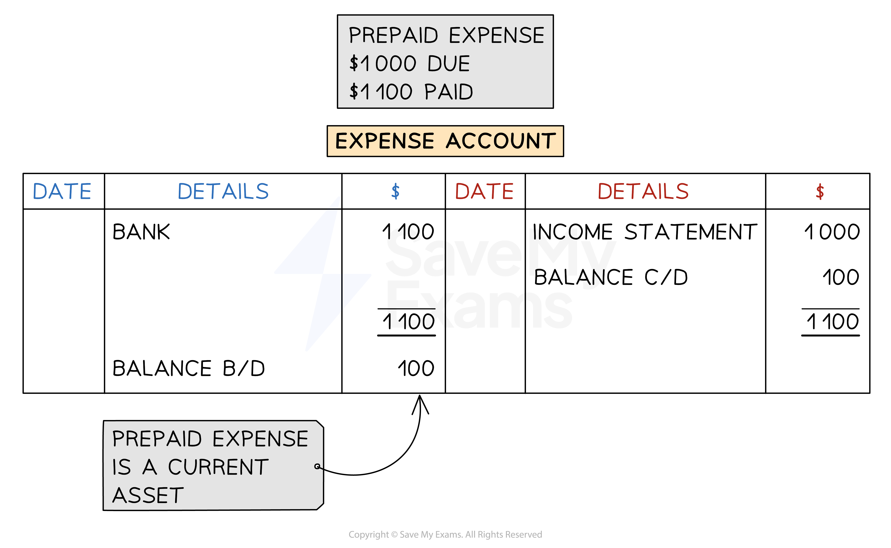
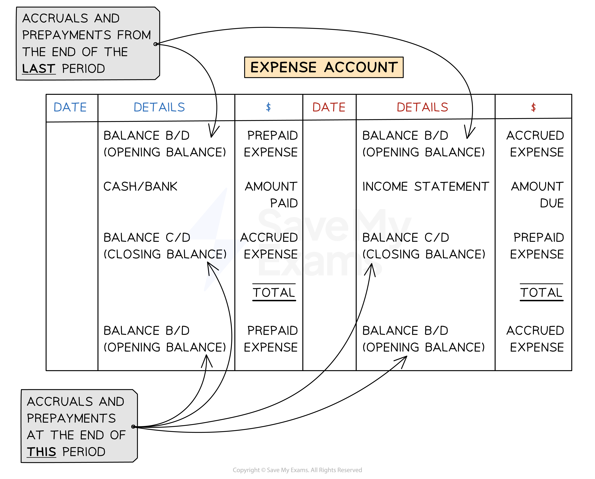

# Accrued & Prepaid Expenses

## Transferring Expenses to the Income Statement

> **Spec point** — `spcpt_zsVqrJjvNSXmShv7`

## Transferring expenses to the income statement

### How do I record expenses in the income statement?

- The **accounting concept **of **accruals **states that **expenses** should be **recorded** for the **financial period** in which **they are incurred**
- The **value posted to the income statement** for an expense should be the **actual amount invoiced for that period**
- **Entries** are made in the **expense account**:

  - **During the financial period** when payments are made
  - At the **end of the financial period**

|   | **Payments made during the financial period** | **At the end of the financial period** |
|---|---|---|
| **Account to debit** | Expense account | Income statement |
| **Account to credit** | Cash or bank account | Expense account |
| **Amount to record** | The amount paid | The amount due to suppliers for the financial period |

### How do I calculate the amount to charge to the income statement for an expense?

- In an exam, you will likely be given information about an **invoice for an expense** for a **period that** **does not fully align with the financial period**

  - For example, the **financial period **might be from **March 2023 to February 2024** but an **invoice** for an expense might be for **August 2023 to July 2024**
  
    - Only the amount for **August 2023 to February 2024** should be posted to the income statement

- **STEP 1**
Find the **amount due per month**

  - Divide the total amount by the number of months in the invoice period
- **STEP 2**
Find the **amount** of the invoice **due in that financial period**

  - **Multiply** the **amount per month** by the **number of months** that are also in the financial period
- There might be **multiple invoices** which cover the financial period

  - Find the **amount of each** which is due in the financial statement
  - **Add these amounts together** to get the total amount due

> **Exam Hint**
> It can help to write out the months involved and identify which ones belong in the financial period.

> **Worked Example**
> Soraia is a trader. Soraia pays her rent on 1 February each year for the following 12 months.
> 
> On 1 February 2023, she pays \$6 420 for rent and on 1 February 2024 she pays \$8 040 for rent.
> 
> How much should Soraia include for rent in her income statement for the year ended 30 April 2024?
> 
> Answer
> 
> > *The invoice period is from February 2023 to January 2024.*
> 
> > *The financial period is from May 2023 to April 2024.*
> 
> > *\$6 420 is for the 12 months from February 2023 to January 2024.*
> 
> |   | > *Current financial period* |   |   |   |   |   |   |   |   |   |   |   |   |   |   |   |   |   |   |   |   |   |   |
> |---|---|---|---|---|---|---|---|---|---|---|---|---|---|---|---|---|---|---|---|---|---|---|---|
> | > *F* | > *M* | > *A* | > *M* | > *J* | > *J* | > *A* | > *S* | > *O* | > *N* | > *D* | > *J* | > *F* | > *M* | > *A* | > *M* | > *J* | > *J* | > *A* | > *S* | > *O* | > *N* | > *D* | > *J* |
> | > *\$6 420 rent for the year* | > *\$8 040 rent for the year* |   |   |   |   |   |   |   |   |   |   |   |   |   |   |   |   |   |   |   |   |   |   |
> 
> > *Only amounts due between May 2023 and January 2024 are included in the financial period.*
> 
> - *STEP 1**: Divide by 12 to find the monthly expense*
> 
>   - *\$6 420 ÷ 12 = \$535*
> - *STEP 2**: Find the part of this payment to be included in the income statement*
> 
>   - *9 months (M-J-J-A-S-O-N-D-J)*
>   - *\$535 ✕ 9 = \$4 815*
> 
> > *\$8 040 is for the 12 months from February 2024 to January 2025.*
> 
> > *Only amounts due between February 2024 and April 2024 are included in the financial period.*
> 
> - *STEP 1**: Divide by 12 to find the monthly expense*
> 
>   - *\$8 040 ÷ 12 = \$670*
> - *STEP 2**: Find the part of this payment to be included in the income statement*
> 
>   - *3 months (F-M-A)*
>   - *\$670 ✕ 3 = \$2 010*
> 
> > *Add the two values together to find the amount for the income statement. *
> 
> *\$4 815 + \$2 010 =* **\$6 825**

## Accrued Expenses

> **Spec point** — `spcpt_QtChwZW4N4qHfFFB`

## Accrued expenses

### What is an accrued expense?

- An **accrued expense** is an expense that is **still owed** at the **end of a financial period**

  - This is also called an **accrual**
  - The expense is **in arrears**
- Accrued expenses can occur at the end of a financial period when a** business pays less than the amount due** in that period

  - This usually happens when the **invoice period** of an expense **does not align** with the **financial period** of the business
  - The business might** pay at the end of the invoice period**
  
    - However, this might be **after the end of current financial period**
- An accrued expense is a **liability** to the business

  - The business **owes money**

### How do I record accrued expenses?

- The **expense account** will have a **credit balance** if there is an **accrual** at the end of the financial period

  - This indicates that it is a** liability,** as the business still owes money for that period
- The **full amount that is due** for the period is stated on the **income statement**
- The **amount that is accrued** appears on the **statement of financial position** as a **current liability**

  - It is included in the amount for **other payables**

*Example of an expense account with an accrual*

## Prepaid Expenses

> **Spec point** — `spcpt_Xp3btZQZMhCwnFDT`

## Prepaid expenses

### What is a prepaid expense?

- A **prepaid expense** is an expense for the **next financial period** that is **paid in advance** during the current financial period

  - This is also called a **prepayment**
- Prepaid expenses can occur at the end of a financial period when a** business pays more than the amount due** in that period

  - This commonly happens when the **invoice period** of an expense **does not align** with the **financial period** of the business
  - The business might** **pay an expense** in full as soon as they receive an invoice **
  
    - However, this invoice might also cover part of the **next financial period**
- A prepaid expense is an **asset** to the business

  - The business has paid too much to the supplier for that period
  - Technically, the **business is owed money** by the supplier

### How do I record prepaid expenses?

- The **expense account** will have a **debit balance** if there is a **prepayment** at the end of the financial period

  - This indicates that it is an** asset,** as the business has already made payments that relate to the next financial period
- The **full amount that is due** **for the period** is stated on the **income statement**
- The **amount that is prepaid** appears on the **statement of financial position** as a **current asset**

  - It is included in the amount for **other receivables**

*Example of an expense account with a prepayment*

## Expense Accounts with Accruals & Prepayments

> **Spec point** — `spcpt_P7KFwMnmtRv7KfXx`

## Expense accounts with accruals & prepayments

### How do I calculate the value to transfer to the income statement?

- You could be asked to find the find value to transfer to the income statement

  - This is the **amount that is due** for that financial period
- **STEP 1**
Start with the **amount that has been paid** during the current financial period
- **STEP 2**
Deal with any amounts carried over from the **previous financial period**

  - **Subtract **the amount if it is an **accrual**
  
    - Because this amount was not due in the current period
    - It was due in the **previous **period
  - **Add **the amount if it is a **prepayment**
  
    - Because this amount is due in the **current **period
- **STEP 3**
Deal with any amounts that will be carried over to the **next financial period**

  - **Add **the amount if it is an **accrual**
  
    - Because this amount is due in the **current **period
  - **Subtract **the amount if it is a **prepayment**
  
    - Because this amount is not due in the current period
    - It will be due in the **next **period

### How do I calculate the amount paid for an expense within a financial period?

- You could be asked to find the **amount paid** within a financial period

  - This might be **different **to the **amount that is due** for that period
- The method is the **opposite **of the previous method
- **STEP 1**
Start with the **amount that is due** for the current financial period
- **STEP 2**
Deal with any amounts carried over from the **previous financial period**

  - **Add **the amount if it is an **accrual**
  
    - Because this should have been paid in the **current **period
  - **Subtract **the amount if it is a **prepayment**
  
    - Because this was not paid in the current period
    - It was paid in the **previous **period
- **STEP 3**
Deal with any amounts that will be carried over to the **next financial period**

  - **Subtract **the amount if it is an **accrual**
  
    - Because this has not been paid during the current period
    - It will be paid in the **next **period
  - **Add **the amount if it is a **prepayment**
  
    - Because this was also paid during the **current **period

> **Exam Hint**
> Try to understand the logic behind the two methods above rather than memorising them.
> 
> - If you need to find the amount to include on the **income statement**, then consider **which amounts are due** in the current financial period.
> - If you need to find the amount that has** been paid**, then consider **which amounts were paid** during the current financial period.

### How do I calculate a missing value in an expense account?

- You can use a **ledger account** to find any missing value

  - Fill in the **amounts** that you know on the **correct sides**
  - Find the **missing value** which** balances** the account
- You can use this method to find the **amount paid** for an expense as an alternative to the previous method

*Layout of an expense account showing the entries on each side for accruals and prepayments*

> **Worked Example**
> Garry is charged \$4 200 each year for commission. At the start of the financial year, Garry was in arrears of \$700 for commission. At the end of the financial year, Garry owed three months’ commission.
> 
> How much did Garry pay for commission during the financial year?
> 
> Answer
> 
> > *Find the accrual at the end of the year.*
> 
> - *STEP 1**: Divide the yearly charge by 12 to get the monthly charge*
> 
>   - *\$4 200 ÷ 12 = \$350*
> - *STEP 2**: Multiply it by 3 to find the accrual at the end of the year*
> 
>   - *\$350 ✕ 3 = \$1 050*
> 
> > *Deal with the accruals at the start and end of the year.*
> 
> - *Garry started the year with an accrual *
> 
>   - *so he also needed to pay that amount during the year*
>   - *add this to the yearly charge*
> - *Garry ended the year with an accrual*
> 
>   - *so he had not paid that during the year*
>   - *subtract this from the yearly charge*
> 
> *\$4 200 + \$700 - \$1 050 =* **\$3 850**

> **Exam Hint**
> You might be asked to complete an expense account which deals with two expenses together. You would complete this using the same method. You can combine the balances if they appear on the same side. If you combine them, it is good practice to show both values separately as well as the combined total. You can combine the entries for the income statement in a similar way as shown in the following worked example.

> **Worked Example**
> Yuzra combines rent and rates into one single ledger account.
> 
> On 1 January 2023
> 
> - \$500 was owed for rent
> - \$800 was owed for rates
> 
> On 1 January 2024
> 
> - \$400 was owed for rent
> - \$200 was prepaid for rates
> 
> During the year (2023)
> 
> - \$4 900 was paid for rent by cheque
> - \$2 300 was paid for rates by cheque
> 
> Prepare the rent and rates account in the ledger for Yuzra for the financial year ended 31 December 2023. Balance the account and bring down the balances on 1 January 2024. Clearly show the amount that is transferred to the income statement
> 
> Answer
> 
> > *Identify which side each amount needs to be posted to:*
> 
> - *On 1 January 2023, both amounts were owed by Yuzra*
> 
>   - *Therefore they represent liabilities*
>   - *The opening balances will appear on the credit side*
> - *On 1 January 2024, Yuzra owed rent*
> 
>   - *The opening balance for January 2024 will be on the credit side*
>   - *Therefore the closing balance for December 2023 will be on the debit side*
> - *On 1 January 2024, Yuzra had prepaid rates which represents an asset*
> 
>   - *The opening balance for January 2024 will be on the debit side*
>   - *Therefore the closing balance for December 2023 will be on the credit side*
> 
> > *Deal with the payments during the year:*
> 
> - *The payments for rent and rates will be on the debit side*
> 
>   - *Because they would appear on the credit side in the cash book*
> 
> > *Calculate the amount that should be transferred to the income statement for rent and rates. You can either do this by balancing the account for rent and rates separately or by calculating how much should have been paid for the financial year.*
> 
> - *Rent: \$4 900 (amount paid) *
> 
>   - *- \$500 (amount owed from last year) *
>   - *+ \$400 (amount owed at end of this year) *
>   - *= \$4 800*
> - *Rates: \$2 300 (amount paid) *
> 
>   - *- \$800 (amount owed from last year)*
>   - *- \$200 (amount prepaid for next year) *
>   - *= \$1 300*
> 
> **Final answer:** **Yuzra**
> **Rent and Rates Account**
> 
> | **Final answer:** **Date** | **Final answer:** **Details** | **Final answer:** **\$** | **Final answer:** **Date** | **Final answer:** **Details** | **Final answer:** **\$** |
> |---|---|---|---|---|---|
> | **Final answer:** **2023**  **Final answer:** **Dec 31** | **Final answer:** **Bank**  **Final answer:** **   Rent 4 900**  **Final answer:** **   Rate 2 300** | **Final answer:** **7 200** | **Final answer:** **2023**  **Final answer:** **Jan 1** | **Final answer:** **Balance b/d**  **Final answer:** **   Rent 500**  **Final answer:** **   Rates 800** | **Final answer:** **1 300** |
> | **Final answer:** **Dec 31** | **Final answer:** **Balance c/d (rent)** | **Final answer:** **400** | **Final answer:** **Dec 31** | **Final answer:** **Income statement**  **Final answer:** **   Rent 4 800**  **Final answer:** **   Rates 1 300    ** | **Final answer:** **6 100** |
> |   |   | <u>            </u> | **Final answer:** **Dec 31** | **Final answer:** **Balance c/d (rates)** | **Final answer:** **200** |
> |   |   | **Final answer:** **7 600** |   |   | **Final answer:** **7 600** |
> | **Final answer:** **2024**  **Final answer:** **Jan 1** | **Final answer:** **Balance b/d (rates)** | **Final answer:** **200** | **Final answer:** **2024**  **Final answer:** **Jan 1** | **Final answer:** **Balance b/d (rent)** | **Final answer:** **400** |
