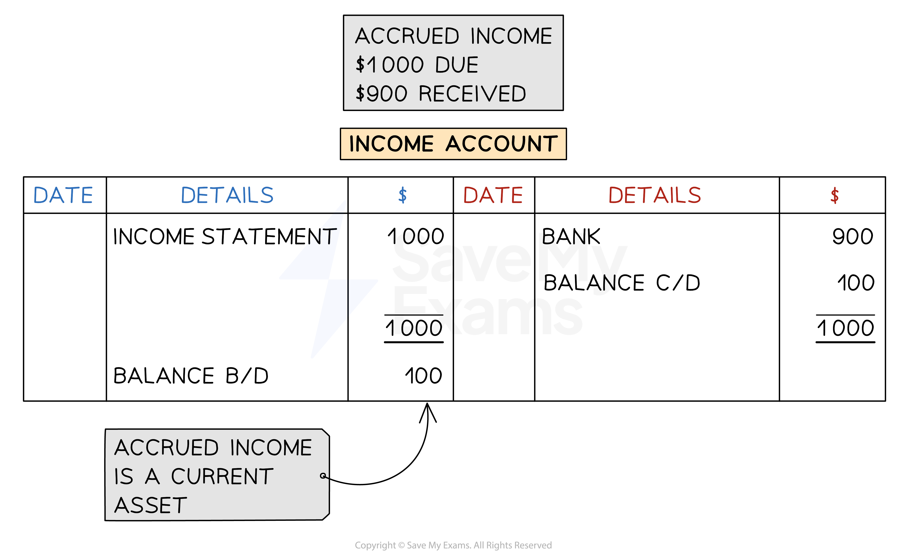
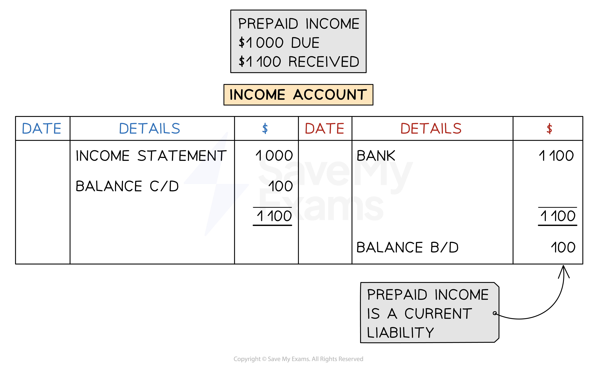
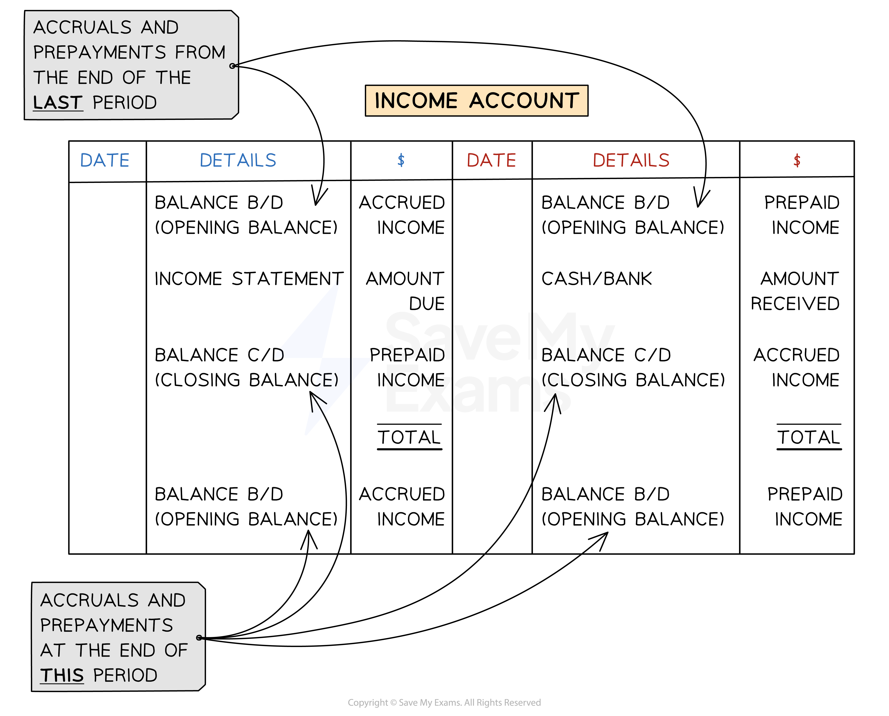

# Accrued & Prepaid Income

## Transferring Income to the Income Statement

> **Spec point** — `spcpt_3NQNy3Qw9ZmJ4Zdm`

## Transferring income to the income statement

### How do I record income in the income statement?

- The **accounting concept **of **accruals **states that **income** should be **recorded** for the **financial period** in which **it is received**
- The **value posted to the income statement** for an income account should be the **actual amount invoiced for that period**
- **Entries** are made in the **income account**:

  - **During the financial period** when payments are received
  - At the **end of the financial period**

|   | **Payments made during the financial period** | **At the end of the financial period** |
|---|---|---|
| **Account to debit** | Cash or bank account | Income account |
| **Account to credit** | Income account | Income statement |
| **Amount to record** | The amount received | The amount due from customers for the financial period |

### How do I calculate the amount to transfer to the income statement for an income?

- In an exam, you will likely be given information about an **invoice for an income** for a **period that** **does not fully align with the financial period**

  - For example, the **financial period **might be from **March 2023 to February 2024** but an **invoice** for an income might be for **August 2023 to July 2024**
  
    - Only the amount for **August 2023 to February 2024** should be posted to the income statement
- **STEP 1**
Find the **amount due per month**

  - Divide the total amount by the number of months in the invoice period
- **STEP 2**
Find the **amount** of the invoice **due in that financial period**

  - **Multiply** the **amount per month** by the **number of months** that are also in the financial period
- There might be **multiple invoices** which cover the financial period

  - Find the **amount of each** which is due in the financial statement
  - **Add these amounts together** to get the total amount due

> **Exam Hint**
> It can help to write out the months involved and identify which ones belong in the financial period.

> **Worked Example**
> Tomas is a trader. Tomas receives payment for commission on 1 March each year for the following 12 months.
> 
> On 1 March 2023, he receives \$3 000 commission and on 1 March 2024 he receives \$3 300 commission.
> 
> How much should Tomas include for commission in his income statement for the year ended 30 April 2024?
> 
> Answer
> 
> > *The invoice periods are from March 2023 to February 2024, and from March 2024 to February 2025.*
> 
> > *The financial period is from May 2023 to April 2024.*
> 
> > *\$3 000 is for the 12 months from March 2023 to February 2024.*
> 
> |   | > *Current financial period* |   |   |   |   |   |   |   |   |   |   |   |   |   |   |   |   |   |   |   |   |   |   |
> |---|---|---|---|---|---|---|---|---|---|---|---|---|---|---|---|---|---|---|---|---|---|---|---|
> | > *M* | > *A* | > *M* | > *J* | > *J* | > *A* | > *S* | > *O* | > *N* | > *D* | > *J* | > *F* | > *M* | > *A* | > *M* | > *J* | > *J* | > *A* | > *S* | > *O* | > *N* | > *D* | > *J* | > *F* |
> | > *\$3 000 commission for the year* | > *\$3 300 commission for the year* |   |   |   |   |   |   |   |   |   |   |   |   |   |   |   |   |   |   |   |   |   |   |
> 
> > *Only May 2023 to February 2024 is included in the financial period.*
> 
> - *STEP 1**: Divide by 12 to find the monthly payment*
> 
>   - *\$3 000 ÷ 12 = \$250*
> - *STEP 2**: Find the part of the total payment to be included in the income statement*
> 
>   - *10 months (M-J-J-A-S-O-N-D-J-F)*
>   - *\$250 ✕ 10 = \$2 500*
> 
> > *\$3 300 is for the 12 months from March 2024 to February 2025.*
> 
> > *Only March 2024 to April 2024 is included in the financial period.*
> 
> - *STEP 1**: Divide by 12 to find the monthly payment*
> 
>   - *\$3 300 ÷ 12 = \$275*
> - *STEP 2**: Find the part of the total payment to be included in the income statement*
> 
>   - *2 months (M-A)*
>   - *\$275 ✕ 2 = \$550*
> 
> > *Add the two values together to find the amount for the income statement. *
> 
> *\$2 500 + \$550 =* **\$3 050**

## Accrued Income

> **Spec point** — `spcpt_NVvgM5vtKJd5Y8c4`

## Accrued income

### What is an accrued income?

- An **accrued income** is an income that is **still owed** to the business at the **end of a financial period**

  - This is also called an **accrual**
  - The income is **in arrears**
- Accrued income can occur at the end of a financial period when a** business receives less than the amount due** in that period

  - This commonly happens when the **invoice period** of an income **does not align** with the **financial period** of the business
  - The business might** receive payment at the end of the invoice period**
  
    - However, this might be **after the end of the current financial period**
- An accrued income is an **asset** to the business

  - The business is **owed money **by its customers

### How do I record accrued income?

- The **income account** will have a **debit balance** if there is an **accrual** at the end of the financial period

  - This indicates that it is an** asset,** as the business is still owed money from customers for that period
- The **full amount that is due** for the period is stated on the **income statement**
- The **amount that is accrued** appears on the **statement of financial position** as a **current asset**

  - It is included in the amount for **other receivables**

*Example of an income account with an accrual*

## Prepaid Income

> **Spec point** — `spcpt_9XfSNcmSJk4NHDZT`

## Prepaid income

### What is a prepaid income?

- A **prepaid income** is an income for the next financial payment that is **received in advance** during the current **end of a financial period **

  - This is also called a **prepayment**
- Prepaid income can occur at the end of a financial period when a** business receives more than the amount due** in that period

  - This commonly happens when the **invoice period** of an income **does not align** with the **financial period** of the business
  - The business might** receive payment in full as soon as they issue an invoice**
  
    - However, this invoice might also cover part of the next** financial period**
- A prepaid income is a **liability** to the business

  - The business has received too much from the customer for that period
  - Technically, the **business owes that money** to the customer for that period

### How do I record prepaid income?

- The **income account** will have a **credit balance** if there is a **prepayment** at the end of the financial period

  - This indicates that it is a** liability**
- The **full amount that is due** for the period is stated on the **income statement**
- The **amount that is prepaid** appears on the **statement of financial position** as a **current liability**

  - It is included in the amount for **other payables**

*Example of an income account with a prepayment*

## Income Accounts with Accruals & Prepayments

> **Spec point** — `spcpt_qmQ6BhVQM2drgvVM`

## Income accounts with accruals & prepayments

### How do I calculate the value to transfer to the income statement?

- You could be asked to find the find value to transfer to the income statement

  - This is the **amount that is due** for that financial period
- **STEP 1**
Start with the **amount that has been received** during the current financial period
- **STEP 2**
Deal with any amounts carried over from the **previous financial period**

  - **Subtract **the amount if it is an **accrual**
  
    - Because this amount was not due in the current period
    - It was due in the **previous **period
  - **Add **the amount if it is a **prepayment**
  
    - Because this amount is due in the **current **period
- **STEP 3**
Deal with any amounts that will be carried over to the **next financial period**

  - **Add **the amount if it is an **accrual**
  
    - Because this amount is due in the **current **period
  - **Subtract **the amount if it is a **prepayment**
  
    - Because this amount is not due in the current period
    - It will be due in the **next **period

### How do I calculate the amount received from an income within a financial period?

- You could be asked to find the **amount received** within a financial period

  - This might be **different **to the **amount that is due** for that period
- The method is the **opposite **of the previous method
- **STEP 1**
Start with the **amount that is due** for the current financial period
- **STEP 2**
Deal with any amounts carried over from the **previous financial period**

  - **Add **the amount if it is an **accrual**
  
    - Because this should have been received in the **current **period
  - **Subtract **the amount if it is a **prepayment**
  
    - Because this was not received in the current period
    - It was received in the **previous **period
- **STEP 3**
Deal with any amounts that will be carried over to the **next financial period**

  - **Subtract **the amount if it is an **accrual**
  
    - Because this has not been received during the current period
    - It will be received in the **next **period
  - **Add **the amount if it is a **prepayment**
  
    - Because this was also received during the **current **period

> **Exam Hint**
> ry to understand the logic behind the two methods above rather than memorising them.
> 
> - If you need to find the amount to include on the **income statement**, then consider **which amounts are due** in the current financial period.
> - If you need to find the amount that has** been received**, then consider **which amounts were received** during the current financial period.

### How do I calculate a missing value in an income account?

- You can use a **ledger account** to find any missing value

  - Fill in the **amounts** that you know on the **correct sides**
  - Find the **missing value** which** balances** the account
- You can use this method to find the **amount received **from an income as an alternative to the previous method

*Layout of an income account showing the entries on each side for accruals and prepayments*

> **Worked Example**
> Hussain receives rent from Sayid.
> 
> On 1 January 2023, Sayid owed Hussain three months’ rent.
> 
> On 1 March 2023, Hussain receives a cheque from Sayid for \$8 400 for 16 months’ rent.
> 
> Prepare the rent receivable account in the ledger for Hussain for the financial year ended 31 December 2023. Balance the account and bring down the balances on 1 January 2024. Clearly show the amount that is transferred to the income statement
> 
> Answer
> 
> > *Sayid paid for 16 months:*
> 
> - *12 months for the financial year*
> - *three months for the arrears at the start*
> - *one month prepaid for the next year*
> 
> > *Find the accrual at the start of the year.*
> 
> - *STEP 1**: Divide the payment by 16 to get the monthly rent*
> 
>   - *\$8 400 ÷ 16 = \$525*
> - *STEP 2**: Multiply the monthly rent by 3 to find the accrual at the start of the year*
> 
>   - *\$525 ✕ 3 = \$1 575*
> 
> Find the amount due for the year ended 31 December.
> 
> - *Multiply the monthly rent by 12*
> 
>   - *\$525 ✕ 12 = \$6 300*
> 
> > *Identify which side of the rent receivable account to post each transaction:*
> 
> - *The payment from Sayid will be credited to the rent receivable account*
> 
>   - *Because it will be debited to the cash book*
> - *There is an accrual at the start of the year, which represents an asset*
> 
>   - *Therefore the opening balance will be on the debit side of the rent receivable account*
> - *The amount for the year is credited to the income statement*
> 
>   - *Therefore the rent receivable account will be debited*
> - *There is a prepayment at the end of the year, which represents a liability*
> 
>   - *Therefore there will be an opening balance on the credit side for the next year*
>   - *Therefore, the closing balance will be on the debit side for this year*
> 
> **Final answer:** **Hussain**
> **Rent Receivable Account**
> 
> | **Final answer:** **Date** | **Final answer:** **Details** | **Final answer:** **\$** | **Final answer:** **Date** | **Final answer:** **Details** | **Final answer:** **\$** |
> |---|---|---|---|---|---|
> | **Final answer:** **2023**  **Final answer:** **Jan 1** | **Final answer:** ** **  **Final answer:** **Balance b/d** | **Final answer:** **1 575** | **Final answer:** **2023**  **Final answer:** **Jan 1** | **Final answer:** **Bank** | **Final answer:** **8 400** |
> | **Final answer:** **Dec 31** | **Final answer:** **Income statement** | **Final answer:** **6 300** |   |   |   |
> | **Final answer:** **Dec 31** | **Final answer:** **Balance c/d** | **Final answer:** **525** |   |   | <u>             </u> |
> |   |   | **Final answer:** **8 400** |   |   | **Final answer:** **8 400** |
> |   |   |   | **Final answer:** **2024**  **Final answer:** **Jan 1** | **Final answer:** **Balance b/d** | **Final answer:** **525** |
