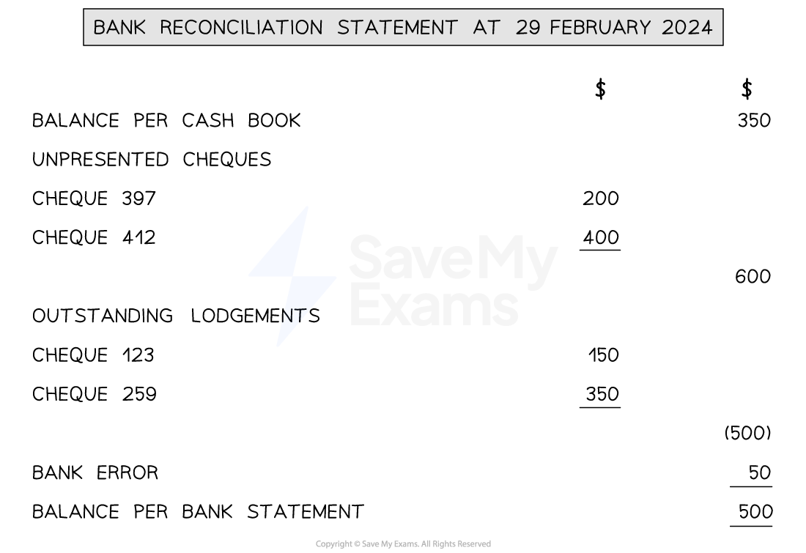

# Bank Reconciliation Statements

## Purpose of a Bank Reconciliation Statement

> **Spec point** — `spcpt_tCqRw4CM228rwGT8`

## Purpose of a bank reconciliation statement

### What is the purpose of a bank reconciliation statement?

- If the **balance** on the **bank statement** is **different** to the **bank balance** in the **cash book,** then the business produces a **bank reconciliation statement**
- This is a statement which **explains why the balances are different**
- The cash book can be **updated** with **missing transactions** that are **on the bank statement**
- However, the business **cannot update the bank statement** with **missing transactions **that are **in the cash book**

  - A bank reconciliation statement is needed to show these
- It contains details of any:

  - Unpresented cheques
  - Uncredited deposits
  - Errors

## Preparing a Bank Reconciliation Statement

> **Spec point** — `spcpt_tVCyVwWxrQhqV6Xx`

## Preparing a bank reconciliation statement

### How do I prepare a bank reconciliation statement?

- **STEP 1**
**Update** the **cash book** using the bank statement

  - Calculate the **updated balance**
- **STEP 2**
**Start the bank reconciliation statement **with the **updated balance in the cash book**

  - If the balance is on the **credit **side then this means the bank should be **overdrawn**
  
    - Put the value in brackets and treat it as a negative number
- **STEP 3**
**Add** any **unpresented cheques**

  - These are the **credit entries in the cash book** that are missing from the bank statement
  - If there is **more than one**, then
  
    - **Add these amounts together** in a **separate column** of the bank reconciliation statement
    - Put the** total** in the **end column**
  - **Add the total** to the balance in the cash book
- **STEP 4**
**Subtract** any **outstanding lodgements**

  - These are the **debit entries in the cash book** that are missing from the bank statement
  - If there is **more than one**, then
  
    - **Add these amounts together** in a **separate column** of the bank reconciliation statement
    - Put the **total** in the **end column**
  - **Subtract the total** from the balance in the cash book
- **STEP 5**
Deal with any **bank errors**

  - If the error has** decreased the balance** on the bank statement then **subtract **this amount from the balance in the cash book
  - If the error has** increased the balance** on the bank statement then **add **this amount to the balance in the cash book
- **STEP 6**
**Check** that this amount is **equal **to the **bank balance** **shown on the bank statement**

  - If the balance is **negative,** then the **bank balance **should be** overdrawn**
  - This means the bank balance should have a **debit balance**

*Example of a bank reconciliation statement*

> **Exam Hint**
> Compare the cash book and the bank statement. If a transaction appears on both of them, then put a tick next to the transaction in the cash book and on the bank statement. Then you just need to use the unticked entries in the cash book to complete a bank reconciliation statement.

### Can I start the bank reconciliation statement with the balance shown on the bank statement?

- You can create the bank reconciliation statement using the **reverse order**:

  - **Start** with the **balance shown on the bank statement**
  - **Subtract** the **unpresented cheques**
  - **Add** the **outstanding lodgements**
  - **Check **that it is **equal** to the **balance shown in the cash book**

> **Exam Hint**
> Always double-check whether the balance is positive or negative. This is the main reason why students lose marks in an exam!

> **Worked Example**
> Leo is a sole trader. On 31 March 2024, his bank statement showed that his business bank account was \$345 overdrawn. On the same date, his cash book showed a credit balance of \$395. Leo identified that some transactions were entered into his cash book but did not appear on his bank statement. These transactions are shown in the following extract of the cash book.
> 
> **Extract of Cash Book (Bank columns)**
> 
> | **Date** | **Details** | **\$** | **Date** | **Details** | **\$** |
> |---|---|---|---|---|---|
> | Mar 9 | Jacob | 500 | Mar 5 | Pru | 200 |
> | 29 | Commission receivable | 300 | 23 | Wages | 750 |
> 
> Leo also noticed an error on his bank statement. A cheque paid for \$100 for office expenses had been mistakenly processed twice by the bank.
> 
> Prepare the bank reconciliation statement for Leo at 31 March 2024.
> 
> Answer
> 
> - *The cash book has a credit balance*
> 
>   - *Therefore this is a negative amount*
> - *The credit entries are the unpresented cheques*
> 
>   - *Add their total to the cash book balance*
> - *The debit entries are the outstanding lodgements*
> 
>   - *Subtract their total from the cash book balance*
> - *The error has caused his bank balance to be lower than it should be*
> 
>   - *Therefore, subtract the amount of the bank error from the cash book balance*
> - *Leo’s business bank account is overdrawn*
> 
>   - *So the bank reconciliation statement will end with a negative amount*
> 
> **Final answer:** **Leo**
> **Bank Reconciliation Statement at 31 March 2024**
> 
> |   | **Final answer:** **\$** | **Final answer:** **\$** |
> |---|---|---|
> | **Final answer:** **Balance per bank statement** |   | **Final answer:** **(395)** |
> | **Final answer:** **Unpresented cheques** |   |   |
> | **Final answer:** **   Pru** | **Final answer:** **200** |   |
> | **Final answer:** **   Wages** | **Final answer:** **750** |   |
> |   |   | **Final answer:** **950** |
> | **Final answer:** **Outstanding lodgements** |   |   |
> | **Final answer:** **   Jacob** | **Final answer:** **500** |   |
> | **Final answer:** **   Commission** | **Final answer:** **300** |   |
> |   |   | **Final answer:** **(800)** |
> | **Final answer:** **Bank error** |   | **Final answer:** **(100)** |
> | **Final answer:** **Balance per cash book** |   | **Final answer:** **(345)** |
> 
> > *Alternatively, it can be presented starting with the balance in the cash book.*
> 
> **Final answer:** **Leo**
> **Bank Reconciliation Statement at 31 March 2024**
> 
> |   | **Final answer:** **\$** | **Final answer:** **\$** |
> |---|---|---|
> | **Final answer:** **Balance per cash book** |   | **Final answer:** **(345)** |
> | **Final answer:** **Unpresented cheques** |   |   |
> | **Final answer:** **   Pru** | **Final answer:** **200** |   |
> | **Final answer:** **   Wages** | **Final answer:** **750** |   |
> |   |   | **Final answer:** **(950)** |
> | **Final answer:** **Outstanding lodgements** |   |   |
> | **Final answer:** **   Jacob** | **Final answer:** **500** |   |
> | **Final answer:** **   Commission** | **Final answer:** **300** |   |
> |   |   | **Final answer:** **800** |
> | **Final answer:** **Bank error** |   | **Final answer:** **100** |
> | **Final answer:** **Balance per bank statement** |   | **Final answer:** **(395)** |
