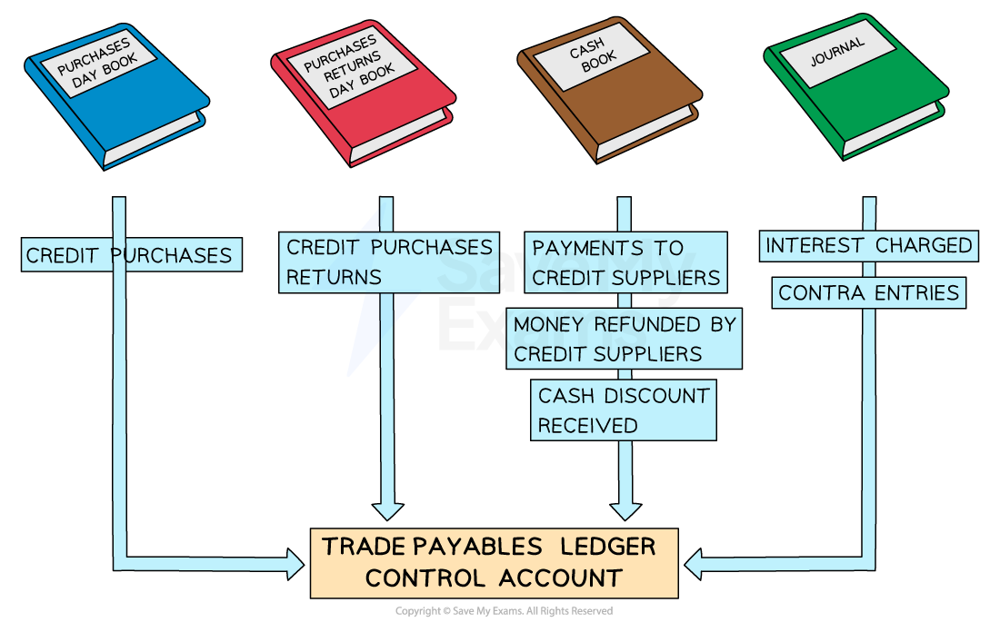

# Trade Payables Ledger Control Account

## Trade Payables Ledger Control Account

> **Spec point** — `spcpt_ypnw89wqhV7JFHqD`

## Trade payables ledger control account

### Where do I find the information to complete a trade payables ledger control account?

- The** books of original entry **are used to find the **totals**
- The **purchases day book **is used to find the total value of **credit purchases**
- The **purchases returns day book **is used to find the total value of **returned goods**
- The **cash book** is used to find the total values for:

  - **Money paid** to credit suppliers
  - **Money refunded **by credit suppliers
  - **Cash discounts received **from credit suppliers
- The** journal **is used to find the total values for:

  - **Interest charged** by credit suppliers on overdue accounts
  - ***Contra entries*** against the sales ledger

> **Exam Hint**
> The ledger accounts are not used when preparing control accounts. The information is taken from the books of original entry.

### Why might there be a debit balance in a trade payables ledger control account?

- A **trade payables account** will usually have a **credit balance**

  - This indicates that the business **owes the credit supplier money**
- However, a trade payables account could have a **debit balance**

  - This indicates that the **credit supplier owes the business money**
- **Debit balances** can occur when:

  - The business **pays** credit suppliers** in advance**
  - The business makes **overpayments** to credit suppliers
  - The business is **owed refunds** from the credit suppliers
  
    - The business has paid for goods and then returned them
- **Debit and credit balances** are **totalled separately** in the trade payables ledger control account

  - This means there could be **two opening balances** and **two closing balances**

### What is the layout of a trade payables ledger control account?

- The layout looks very **similar to the layout of a trade payables ledger account**
- The main differences are:

  - There could be two opening balances
  - There could be two closing balances
- Use the name of the **book of original entry **as the detail

  - Put more information in brackets

| **Entries on the debit side:** | **Entries on the credit side:** |
|---|---|
| - **Opening balance**    - Money that credit suppliers owe  - **Purchases returns day book**    - Credit purchases only - **Cash book**    - Bank        - Bank transfers to credit suppliers   - Cash        - Cash paid to credit suppliers   - Discount received - **Journal**    - Contra | - **Opening balance**    - Money owed to credit suppliers - **Purchases day book**    - Credit purchases - **Journal**    - Interest |

*Layout of a trade payables ledger control account*

> **Exam Hint**
> Remember that cash purchases are not recorded in the payables ledger. Only enter cash paid to credit suppliers when the cash is used to make a payment towards an invoice.

> **Worked Example**
> Mika is a trader. He has provided the following information
> 
> | **2023** | \$ |   |
> |---|---|---|
> | **1 March** | Trade payables ledger control account credit balance | 17 150 |
> |   | Trade payables ledger control account debit balance | 1 350 |
> | **2024** |   |   |
> | **29 February** | Totals for the year: |   |
> |   | Credit purchases | 231 200 |
> |   | Cash purchases | 5 000 |
> |   | Bank payments to credit suppliers | 210 600 |
> |   | Cash payments to credit suppliers | 1 500 |
> |   | Returns to credit suppliers | 6 400 |
> |   | Discount received | 3 200 |
> |   | Contra entries | 2 100 |
> |   | Interest charged by credit suppliers | 800 |
> |   |   |   |
> |   | Trade payables ledger control account credit balance | ? |
> |   | Trade payables ledger control account debit balance | 450 |
> 
> Prepare the trade payables ledger control account for the year ended 29 February 2024. Balance the account and bring down the balances on 1 March 2024.
> 
> Answer
> 
> > *Ignore the cash purchases, as they do not affect the payables ledger accounts.*
> 
> > *Enter the balances and totals on the correct sides of the account.*
> 
> > *Transactions which increase the amount the business owes appear on the credit side.*
> 
> - *Credit purchases*
> - *Interest*
> 
> > *Transactions which reduce the amount the business owes appear on the debit side.*
> 
> - *Payments to credit suppliers using cash or bank transfers*
> - *Purchases returns*
> - *Discount received*
> - *Contra entries*
> 
> > *At the end of the month, there is a \$450 debit balance. On 1 March 2024, there will be a debit balance of \$450; therefore, there will need to be a balance c/d on the credit side on 29 February 2024.*
> 
> **Final answer:** **Mika**
> **Trade Payables Ledger Control Account**
> 
> | **Final answer:** **Date** | **Final answer:** **Details** | **Final answer:** **\$** | **Final answer:** **Date** | **Final answer:** **Details** | **Final answer:** **\$** |
> |---|---|---|---|---|---|
> | **Final answer:** **2023**  **Final answer:** **Mar 1** | **Final answer:** ** **  **Final answer:** **Balance b/d** | **Final answer:** **1 350** | **Final answer:** **2023**  **Final answer:** **Mar 1** | **Final answer:** **Balance b/d** | **Final answer:** **17 150** |
> | **Final answer:** **2024**  **Final answer:** **Feb 29** | **Final answer:** ** **  **Final answer:** **Cash book (bank)** | **Final answer:** ** **  **Final answer:** **210 600** | **Final answer:** **2024**  **Final answer:** **Feb 29** | **Final answer:** **Purchases day book** | **Final answer:** **231 200** |
> | **Final answer:** **29** | **Final answer:** **Cash book (cash)** | **Final answer:** **1 500** | **Final answer:** **29** | **Final answer:** **Journal (interest)** | **Final answer:** **800** |
> | **Final answer:** **29** | **Final answer:** **Purchases returns day book** | **Final answer:** **6 400** | **Final answer:** **29** | **Final answer:** **Balance c/d** | **Final answer:** **450** |
> | **Final answer:** **29** | **Final answer:** **Cash book (discount received)** | **Final answer:** **3 200** |   |   |   |
> | **Final answer:** **29** | **Final answer:** **Journal (contra)** | **Final answer:** **2 100** |   |   |   |
> | **Final answer:** **29** | **Final answer:** **Balance c/d** | **Final answer:** **24 450** |   |   | **Final answer:** **                   ** |
> |   |   | **Final answer:** **249 600** |   |   | **Final answer:** **249 600** |
> | **Final answer:** **Mar 1** | **Final answer:** **Balance b/d** | **Final answer:** **450** | **Final answer:** **Mar 1** | **Final answer:** **Balance b/d** | **Final answer:** **24 450** |
