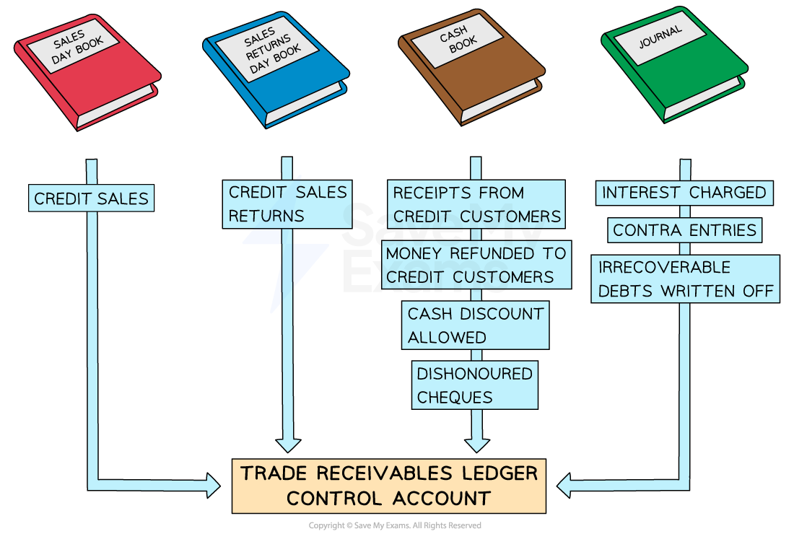

# Trade Receivables Ledger Control Account

## Trade Receivables Ledger Control Account

> **Spec point** — `spcpt_msF3FT2Jx5xG25xX`

## Trade receivables ledger control account

### What is a trade receivables ledger control account?

- A **trade receivables ledger control account** is an account that **summarises** all the **transactions** for** trade receivables**

  - It is not part of the double entry system

### Where do I find the information to complete a trade receivables ledger control account?

- The** books of original entry **are used to find the **totals**
- The **sales day book **is used to find the total value of **credit sales**
- The **sales returns day book **is used to find the total value of **returned goods**
- The **cash book** is used to find the total values for:

  - **Money received** from credit customers
  - **Money refunded **to credit customers
  - **Cash discounts allowed** to credit customers
  - ***Dishonoured cheques***** received** from credit customers
- The** journal **is used to find the total values for:

  - **Interest charged** to credit customers on overdue accounts
  - ***Contra entries*** against the purchases ledger
  - **Irrecoverable debts written off**

> **Exam Hint**
> The ledger accounts are not used when preparing control accounts. The information is taken from the books of original entry.

### Why might there be a credit balance in a trade receivables ledger control account?

- A **trade receivables account** will usually have a **debit balance**

  - This indicates that the **credit customer owes the business money**
- However, a trade receivables account could have a **credit balance**

  - This indicates that the **credit customer is owed money**
- **Credit balances** can occur when:

  - Credit customers **pay in advance** of buying goods
  - Credit customers make an **overpayment**
  - The business **owes refunds** to credit customers
  
    - The customers have paid for goods and then returned them
- **Debit and credit balances** are **totalled separately** in the trade receivables ledger control account

  - This means there could be **two opening balances** and **two closing balances**

### What is the layout of a trade receivables ledger control account?

- The layout looks very **similar to the layout of a trade receivables ledger account**
- The main differences are:

  - There could be two opening balances
  - There could be two closing balances
- Use the name of the **book of original entry **as the detail

  - Put more information in brackets

| **Entries on the debit side:** | **Entries on the credit side:** |
|---|---|
| - **Opening balance**    - Credit customers who owe money - **Sales day book**    - Credit sales only - **Journal**    - Interest - **Cash book**    - Dishonoured cheques from credit customers | - **Opening balance**    - Credit customers who are owed money - **Sales returns day book**    - Credit sales only - **Cash book**    - Bank        - Bank transfers from credit customers   - Cash        - Cash received from credit customers   - Discount allowed - **Journal**    - Irrecoverable debts   - Contra entries |

*Layout of a trade receivables ledger control account*

> **Exam Hint**
> Remember that cash sales are not recorded in the receivables ledger. Only enter cash received from credit customers when the cash is used to make a payment towards an invoice.

> **Worked Example**
> Kimi maintains a full set of account records. She provides the following information for February 2024.
> 
> |   | \$ |
> |---|---|
> | **On 1 February 2024** |   |
> | Trade receivables ledger control account debit balance b/d | 12 780 |
> | Trade receivables ledger control account credit balance b/d | 150 |
> | **Totals for February 2024** |   |
> | Credit sales | 25 470 |
> | Cash sales | 5 780 |
> | Credit sales returns | 7 000 |
> | Cheques received by credit customers | 18 450 |
> | Cash received by credit customers | 1 400 |
> | Discount allowed | 3 290 |
> | Interest charged to credit customers | 860 |
> | Contra purchases ledger | 1 050 |
> | Irrecoverable debts written off | 870 |
> 
> At 29 February, the total amount that Kimi owed to her credit customers was \$460.
> 
> Prepare the trade receivables ledger control account for February 2024. Balance the account and bring down the balances on 1 March 2024.
> 
> Answer
> 
> > *Ignore the cash sales, as they do not affect the receivables ledger accounts.*
> 
> > *Enter the balances and totals on the correct sides of the account. *
> 
> > *Transactions which increase the amount owed to the business appear on the debit side.*
> 
> - *Credit sales*
> - *Interest*
> 
> > *Transactions which reduce the amount owed to the business appear on the credit side.*
> 
> - *Receipts from credit customers using cash or bank transfers*
> - *Sales returns*
> - *Discount allowed*
> - *Irrecoverable debts*
> - *Contra entries*
> 
> > *On 1 March 2024, there will be a credit balance of \$460; therefore, there will need to be a balance c/d on the debit side on 29 February 2024.*
> 
> **Final answer:** **Kimi**
> **Trade Receivables Ledger Control Account**
> 
> | **Final answer:** **Date** | **Final answer:** **Details** | **Final answer:** **\$** | **Final answer:** **Date** | **Final answer:** **Details** | **Final answer:** **\$** |
> |---|---|---|---|---|---|
> | **Final answer:** **2024**  **Final answer:** **Feb 1** | **Final answer:** ** **  **Final answer:** **Balance b/d** | **Final answer:** **12 780** | **Final answer:** **2024**  **Final answer:** **Feb 1** | **Final answer:** **Balance b/d** | **Final answer:** **150** |
> | **Final answer:** **29** | **Final answer:** **Sales day book** | **Final answer:** **25 470** | **Final answer:** **29** | **Final answer:** **Sales returns day book** | **Final answer:** **7 000** |
> | **Final answer:** **29** | **Final answer:** **Journal (interest)** | **Final answer:** **860** | **Final answer:** **29** | **Final answer:** **Cash book (bank)** | **Final answer:** **18 450** |
> | **Final answer:** **29** | **Final answer:** **Balance c/d** | **Final answer:** **460** | **Final answer:** **29** | **Final answer:** **Cash book (cash)** | **Final answer:** **1 400** |
> |   |   |   | **Final answer:** **29** | **Final answer:** **Cash book (discount allowed)** | **Final answer:** **3 290** |
> |   |   |   | **Final answer:** **29** | **Final answer:** **Journal (contra)** | **Final answer:** **1 050** |
> |   |   |   | **Final answer:** **29** | **Final answer:** **Journal (irrecoverable debts)** | **Final answer:** **870** |
> |   |   | **Final answer:** **              ** | **Final answer:** **29** | **Final answer:** **Balance c/d** | **Final answer:** **7 360** |
> |   |   | **Final answer:** **39 570** |   |   | **Final answer:** **39 570** |
> | **Final answer:** **Mar 1** | **Final answer:** **Balance b/d** | **Final answer:** **7 360** | **Final answer:** **Mar 1** | **Final answer:** **Balance b/d** | **Final answer:** **460** |
