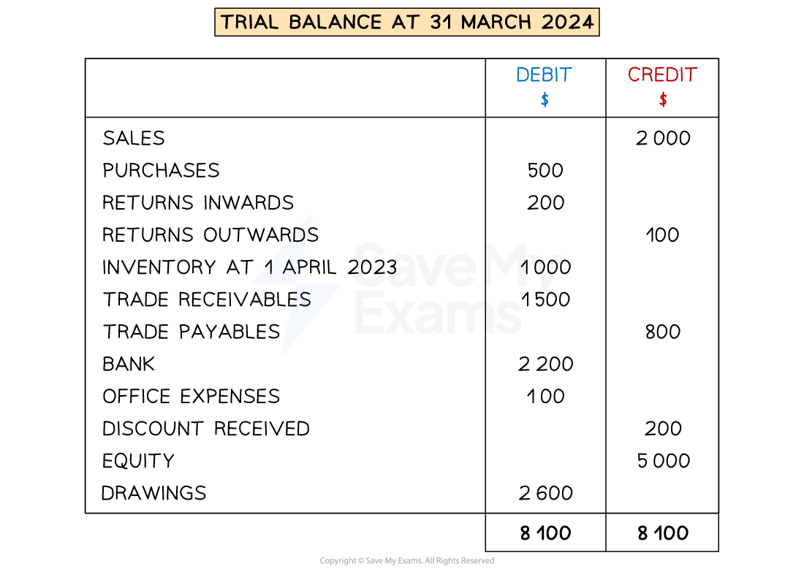

# The Trial Balance

## Uses & Limitations of a Trial Balance

> **Spec point** — `spcpt_pR24x4fHRXT2fsYr`

## Uses & limitations of a trial balance

### What is a trial balance?

- A** trial balance** is a **statement** which **lists all accounts** and their **balances** on a **particular date**

  - Each balance is placed either in the debit column or in the credit column
- The **totals** of the **debit** and **credit** columns are calculated

  - The totals should be equal
- A trial balance is **not part of the double entry system**
- The balance for the **inventory** account will always be the **opening balance**

  - This is because the current inventory is contained within the purchases account
  - This is dealt with once the balances are transferred to the income statement

*Example of a trial balance*

### What are the uses of a trial balance?

- A trial balance is used to check for **arithmetic errors** in the ledger accounts

  - If the balance of a ledger account has been miscalculated, it is likely that the totals in the trial balance will not be equal
- Preparing a trial balance **helps** with the **preparation of financial statements**

  - All the balances are in one place

### What are the limitations of a trial balance?

- **Not all errors** **are identified** by a trial balance

  - The totals may be equal despite there being errors
- You will need to use **other measures** to locate errors

  - Such as bank reconciliation statements and control accounts

## Preparing a Trial Balance

> **Spec point** — `spcpt_4JGrRT6ZTKHKBqp3`

## Preparing a trial balance

### How do I prepare a trial balance?

- You will likely be given a list of accounts and balances
- **STEP 1**
**Identify** whether each account should have a **debit or a credit balance**

  - The table below gives a summary of the different accounts
- **STEP 2**
Check that the total of the **debits** is **equal** to the total of the **credits**
- **STEP 3**
**Write each account** in the trial balance and put the balance in the correct column
- **STEP 4**
**Total** each column

| **Accounts with debit balances** | **Accounts with credit balances** |
|---|---|
| Purchases | Purchases returns (returns outwards) |
| Sales returns (returns inwards) | Sales (revenue) |
| Other expenses | Other income |
| Trade receivables | Trade payables |
| Bank | Bank overdraft |
| Other assets  (Including inventory, vehicles, machinery, etc) | Other liabilities  (Including bank loan, mortgage, etc) |
| Drawings | Equity |
|   | Provision for depreciation |
| Provision for doubtful debt |   |

> **Exam Hint**
> Check the totals agree before you write any accounts in the trial balance. This will help you spot any mistakes before you write anything in the trial balance.

### How do I amend a trial balance?

- You could be given a trial balance which contains errors

  - The balances could also be in the wrong columns
- **STEP 1**
**Correct the errors** to find the correct balances for each account
- **STEP 2**
**Double-check** whether each account has been **correctly identified as a debit or a credit**
- **STEP 3**
**Complete** a corrected trial balance

  - The totals will be equal

> **Worked Example**
> Dimitri is a sole trader. He has prepared a trial balance on 31 March 2024. However, it contains errors.
> 
> Dimitri
> Trial Balance at 31 March 2024
> 
> |   | Debit  \$ | Credit  \$ |
> |---|---|---|
> | Sales |   | 35 471 |
> | Purchases | 17 714 |   |
> | Returns outwards | 1 407 |   |
> | Discount received | 1 895 |   |
> | Rent paid |   | 5 321 |
> | General expenses | 2 087 |   |
> | Office equipment at cost | 20 000 |   |
> | Provision for depreciation of office equipment | 4 580 |   |
> | Trade receivables |   | 9 710 |
> | Trade payables | 3 980 |   |
> | Inventory | 7 060 |   |
> | Bank overdraft | 450 |   |
> | Equity at 1 April 2023 |   | 20 869 |
> | Drawings | 8 760 |   |
> |   | 67 933 | 71 371 |
> 
> Dimitri has included the value of the inventory on 31 March 2024, the value of the inventory on 31 March 2023 was \$2 000 lower than this value. Prepare a corrected trial balance at 31 March 2024.
> 
> Answer
> 
> - *STEP 1 - Correct any amounts*
> 
>   - *The value of inventory should be for 31 March 2023*
>   
>     - *\$7060 - \$2000 = \$5060*
> - *STEP 2 - Identify whether the balances should be debits or credits*
> 
>   - *The following should have debit balances:*
>   
>     - *Purchases*
>     - *Rent paid*
>     - *General expenses*
>     - *Office equipment at cost*
>     - *Trade receivables*
>     - *Inventory*
>     - *Drawings*
>   - *All other items should have credit balances*
> - *STEP 3 - Prepare the corrected trial balance*
> 
> **Final answer:** **Dimitri**
> **Corrected Trial Balance at 31 March 2024**
> 
> |   | **Final answer:** **Debit**  **Final answer:** **\$** | **Final answer:** **Credit**  **Final answer:** **\$** |
> |---|---|---|
> | **Final answer:** **Sales** |   | **Final answer:** **35 471** |
> | **Final answer:** **Purchases** | **Final answer:** **17 714 ** |   |
> | **Final answer:** **Returns outwards** |   | **Final answer:** **1 407** |
> | **Final answer:** **Discount received** |   | **Final answer:** **1 895** |
> | **Final answer:** **Rent paid** | **Final answer:** **5 321** |   |
> | **Final answer:** **General expenses** | **Final answer:** **2 087** |   |
> | **Final answer:** **Office equipment at cost** | **Final answer:** **20 000** |   |
> | **Final answer:** **Provision for depreciation of office equipment** |   | **Final answer:** **4 580** |
> | **Final answer:** **Trade receivables** | **Final answer:** **9 710** |   |
> | **Final answer:** **Trade payables** |   | **Final answer:** **3 980** |
> | **Final answer:** **Inventory** | **Final answer:** **5 060** |   |
> | **Final answer:** **Bank overdraft** |   | **Final answer:** **450** |
> | **Final answer:** **Equity at 1 April 2023** |   | **Final answer:** **20 869** |
> | **Final answer:** **Drawings** | **Final answer:** **8 760** | <u>                 </u> |
> |   | **Final answer:** **68 652** | **Final answer:** **68 652** |
