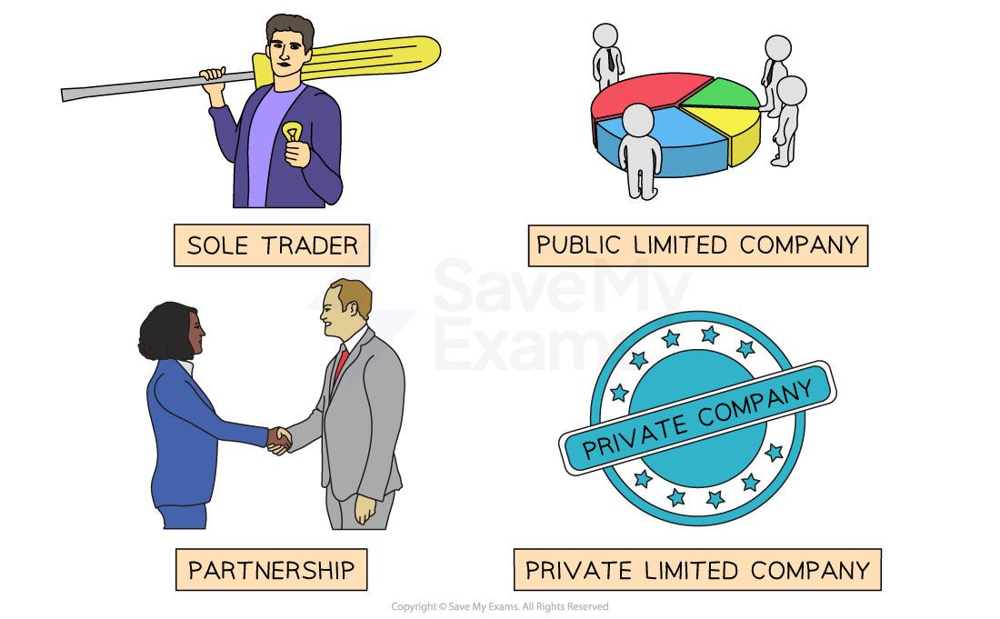
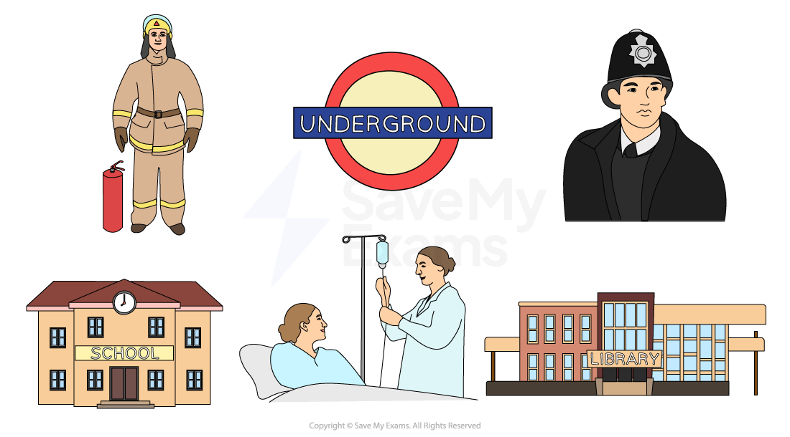

# Private & Public Sector Organisations

### What are the key classifications of a business?

- A business can be **classified **using the following **categories**:

  - **Type of sector**
  
    - Private sector
    - Public sector
  - **Type of organisation**
  
    - Sole trader
    - Partnership
    - Private limited company
    - Public limited company
    - Society, club or charity

*Businesses can operate as sole traders, partnerships, private limited companies or public limited companies*

## Private & Public Sector Organisations

> **Spec point** — `spcpt_Hz6GygvqgnWyvS26`

## Private & public sector organisations

### What are the differences between private and public sector organisations?

- The **differences **between **private **and **public **sector organisations are summarised in the following table

|   | Private sector organisation | Public sector organisation |
|---|---|---|
| Aim of the business | To make a profit | To provide a service to the public |
| Ownership of the business | Owned by individuals | Owned by the Government |
| Funding of the business | Money invested by the owners | Money generated from taxes |
| Examples | - Restaurants - Retail stores - Mechanics | - National Health Service (NHS) - State schools - Police |

- **Examples **of **private **sector organisations include:

  - Restaurants
  - Retail stores
  - Mechanics
- **Examples **of **public **sector organisations include:

  - National Health Service (NHS)
  - State schools
  - Libraries
  - Emergency services
  - Public transport

*Examples of public sector organisations*
