# Characteristics of Living Organisms

## The Unifying Characteristics of Living Organisms

> **Spec point** — `spcpt_N8JcjXHFGp76BmXB` · "understand how living organisms share the following characteristics
they require nutrition, they respire, they excrete their waste, they respond to their surroundings, they move, they control their internal conditions, they reproduce, they grow and develop"

## The Unifying Characteristics of Living Organisms

- In order for something to be considered 'living', it must fulfil specific criteria that are true of all living ***organisms***
- These criteria can be remembered using the acronym MRS C GREN, which stands for:

  - Movement
  - Respiration
  - Sensitivity
  - Control
  - Growth
  - Reproduction
  - Excretion
  - Nutrition
- If something does not carry out all of these life processes, it is either dead or non-living
- Viruses are a good example of non-living particles/agents

## Nutrition

> **Spec point** — `spcpt_YDfbs65hBRFgkQ2t` · "understand how living organisms share the following characteristics
they require nutrition, they respire, they excrete their waste, they respond to their surroundings, they move, they control their internal conditions, they reproduce, they grow and develop"

## Nutrition

- Organisms must obtain food to provide **energy **and the materials they require to grow and develop

  - Energy is necessary to carry out life processes e.g. movement and excretion

### Nutrition in plants

- Plants use **sunlight, carbon dioxide** and **water** to produce **oxygen** and **glucose** in the process of **photosynthesis **to produce food

### Nutrition in animals

- Animals consume other **living organisms** as food in order to obtain energy and the nutrients they require to live, grow and develop
- Animals break down larger complex molecules into simpler molecules through the process of **digestion**
- The simpler molecules are then absorbed into the bloodstream to transport to cells which use them for processes like respiration for **energy** and growth and repair

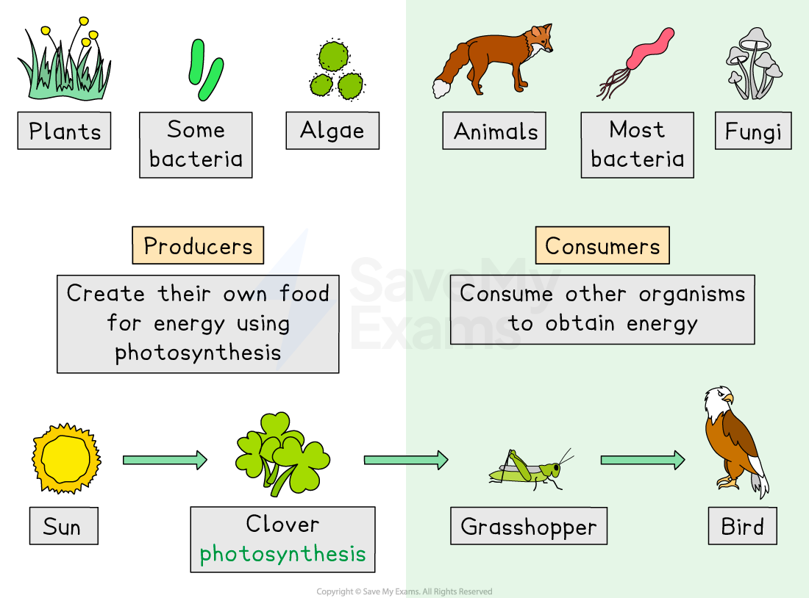

*Animals obtain nutrients by eating plants and other animals, whereas plants make their own food by photosynthesising*

<u>[Use this](https://www.savemyexams.com/info/policies/using-our-illustrations-images-fair-use/)</u><u></u><u>[image](https://www.savemyexams.com/info/policies/using-our-illustrations-images-fair-use/)</u>

> **Exam Hint**
> Remember all living organisms require nutrition. Some organisms, like plants, make their own food, while others, like animals and fungi, must consume (take in) food to obtain nutrients.

## Respiration

> **Spec point** — `spcpt_vC3ymMsQZpqqWNqs` · "understand how living organisms share the following characteristics
they require nutrition, they respire, they excrete their waste, they respond to their surroundings, they move, they control their internal conditions, they reproduce, they grow and develop"

## Respiration

- **Respiration** is a **chemical process** carried out in **all** living organisms
- **Energy** is released from** glucose** either in the presence of oxygen (**aerobic** respiration) or the absence of oxygen (**anaerobic** respiration)
- The reactions ultimately result in the production of **carbon dioxide** and **water **as waste products
- Energy is transferred in the form of **ATP**

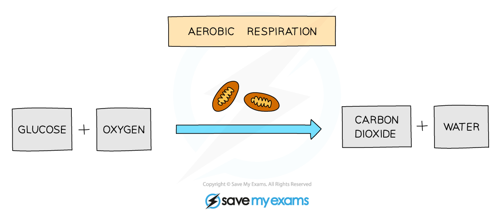

<u>[Use this image](https://www.savemyexams.com/info/policies/using-our-illustrations-images-fair-use/)</u>

***The equation for aerobic respiration***

> **Exam Hint**
> Make sure not to confuse respiration with gas exchange. Gas exchange involves getting oxygen into the cells and carbon dioxide out. Respiration uses the oxygen supplied from gas exchange to release **energy **in the form of **ATP.**

## Excretion

> **Spec point** — `spcpt_4CrBqmm6Mjvkbx54` · "understand how living organisms share the following characteristics
they require nutrition, they respire, they excrete their waste, they respond to their surroundings, they move, they control their internal conditions, they reproduce, they grow and develop"

## Excretion

- **Chemical reactions** that take place inside living cells are described as **metabolic reactions**
- Metabolic reactions produce waste products, some of which may be **toxic**
- These toxic products must be **eliminated** from the body
- Excretion is the** removal of toxic materials and substances** from organisms

#### Excretion in animals

- Waste products excreted by **animals** include:

  - **Carbon dioxide** from aerobic **respiration**
  - **Water** from aerobic **respiration** and other chemical reactions
  - **Urea** which contains** nitrogen** resulting from the breakdown of **proteins**

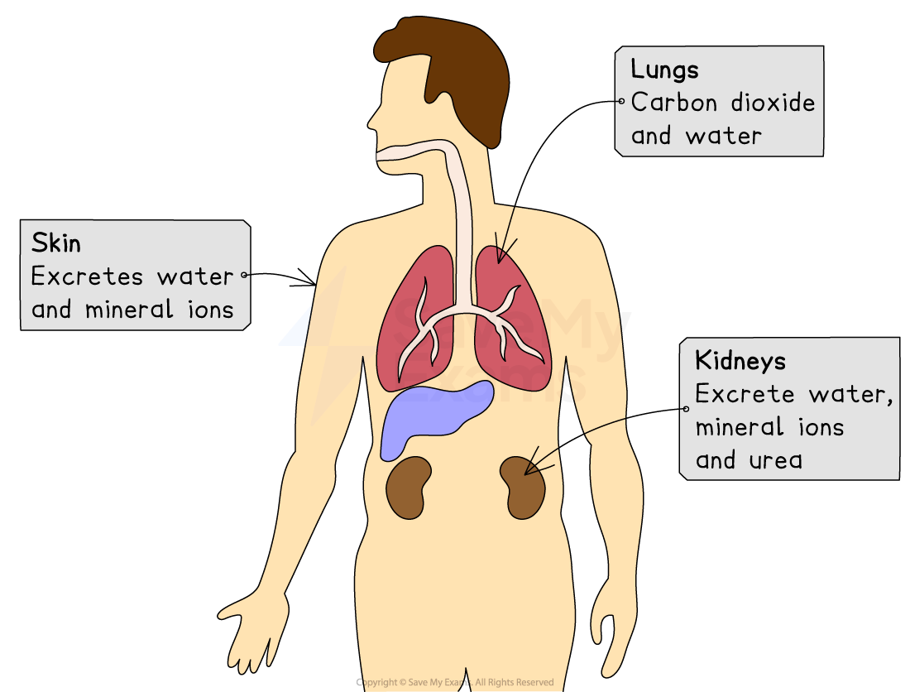

*Excretion in humans, the waste products and organs involved.*

<u>[Use this image](https://www.savemyexams.com/info/policies/using-our-illustrations-images-fair-use/)</u>

#### Excretion in plants

- Waste products excreted by **plants** include:

  - **Oxygen** from **photosynthesis**
  - **Carbon dioxide** from **respiration**

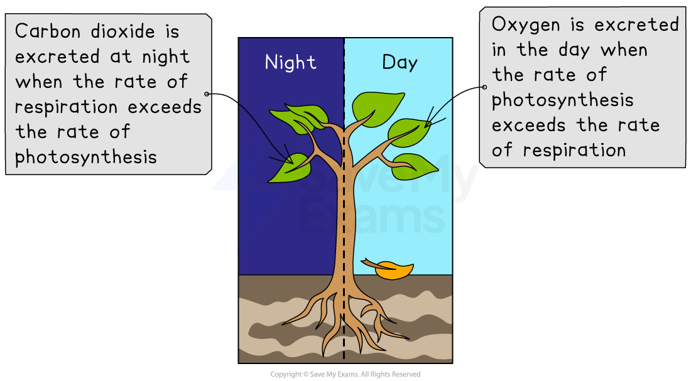

*Excretion in plants, the waste products and the difference between day and night.*

<u>[Use this image](https://www.savemyexams.com/info/policies/using-our-illustrations-images-fair-use/)</u>

> **Exam Hint**
> **Excretion** is often confused with **egestion**. Remember that the waste products removed through excretion have originated from **chemical reactions in the cells**. However, the waste products produced in egestion are in the form of **faeces** and originate from the remains of the **substances not absorbed during digestion**.

## Response to Surroundings

> **Spec point** — `spcpt_3wQdKC3pyNdXpYP6` · "understand how living organisms share the following characteristics
they require nutrition, they respire, they excrete their waste, they respond to their surroundings, they move, they control their internal conditions, they reproduce, they grow and develop"

## Response to Surroundings

- **The sensitivity **of an organism refers to its ability to detect and **respond** to **stimuli** in its **surroundings**
- Responding to the environment around them gives an organism the best **chances of survival**

#### Sensitivity responses in animals

- In humans, **the nervous system** provides a complex system of **receptors**, **neurones **and** effectors** which detect and respond to different stimuli using **electrical impulses**
- The **endocrine system** also allows a response to stimuli using chemical messengers, which travel in the **blood**, called **hormones**

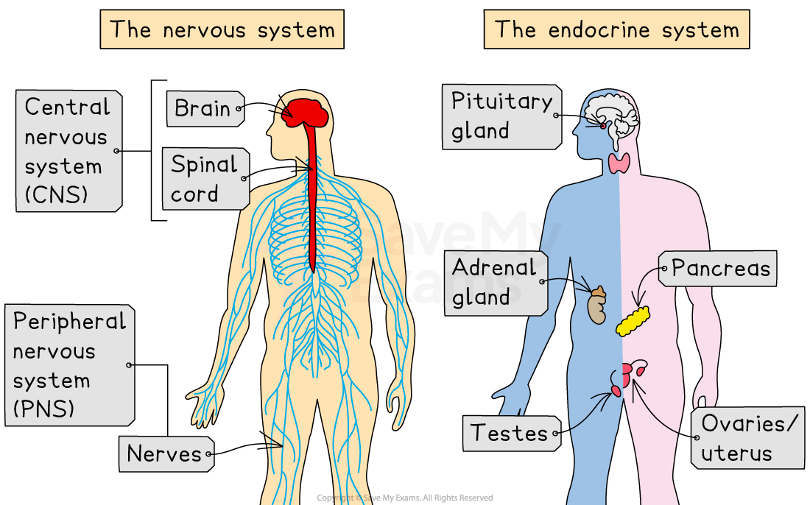

*The nervous system and endocrine system allow humans to respond to their environment.*

<u>[Use this image](https://www.savemyexams.com/info/policies/using-our-illustrations-images-fair-use/)</u>

#### Sensitivity responses in plants

- In plants, responses are controlled by **chemicals** and are usually much **slower**

  - **Geotropism** describes a plants response to **gravity** which causes the roots to grow down into the soil
  - **Phototropism** describes a plants response to **light** which causes shoots to grow towards sunlight

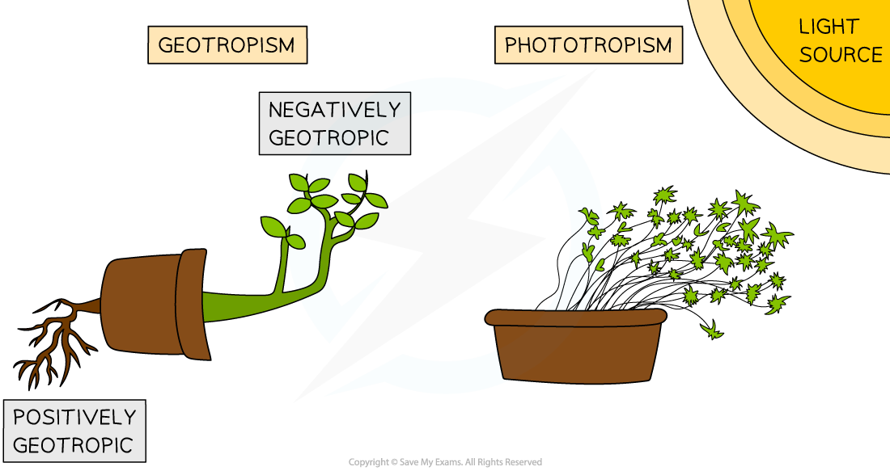

<u>[Use this image](https://www.savemyexams.com/info/policies/using-our-illustrations-images-fair-use/)</u>

***Phototropism and geotropism allow plants to respond to their environment.***

## Movement

> **Spec point** — `spcpt_dCV6Q7gVjb6wRf2b` · "understand how living organisms share the following characteristics
they require nutrition, they respire, they excrete their waste, they respond to their surroundings, they move, they control their internal conditions, they reproduce, they grow and develop"

## Movement

- Movement is an** action by an organism **causing a** change of position or place**
- The movement of an organism from place to place is called **locomotion**
- Plants cannot move from place to place but can change their **orientation**

  - For example, sunflowers track the sun and so change their orientation throughout the day

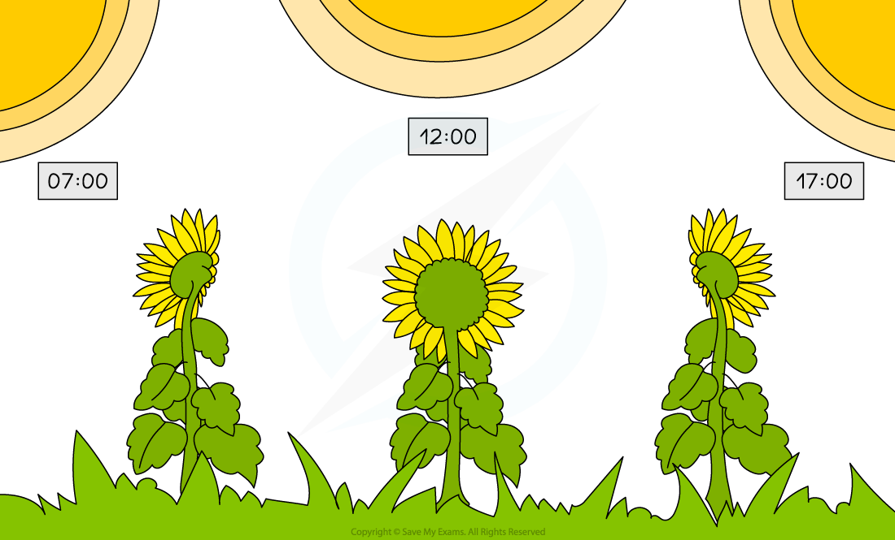

<u>[Use this image](https://www.savemyexams.com/info/policies/using-our-illustrations-images-fair-use/)</u>

***Sunflowers track the sun throughout the day.***

## Control

> **Spec point** — `spcpt_NC4bnH5Y66mKhHFr` · "understand how living organisms share the following characteristics
they require nutrition, they respire, they excrete their waste, they respond to their surroundings, they move, they control their internal conditions, they reproduce, they grow and develop"

## Control

- Living organisms must control their internal environment in order to keep conditions within **required limits**
- This is called **homeostasis**

#### Homeostasis in humans

- Thermoregulation refers to the control of body temperature
- **The optimum** human body temperature is **37°C**

  - If body temperature **increases** e.g. during exercise, mechanisms for control will be initiated to **return the temperature** back to the optimum
  - Mechanisms include **sweating or vasodilation**

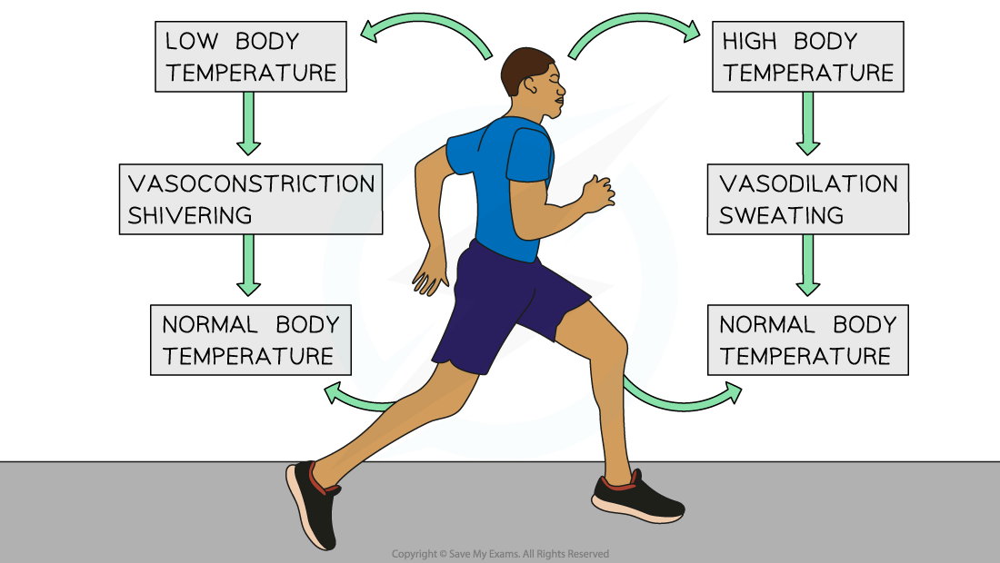

<u>[Use this image](https://www.savemyexams.com/info/policies/using-our-illustrations-images-fair-use/)</u>

***Thermoregulation is an example of homeostasis required to maintain a body temperature of 37°C.***

- Another homeostatic mechanism in humans is **osmoregulation** (control of water levels)

#### Homeostasis in plants

- Plants use **transpiration** to maintain a suitable **temperature**
- Water **evaporates** from the **stomata** on the underside of the leaf, leading to **heat loss**

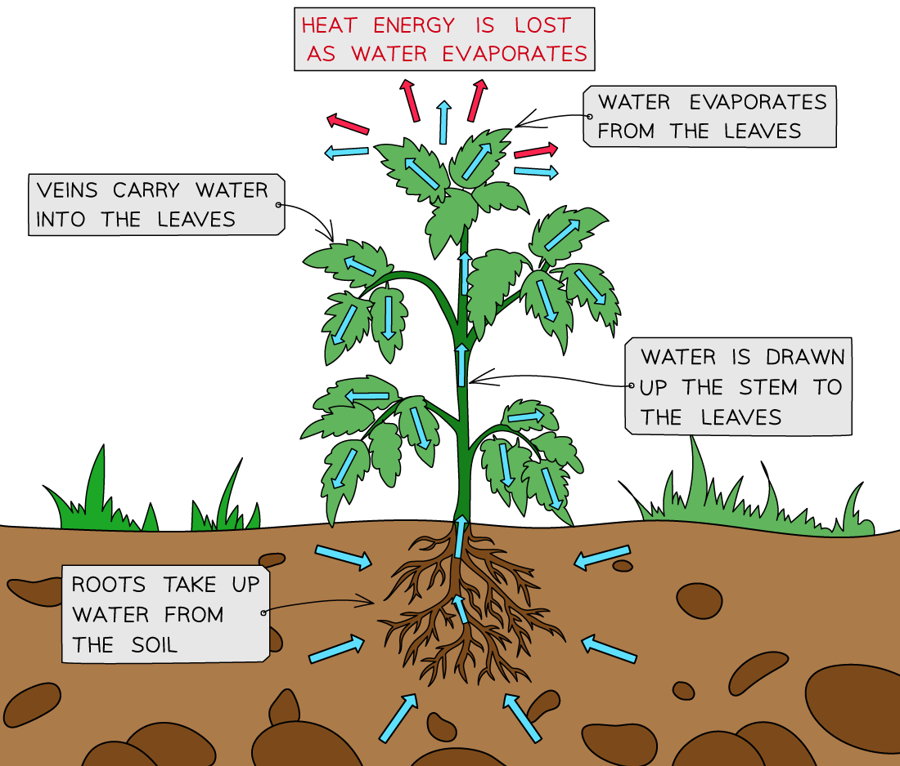

<u>[Use this image](https://www.savemyexams.com/info/policies/using-our-illustrations-images-fair-use/)</u>

***Plants maintain an optimum temperature through transpiration.***

## Reproduction

> **Spec point** — `spcpt_TFZBG25hvdkdzZkK` · "understand how living organisms share the following characteristics
they require nutrition, they respire, they excrete their waste, they respond to their surroundings, they move, they control their internal conditions, they reproduce, they grow and develop"

## Reproduction

- **Reproduction **is the process that leads to the** production of more of the same kind of organism**
- Reproduction is fundamental to the **survival** of a population and ultimately, the species
- There are different types of reproduction: sexual and asexual

#### Sexual reproduction

- In this type of reproduction, the male and female **gametes** **fuse together**

  - In humans, the male gamete is the **sperm** and the female gamete is the **egg**
  - In plants, the male gamete is in the **pollen** grains and the female gamete is the **ovule**
- The DNA of the offspring is composed of both **maternal** and **paternal** DNA

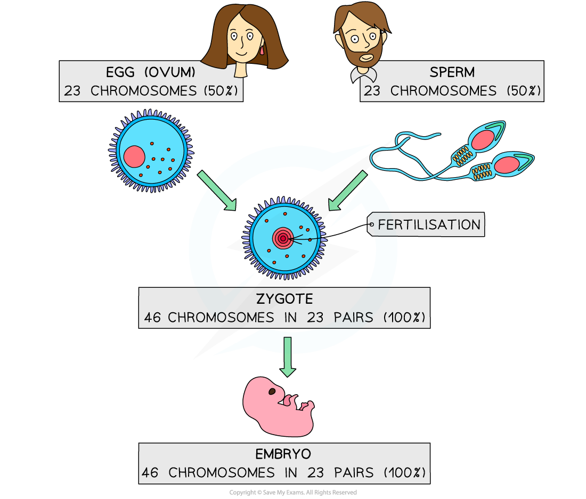

***Sexual reproduction involves the fusing of two gametes to form a zygote that contains DNA from both parents.***

#### Asexual reproduction

- Cells or whole organisms can also reproduce using **asexual reproduction**
- **Mitosis** is an example of asexual reproduction
- There is only **one parent** involved so an exact **clone** is produced
- The DNA of offspring is** identical** to parental DNA

  - Plants can reproduce asexually naturally by **runners **or artificially by the taking of **cuttings**
  - Single-celled organisms such as **bacteria** or protoctist **amoeba** reproduce asexually

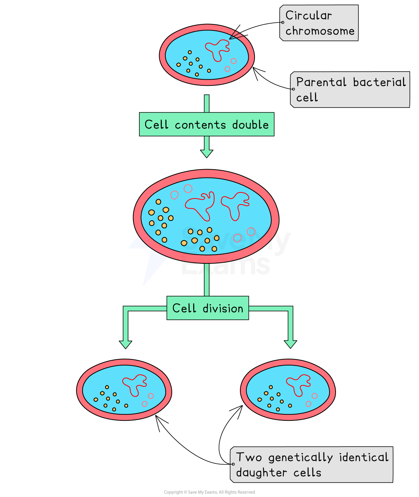

*Asexual reproduction in bacteria involves creating exact copies of the parent cell.*

## Growth

> **Spec point** — `spcpt_W9GG3px2h2jjVdjF` · "understand how living organisms share the following characteristics
they require nutrition, they respire, they excrete their waste, they respond to their surroundings, they move, they control their internal conditions, they reproduce, they grow and develop"

## Growth

- **Growth **is defined as a** permanent increase in size**
- In **animals**, an individual grows larger between the zygote and **adult** stage with **changes in proportion or shape**
- In **plants**, an individual grows **larger throughout their whole life** with** new** shoots, leaves, branches etc. forming year after year
