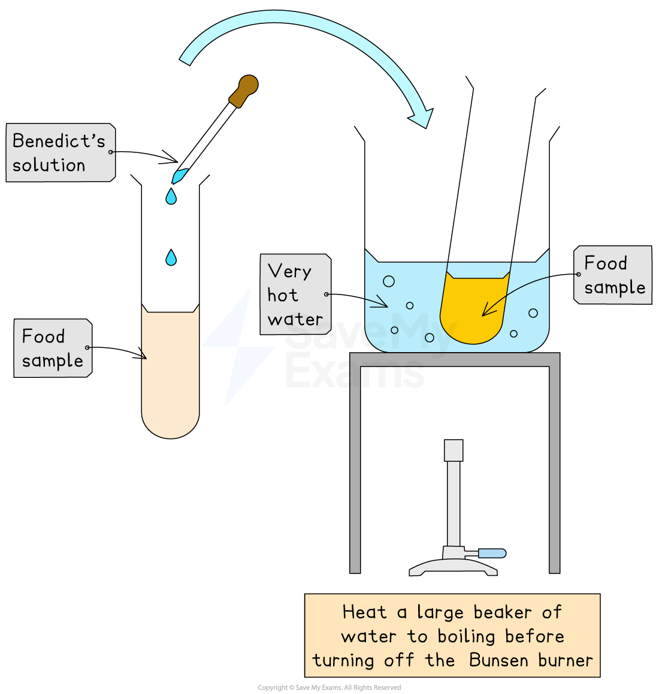
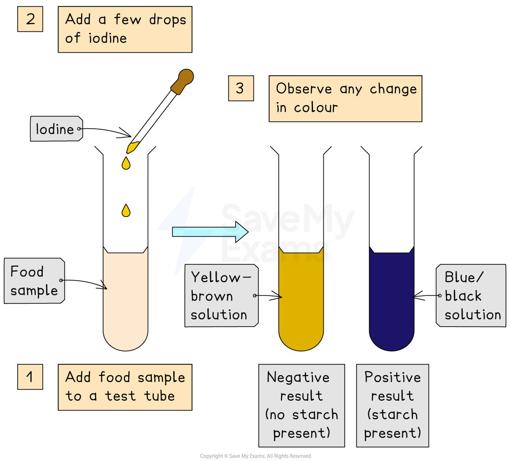
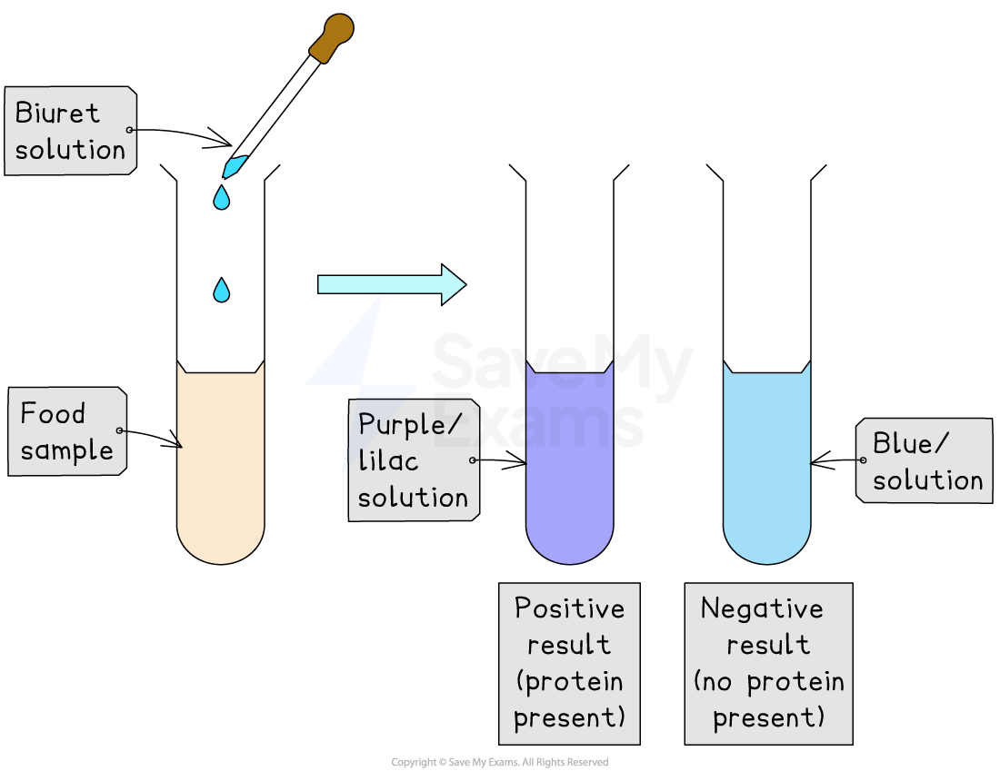
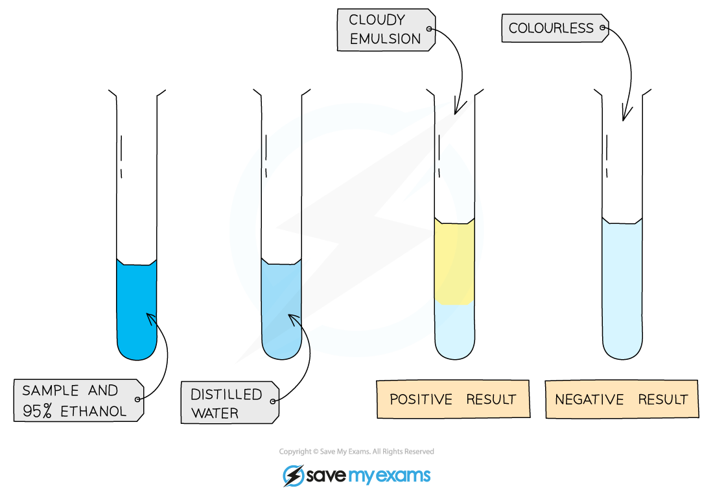
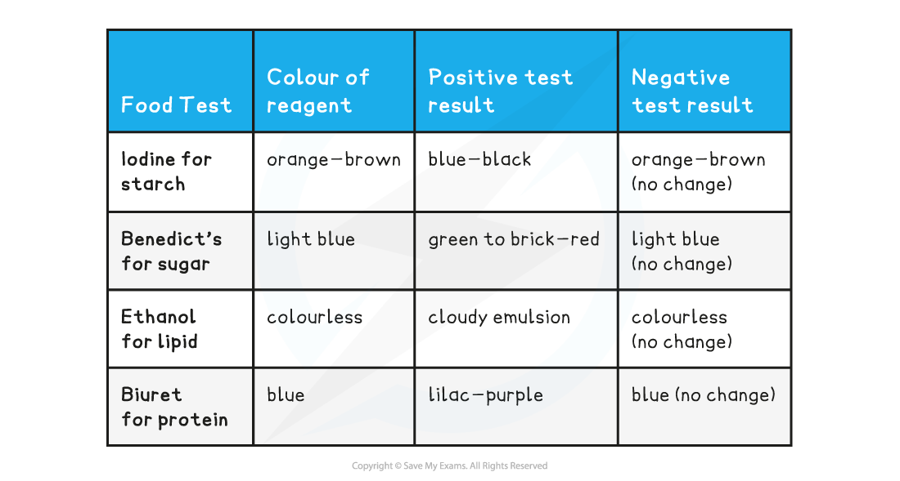

# Practical: Food Tests

## Practical: Food Tests

> **Spec point** — `spcpt_Vkzrjb27qnYvwqyF` · practical: investigate food samples for the presence of glucose, starch, protein and fat

## Practical: Food Tests

- Food samples can be investigated for the presence of the following biological molecules:

  - Glucose
  - Starch
  - Protein
  - Fat

### Preparing a sample

- Before you can carry out any of the food tests described below, you may need to prepare a food sample first (especially for solid foods to be tested)
- To prepare solid food for a food test:

  - Break up the food using a pestle and mortar
  - Transfer to a test tube and add distilled water
  - Mix the food with the water by stirring with a glass rod
  - Filter the mixture using a funnel and filter paper, collecting the solution
  - Proceed with the food tests
- Powdered foods also work really well for this experiment:

  - Eg. powdered potato, milk powder, protein powder, powdered egg white and powdered glucose
- There are several **safety precautions** to be aware of:

  - Wear eye protection
  - Wash any splashes from skin quickly
  - Do not taste any of the food substances
  - Take care to avoid spilling hot water

### Test for glucose (a reducing sugar)

- Add a few drops of **Benedict's solution** to the sample food solution

  - Benedict's solution is a light or bright blue colour
- **Heat** in a beaker of very hot water for **5 minutes**
- Observe if there has been a colour change
- A positive test will show a colour change from **a light blue **to** orange **/** brick red **depending on the concentration of glucose in the food sample

  - If there is a colour change, the darker the colour, the higher the concentration of glucose present
- **Safety precautions** for this food test:

  - Wear safety goggles
  - Switch off the Bunsen burner after the water has been heated to almost boiling (or alternatively use a water bath)

*The Benedict's test for glucose*

### Test for starch using iodine solution

- Iodine solution is used to test for the presence or absence of starch in a food sample

  - Iodine solution is yellow-brown in colour
- Add several drops of** iodine solution** to the food sample
- A positive test for starch is a colour change from **yellow-brown to blue-black**

*Iodine test for the presence of starch*

### Protein food test

- Add a few drops of **Biuret solution** to the food sample

  - Biuret solution is a blue colour
- A positive test will show a colour change from **blue to violet / lilac / purple**

*The Biuret test for protein*

### Test for lipids (fats)

- Mix the food sample with **4cm****3**** of ethanol**

  - Ethanol is a clear, colourless liquid
- Place a bung firmly in the end of the test tube before shaking the tube vigorously
- Allow time for the sample to settle
- Strain the ethanol solution into another test tube
- Add the ethanol solution to an equal volume of **cold distilled water (4cm****3****)**
- A positive test will show a **cloudy emulsion** forming

***The ethanol test for lipids***

#### Food Test Results Table

### Important hazards

- Whilst carrying out this practical you should try to identify the main hazards and be thinking of ways to reduce harm

  - Biuret solution contains **copper (II) sulfate** which is dangerous particularly if it gets in the eyes, so always wear **goggles**
  - Iodine solution is also an **irritant **to the eyes
  - **Sodium hydroxide** in Biuret solution is **corrosive**, if any chemicals get onto your skin wash your hands immediately
  - **Ethanol** is highly **flammable;** keep it away from any Bunsen burner
  - The Bunsen burner itself is a hazard due to the open flame. It should be turned off when not in use

> **Worked Example**
> A student used several different reagents to test for the presence of different biological molecules within common foods.
> 
> 
> 
> a) Which food groups are present in the apple? Explain how you know.
> 
> - The apple contained both starch and sugar as it tested positive for both the iodine test (orange → blue - black) and the Benedict's test (blue → orange).
> - The apple did not contain protein or lipid (fat) as the Biuret and emulsion tests were both negative.
> 
> b) Which foods contained lipids?
> 
> - Olive oil
> - Egg yolk
> - Biscuit

> **Exam Hint**
> If you're asked to describe how to test for the presence of a biological molecule, make sure you state which **solution** you would use for the test and the **colour change** that you would expect to observe if the molecule was present. 
> 
> Eg. if you're asked to **describe how to test for glucose**, you need to state that you would use **Benedict's solution**, add **heat** and that you would expect to see a **red/orange/yellow colour change** for a **positive result**.
