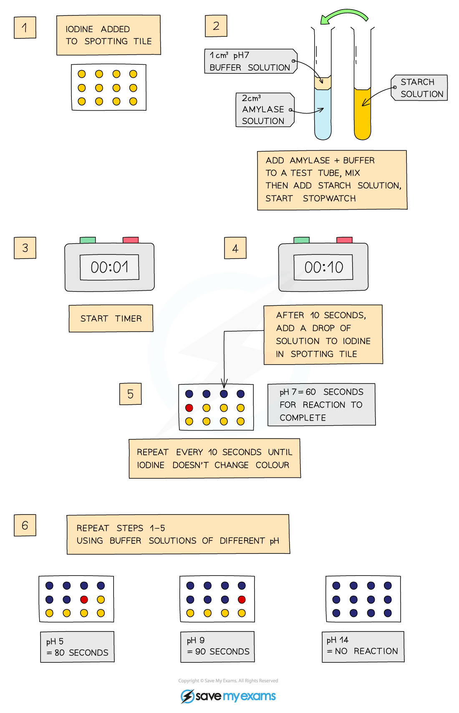
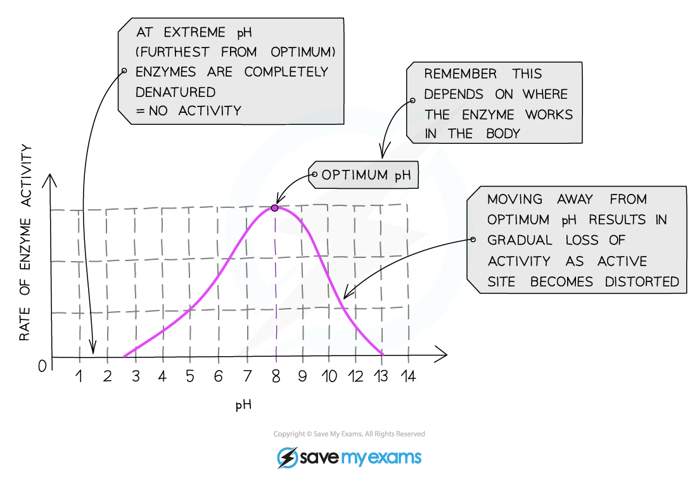

# Practical: Investigating pH & Enzyme Activity

## Practical: Enzymes & pH

> **Spec point** — `spcpt_PnXQ4xtdyRTHqtKP` · practical: investigate how enzyme activity can be affected by changes in pH

## Practical: Enzymes & pH

- **Amylase** is an enzyme that digests **starch **into** maltose**
- The effect of different pH levels on the activity of amylase can be investigated using buffer solutions at different pHs

#### Apparatus

- Spotting tile
- Measuring cylinder
- Test Tube
- Syringe
- Pipette
- Stopwatch
- Buffer solutions at different pH levels
- Iodine
- Starch solution
- Amylase solution

#### Safety

- Both iodine solution and amylase solution can cause irritation to eyes - wear safety goggles
- Amylase solution can cause irritation to the skin - wear gloves

#### Method

- Add a drop of **iodine** to each of the wells of a spotting tile
- Use a syringe to place 2 cm3 of **amylase** into a test tube
- Add 1cm3 of **buffer solution** (at pH 3) to the test tube using a syringe
- Use another test tube to add 2 cm3 of **starch solution** to the amylase and buffer solution, start the stopwatch whilst mixing using a pipette
- Every 10 seconds, transfer a droplet of the solution to a new well of iodine solution (which should turn blue-black)
- Repeat this transfer process every 10 seconds until the iodine solution** stops turning blue-black **(this means the amylase has broken down all the starch)
- **Record the time** taken for the reaction to be completed by counting the number of tiles up to when the iodine stops changing colour and remains yellow-brown
- Repeat the investigation with buffers at different pH values (eg. pH 5.0, 7.0, 9.0 and 11.0)

***Investigating the effect of pH on enzyme activity***

#### Results and Analysis

- Amylase is an enzyme which **breaks down** **starch**
- When the iodine solution remains orange-brown, all the starch has been digested
- This investigation shows:

  - At the **optimum pH**, the iodine stopped turning blue-black and remained yellow-brown within the shortest amount of time
  
    - This is because the enzyme is working at its fastest rate and has digested all the starch
- At **higher or lower pH's** (above or below the optimum) the iodine took a longer time to stop turning blue-black or continued to turn blue-black for the entire investigation

  - This is because on either side of the optimum pH, the enzymes are starting to become denatured and as a result are unable to bind with the starch or break it down

***A graph showing the optimum pH for an enzyme from a region of the small intestine***

#### Applying CORMS to practical work

- CORMS can be used to plan a valid investigation on the effect of pH on enzyme activity

***CORMS Evaluation***

- The CORMS for an investigation into the effect of pH on enzyme activity might look like this:

  - **C** - change the pH of the environment
  - **O** - same concentration of enzyme
  - **R** - repeat the investigation several times to ensure reliability
  - **M1** - measure the time taken by counting the number of wells for the iodine to stop turning  blue-black (1 well = 10 seconds)
  - **S** -control the temperature and volume of the amylase, iodine and starch solution used in the investigation

> **Exam Hint**
> When describing the effect of pH on enzyme activity, it is important to remember that any pH outside of the optimum can lead to the enzyme becoming permanently denatured.
