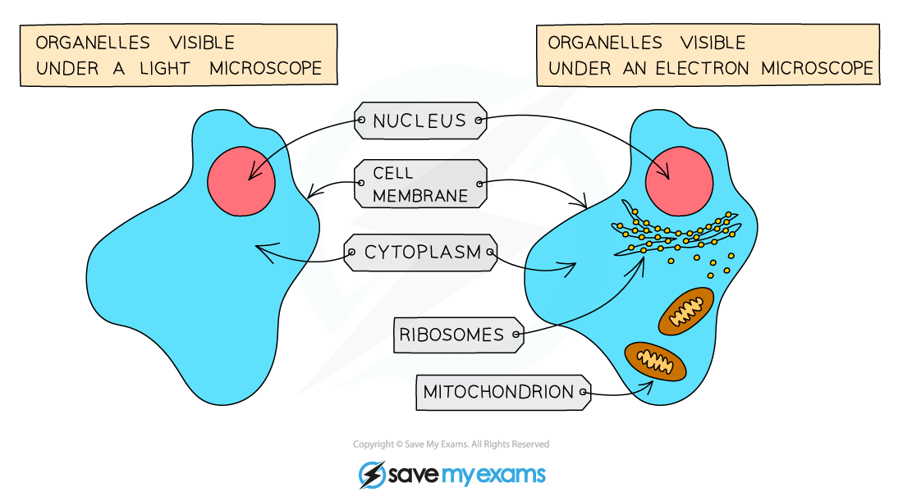
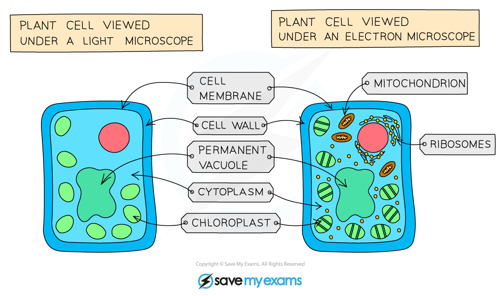

# Animal & Plant Cells: Similarities & Differences

## Plant & Animal Cells

> **Spec point** — `spcpt_QR5wnp3GNCpffxbP` · know the similarities and differences in the structure of plant and animal cells

## Plant & Animal Cells

### Animal cells

- The main subcellular structures in **animal cells** are:

  - The **nucleus**: contains genetic material
  - **Cell membranes**: controls what enters and leaves the cell
  - **Mitochondria**: site of aerobic respiration
  - **Ribosomes**: site of protein synthesis
  - **Cytoplasm**: chemical reactions take place in this jelly-like substance

***Some cellular structures can only be seen when viewed with an electron microscope***

### Plant cells

- In addition to the subcellular parts found in animal cells, **plant cells** have:

  - A **cell wall** made of **cellulose: **gives the cell shape and protection
  - A **permanent vacuole** filled with cell sap: pushes the cytoplasm against the cell wall, keeping the cell turgid
  - Plant cells found in the leaf and stem may also contain **chloroplasts: **the site of photosynthesis

***The plant cell shown above contains chloroplasts, so it would be found in the leaves of a plant***

#### Similarities & differences between animal & plant cells table

| **Structure** | **Animal** | **Plant** |
|---|---|---|
| Nucleus | Yes | Yes |
| Cytoplasm | Yes | Yes |
| Cell membrane | Yes | Yes |
| Cell wall | No | Yes |
| Mitochondria | Yes | Yes |
| Chloroplasts | No | Yes |
| Ribosomes | Yes | Yes |
| Vacuole | Yes - small & temporary | Yes - large & permanent |

> **Exam Hint**
> You need to know the similarities and differences between animal and plant cells, so learn the features in the table above! You could be asked to look at an image with some of the features of the cell labelled, and compare the structures present with another type of cell.
