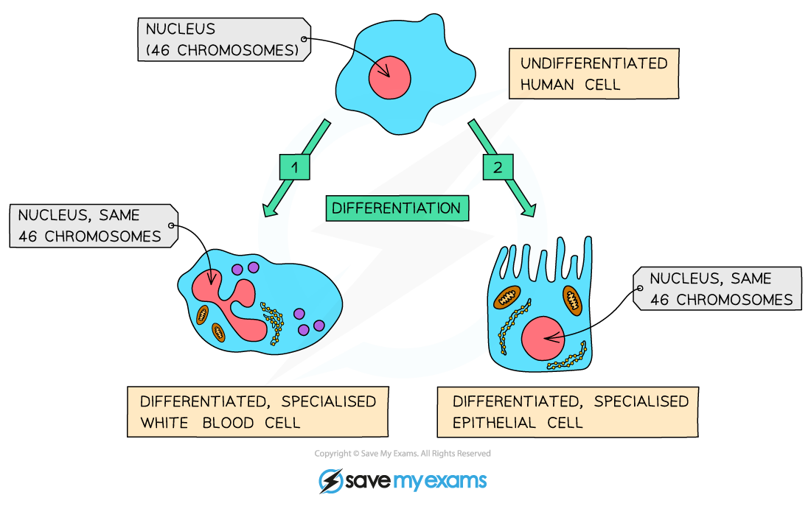
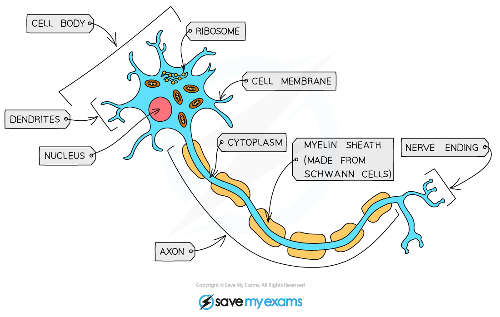
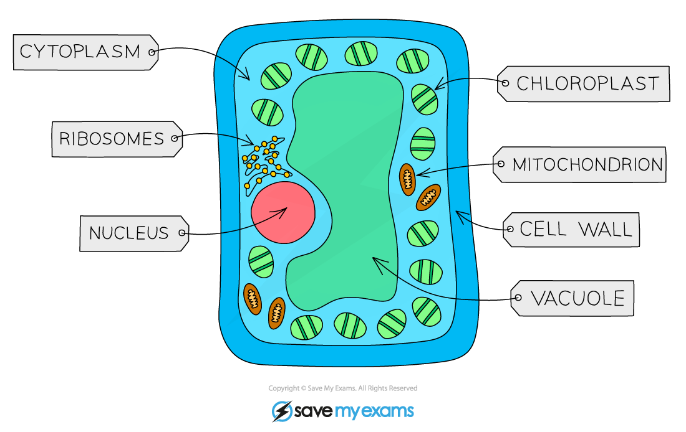

# Importance of Cell Differentiation

## Cell Differentiation & Specialised Cells

> **Spec point** — `spcpt_DWRWjYhXYh2byXXY` · explain the importance of cell differentiation in the development of specialised cells

## Cell Differentiation & Specialised Cells

- The **structural differences** between different types of cells enable them to perform **specific functions** within an organism
- **Cell differentiation** is an important process by which a cell changes to become** specialised**

  - Cell differentiation is how cells develop the structure and characteristics needed to be able to carry out their functions
  - Specialised cells are those that have **developed certain characteristics** that allow them to **perform particular functions**. Developing these characteristics is **controlled by genes** in the nucleus
- As an organism develops, cells differentiate to form **different types of cells**
- When a cell differentiates, it **develops a structure and composition of subcellular structures** which enables it to carry out a certain function

  - E.g. to form a nerve cell the cytoplasm and cell membrane of an undifferentiated cell must elongate to form connections over large distances

***When a cell differentiates, it develops a structure and composition that enables it to carry out a particular function. ***

### Differentiation and development

- **Stem cells** are undifferentiated (unspecialised) cells that can divide by mitosis to form more stem cells **or** cells that go on to differentiate to become specialised cells
- As a multicellular organism develops, its cells differentiate to form specialised cells

  - In animals, most cells differentiate at an **early stage** of development
  - As a result, animal cells lose their ability to differentiate early in the life of the organism
- Specific cells in various locations throughout the body of an animal **retain the ability** to differentiate throughout the life of the animal

  - These undifferentiated cells are called **adult stem cells** and they are mainly involved in **replacing and repairing cells**, such as blood or skin cells
- Plants differ from animals in that **many types **of plant cells retain the **ability to fully differentiate** throughout the life of a plant, not just in the early stages of development

### Examples of specialised cells

#### Ciliated cell

- Ciliated cells move mucus in the **trachea** and **bronchi**
- They have **hair-like extensions called cilia,** which beat to transport** mucus and trapped particles** toward the throat

***Ciliated epithelial cells***

#### Nerve cell

- Nerve cells conduct** impulses** and are long, allowing communication between different parts of the body and the **central nervous system**
- Their **axons** are covered in a** fatty sheath that insulates** and speeds up nerve transmission

***A nerve cell***

#### Red blood cell

- Red blood cells transport **oxygen **efficiently due to their** biconcave shape**, which provides a high** surface area to volume ratio **for oxygen diffusion
- Red blood cells are packed with the protein **haemoglobin, **which transports oxygen from the lungs to the rest of the body. Red blood cells **do not have a nucleus**, maximising space for haemoglobin to transport oxygen

*Red blood cells*

#### Root hair cell

- Root hair cells absorb **water** and **mineral ions **from the soil
- Root hair cells have** long extensions to increase surface area** for maximum absorption, and their **thin walls **help water move quickly through them

***Root hair cell***

#### Palisade mesophyll cell

- Palisade mesophyll cells are found in the leaf and are adapted for** photosynthesis**
- Palisade mesophyll cells contain many **chloroplasts**
- The cells are** column-shaped**  and **tightly packed** together beneath the upper epidermis of the leaf to  maximise light absorption for photosynthesis

***Palisade mesophyll cell***
