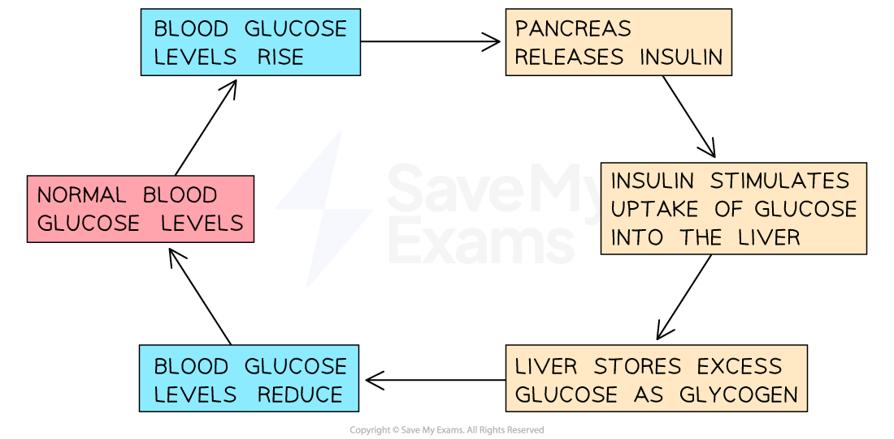

# Hormones: Adrenaline, Insulin, Testosterone, Progesterone & Oestrogen

## The Role of Hormones: Basic

> **Spec point** — `spcpt_T3DSBV3rJxnZ6xVv` · understand the sources, roles and effects of the following hormones: adrenaline, insulin, testosterone, progesterone and oestrogen

## The Role of Hormones: Adrenaline, Insulin, Testosterone, Progesterone & Oestrogen

- A **hormone** is a chemical substance produced by a **gland** and **carried by the blood**, which alters the activity of one or more specific **target organs**

  - They are chemicals that transmit information from one part of the organism to another and bring about a **change**
- The following hormones are of great importance in humans:

  - **Adrenaline**
  - **Insulin**
  - **Testosterone**
  - **Progesterone**
  - **Oestrogen**

### Adrenaline

- Adrenaline is known as the **'fight or flight'** hormone as it is produced in situations where the body may be in **danger**
- Adrenaline causes a range of different things to happen in the body, all designed to prepare it for movement (i.e. fight or flight)
- Effects of adrenaline include:

  - **Increased heart rate and breathing rate** – **delivers** **glucose and oxygen** to muscle cells faster and **removes carbon dioxide** more efficiently
  - **Redirects blood flow to muscles** and away from non-essential organs (e.g. the alimentary canal) – ensures muscles receive more oxygen (and glucose)  for respiration
  - **Dilation of blood vessels in muscles** – allows more blood (and therefore glucose and oxygen) to reach active muscles
  - Breaking down of stored glycogen to glucose in the liver and muscle cells, with glucose released by the liver being transported to active muscle cells, which can be used in respiration by muscle cells

### Insulin

- Blood glucose concentration must be kept within a **narrow range**, so it’s another example of **homeostasis** (like the control of core body temperature)

  - Too high a level of glucose in the blood can lead to cells of the body losing water by osmosis, which can be dangerous
  - Too low a level of glucose in the blood can lead to the brain receiving insufficient glucose for **respiration**, potentially leading to a coma or even death
- The **pancreas** and **liver** work together to **control blood glucose levels**
- To carry out this role, the pancreas acts as an **endocrine gland** (making and secreting **hormones** into the **bloodstream**), although it also plays a vital (but separate) role in digestion (making and secreting enzymes into the digestive system)
- **If the blood glucose concentration gets too high:**

  - Cells in the **pancreas** detect the increased blood glucose levels
  - The pancreas produces the hormone **insulin**, secreting it into the blood
  - Insulin stimulates **muscles** and the **liver** to **take up glucose** from the bloodstream and** store it as glycogen** (a polymer of glucose)
  - This **reduces** the concentration of glucose in the blood back to normal levels, at which point the pancreas stops secreting insulin

***The regulation of blood glucose levels***

### Testosterone

- Testosterone is produced in the male **testes**
- It is responsible for stimulating the development of male reproductive organs and the development of **secondary sexual characteristics in males **(facial/pubic/underarm hair, deepening of voice, increased muscle mass)

### Progesterone

- Progesterone is produced in the female **ovaries**
- It is responsible for **maintaining the uterine lining **during pregnancy and prevents further ovulation

### Oestrogen

- Oestrogen is produced by the female **ovaries**
- It is responsible for:

  - The development of **secondary sexual characteristics in females  **(breast development, wider hips, pubic/underarm hair)
  - **Regulating the menstrual cycle **by stimulating the** repair of the lining of the uterus (endometrium**) after menstruation and helps control the release of eggs (**ovulation**) by influencing other hormones (such as FSH and LH)

#### Summary of hormones and their functions table

| **Hormone** | **Source** | **Role ** | Effect |
|---|---|---|---|
| Adrenaline | Adrenal gland | Readies the body for a 'fight or flight' response | Increases heart and breathing rate, redirects blood flow to muscles, stimulates breakdown of glycogen to glucose for increased respiration in muscle cells |
| Insulin | Pancreas | Lowers blood glucose levels | Causes excess glucose in the blood to be taken up by the muscles and liver and converted into glycogen for storage |
| Testosterone | Testes | Development and function of the male reproductive system | Causes the development of male reproductive organs and secondary sexual characteristics in male |
| Progesterone | Ovaries | Regulation of the menstrual cycle and maintenance of pregnancy | Maintains the thick uterus lining for pregnancy and inhibits ovulation (via influence over other hormones) |
| Oestrogen | Ovaries | Regulation of the menstrual cycle and development of female reproductive system | Development of female secondary sexual characteristics and stimulates thickening of the uterus lining after menstruation |
