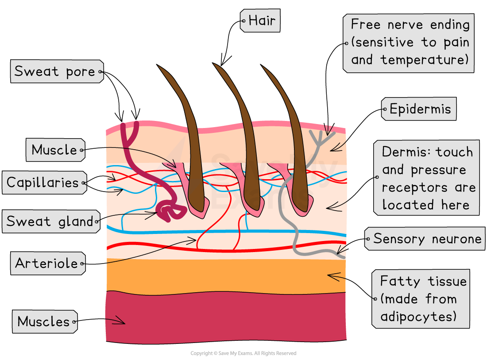
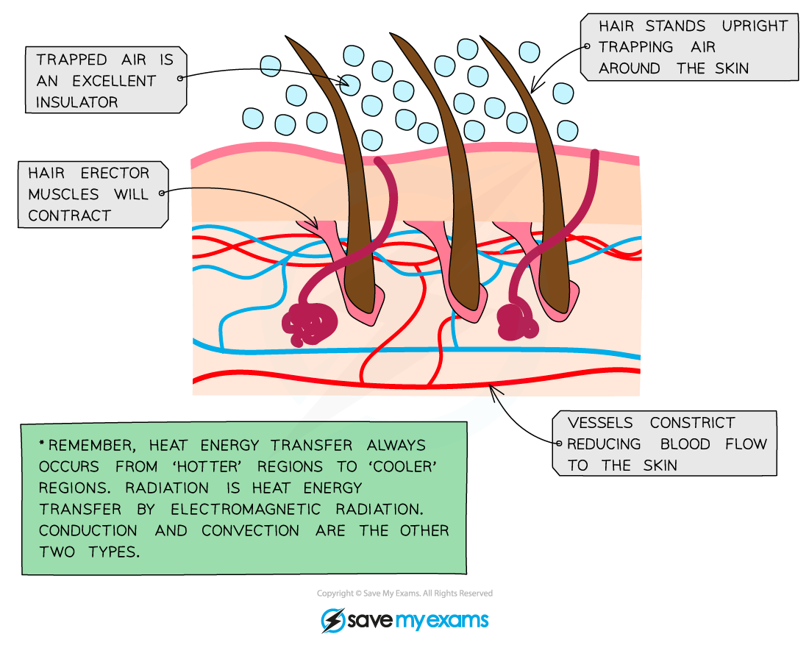

# The Role of Skin in Temperature Regulation

## The Role of Skin in Temperature Regulation

> **Spec point** — `spcpt_g8VqfC5rgJnzyTjg` · describe the role of the skin in temperature regulation, with reference to sweating, vasoconstriction and vasodilation

## The Role of Skin in Temperature Regulation

- The skin is our** largest sense organ**
- It contains many different **receptors** that enable us to detect various **external stimuli**, including touch, pressure, pain, heat and cold
- **Structures within the skin** also play an important role in regulating body temperature (an example of [homeostasis](https://www.savemyexams.com/igcse/biology/edexcel/19/revision-notes/2-structure-and-function-in-living-organisms/co-ordination--response/2-81-homeostasis/))

***Human skin contains structures involved in processes that can increase or reduce heat loss to the surroundings***

### Cooling mechanisms in humans

- **Vasodilation of skin capillaries**

  - Heat exchange (both during warming and cooling) occurs at the body's surface as this is where the blood comes into closest proximity to the environment
  - One way to **increase heat loss** is to supply the **capillaries** in the skin with a **greater volume of blood**, which then loses heat to the environment via **radiation**
  - **Arterioles** (small vessels that connect arteries to capillaries) have muscles in their walls that can relax or contract to allow more or less blood to flow through them
  - During **vasodilation**, these muscles **relax**, causing the arterioles near the skin to **dilate** (get wider) and allowing more blood to flow through capillaries
- **Sweating**

  - Sweat is secreted by sweat glands
  - This cools the skin by evaporation which uses heat energy from the body to convert liquid water into water vapour
- **Flattening of hairs**

  - The hair erector muscles in the skin **relax**, causing hairs to lie **flat**
  - This stops them from forming an insulating layer by trapping air and allows air to circulate over the skin and allows heat to leave by **radiation**

***Responses in the skin when the body temperature is too high and needs to decrease***

> **Exam Hint**
> The specification requires you to describe the role of the skin in temperature regulation, specifically mentioning **sweating, vasoconstriction, and vasodilation**. You do **not** need to mention the hairs on the skin.
> 
> For example, if asked *“Describe how the skin responds when a person enters a hot room”*, you should mention:
> 
> - **Vasodilation** – arterioles supplying capillaries near the skin surface widen, allowing more blood to flow close to the skin so heat is lost by **radiation**.
> - **Sweating** – sweat evaporates from the skin surface, cooling the body.

### Warming mechanisms in humans

- **Vasoconstriction of skin capillaries**

  - One way to **decrease heat loss** is to supply the capillaries in the skin with a** smaller volume of blood**, minimising the loss of heat to the environment via **radiation**
  - During vasoconstriction, the muscles in the arteriole walls **contract**, causing the arterioles near the skin to constrict (get smaller) and allowing less blood to flow through capillaries
  - Vasoconstriction is not, strictly speaking, a 'warming' mechanism as it does not raise the temperature of the blood but instead reduces heat loss from the blood as it flows through the skin
- **Shivering**

  - This is a **reflex action** in response to a decrease in core body temperature
  - Muscles contract in a rapid and regular manner
  - The exothermic metabolic reactions required to power this shivering generate sufficient heat to warm the blood and raise the core body temperature
- **Erection of hairs**

  - The hair erector muscles in the skin **contract**, causing hairs to **stand on end**
  - This forms an insulating layer over the skin's surface by trapping air between the hairs and stops heat from being lost by **radiation**

***Responses in the skin when body temperature is too low and needs to increase***

> **Exam Hint**
> When asked *“Describe how the skin responds when a person enters a cold environment”*, focus on **vasoconstriction** and **reduced sweating**:
> 
> - **Vasoconstriction** – arterioles supplying capillaries near the skin surface narrow, reducing blood flow to the skin. This **reduces heat loss** from the body.
> - **Sweating decreases** – less sweat is produced, so **less heat is lost by evaporation**.
> 
> **Note:** You do **not** need to mention hairs standing up (goosebumps).

### The importance of temperature regulation

- The **core body temperature** of humans is kept close to **37°C**

  - This is very tightly controlled as a change in core body temperature of more than 2°C can be fatal
- For this reason, the human body must be able to make a **coordinated response** to any **rise** or **fall** in body temperature
- **Temperature receptors** (also known as **thermoreceptors**) in the **skin** and **hypothalamus** (a part of the brain) can detect minute changes in body temperature
- The brain then coordinates a cooling or heating response, depending on what is required

***Temperature regulation is an example of homeostasis as it must be maintained within a constant range***
