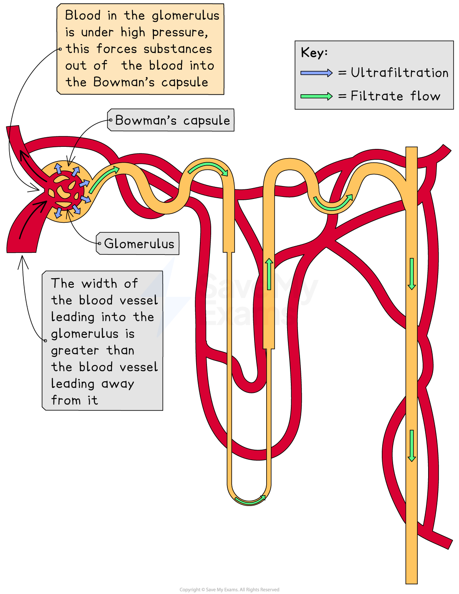
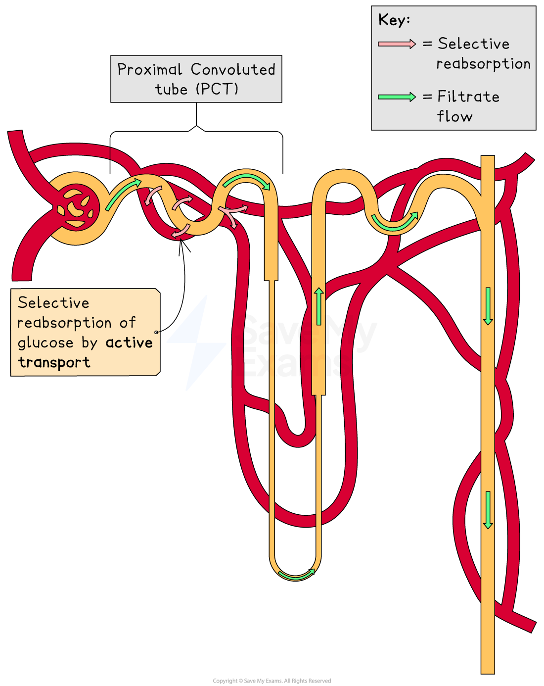
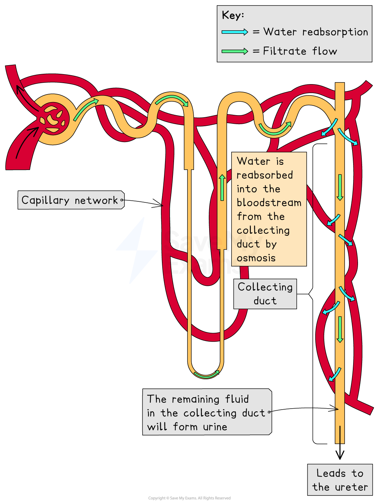

# Nephron Function

## Ultrafiltration

> **Spec point** — `spcpt_cMPyvRwPZcHc8hyV` · describe ultrafiltration in the Bowman’s capsule and the composition of the glomerular filtrate

## Formation of urine

- The human body is constantly producing metabolic waste (eg. **urea**)
- The kidneys filter the blood to remove waste products, forming **urine**
- However it’s important that **useful substances** (eg. **glucose**) or too much water, don’t end up in urine
- Three main processes occur in the nephron to form urine:

  - 1. Ultrafiltration
  - 2. Selective reabsorption of glucose
  - 3. Reabsorption of water

### Ultrafiltration

- **Ultrafiltration** is the first stage of urine formation
- Ultrafiltration occurs in the **glomerulus**
- The walls of the capillaries of the **glomerulus** and the **Bowman’s capsule** are separated by a thin membrane that acts like a filter (or sieve)

  - Small molecules can pass through the membrane but large molecules cannot
- Blood in the glomerulus is under **high pressure**, forcing small molecules such as **water, glucose and urea** **out of the blood** into the Bowman’s capsule

  - The width of the lumen of the blood vessel leading into the glomerulus is greater than the width of the lumen leading away from the glomerulus
  - This difference in width increases the pressure of the blood in the glomerulus for ultrafiltration, so that small molecules are forced out into the Bowman's capsule
- Despite the high pressure, larger molecules in the blood (eg. **proteins**) and blood cells themselves are **too big** to pass through the membrane, so they remain in the blood in the capillaries
- The fluid that collects in the Bowman’s capsule is called the **glomerular filtrate**
- Substances present in the glomerular filtrate are:

  - Water
  - Glucose
  - Urea
  - Ions (salts)

*During ultrafiltration small molecules are forced out of the glomerulus and into the Bowman's capsule due to high pressure*

## Selective Reabsorption

> **Spec point** — `spcpt_7xMh9R6Gs7kR3Vfg` · understand why selective reabsorption of glucose occurs at the proximal convoluted tubule

## Selective Reabsorption

- After ultrafiltration, the glomerular filtrate passes through the **proximal convoluted tube** (**PCT**)
- The body does not want to excrete (lose) any glucose, so **all** of the glucose present in the glomerular filtrate is **selectively reabsorbed** in the PCT
- This process is called selective reabsorption because glucose, a useful substance, is reabsorbed back into the bloodstream while waste products like urea remain in the filtrate

  - Remember glucose is required for respiration, as well as maintaining a blood glucose concentration
- Glucose is reabsorbed from the filtrate in the PCT into the capillaries by **active transport**, which moves glucose **against its concentration gradient**.
- The cells of the PCT contain many mitochondria to provide the energy (ATP) needed for **active transport of glucose**

*Diagram showing reabsorption in the nephron*

> **Exam Hint**
> Take care to describe clearly where substances are moving from and to in the kidneys e.g. glucose moves from the filtrate into the bloodstream when it is selectively reabsorbed.
> 
> Small substances such as urea are forced out of the blood during ultrafiltration, they don’t **diffuse **out of the blood.

## Reabsorption of Water

> **Spec point** — `spcpt_6Tb3vYZZnnjvHYH7` · understand how water is reabsorbed into the blood from the collecting duct

## Reabsorption of Water

- The final step for urine formation is reabsorption of water, which is part of the process of **osmoregulation** — maintaining a water levels in the body
- After selective reabsorption of glucose in the PCT, the filtrate passes through the rest of the nephron: the loop of Henle, distal convoluted tubule (DCT), and collecting duct
- Some water reabsorption from the filtrate occurs in the loop of Henle, but the majority of water reabsorption occurs from the collecting duct
- Water is absorbed into the blood from the collecting duct by **osmosis**. The amount of water absorbed from the filtrate is dependent on the concentration of the [hormone ADH](https://www.savemyexams.com/igcse/biology/edexcel/19/revision-notes/2-structure-and-function-in-living-organisms/excretion/adh-and-composition-of-urine/) **(antidiuretic hormone)**, which is released by the **pituitary gland** in the brain:

  - **More ADH** → **more water reabsorbed**, producing **concentrated urine**
  - **Less ADH** → **less water reabsorbed**, producing **dilute urine**

*Water reabsorption*

## Table summarising ultrafiltration, selective absorption and water absorption

> **Spec point** — `spcpt_KW2X5RdVFhDMwSws`

## Table summarising ultrafiltration, selective reabsorption & water absorption

| **Process** | **Where it happens** | **What happens** | **Substances involved** |
|---|---|---|---|
| Ultrafiltration | Glomerulus | High pressure forces small molecules out of the blood in the glomerulus into the Bowman’s capsule | - Water - Glucose - Urea - Ions (salts) |
| Selective reabsorption | Proximal convoluted tubule (PCT) | Glucose is reabsorbed from the filtrate into the blood by active transport | Glucose |
| Water absorption | Collecting duct | Water is reabsorbed by osmosis from the collecting duct into the bloodstream (controlled by levels of ADH) | Water |

> **Exam Hint**
> Don’t be surprised if in your exam you’re presented with a table that gives you details about the relative concentrations of substances in filtrate at different parts of the nephron or about substances present in the urine.
> 
> In a healthy individual, there should be no glucose present in the filtrate after the PCT, and no protein present in the filtrate/urine at all (the only place protein should be found is in the blood in the glomerulus). The concentration of urea should be greatest in the filtrate in the collecting duct.
> 
> If glucose is present in the nephron beyond the PCT or in the urine, then it could be because blood glucose levels higher than normal (eg. the person is diabetic). If someone has high blood pressure, this could cause damage to the glomerulus and protein molecules may be squeezed/forced out of the glomerulus into the Bowman’s capsule. The protein cannot be reabsorbed back into the bloodstream from the nephron, so it will end up in the urine.
