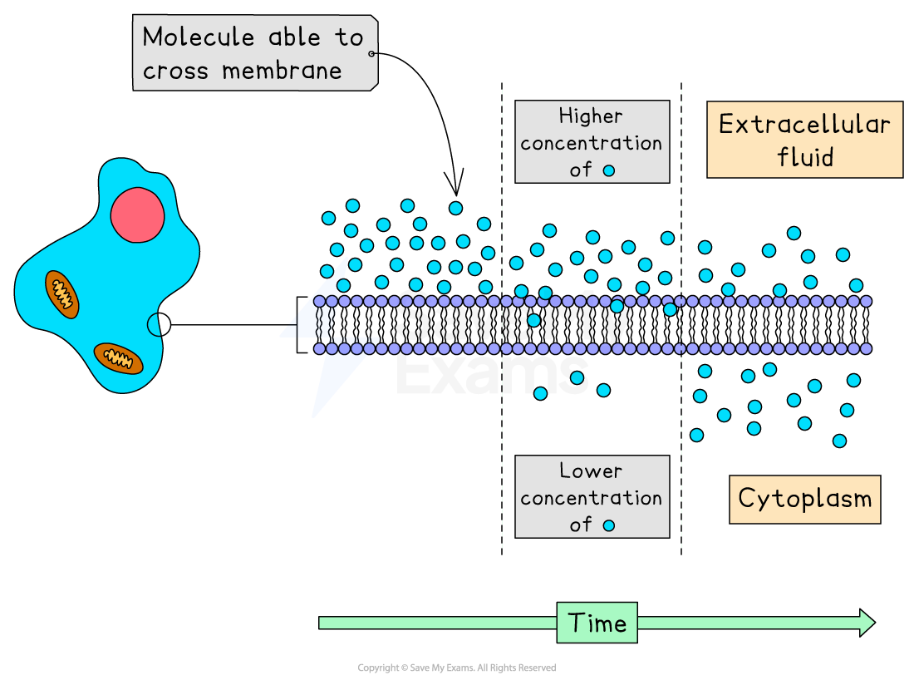
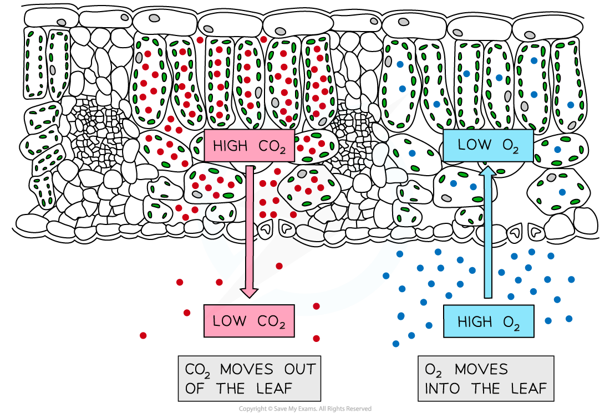
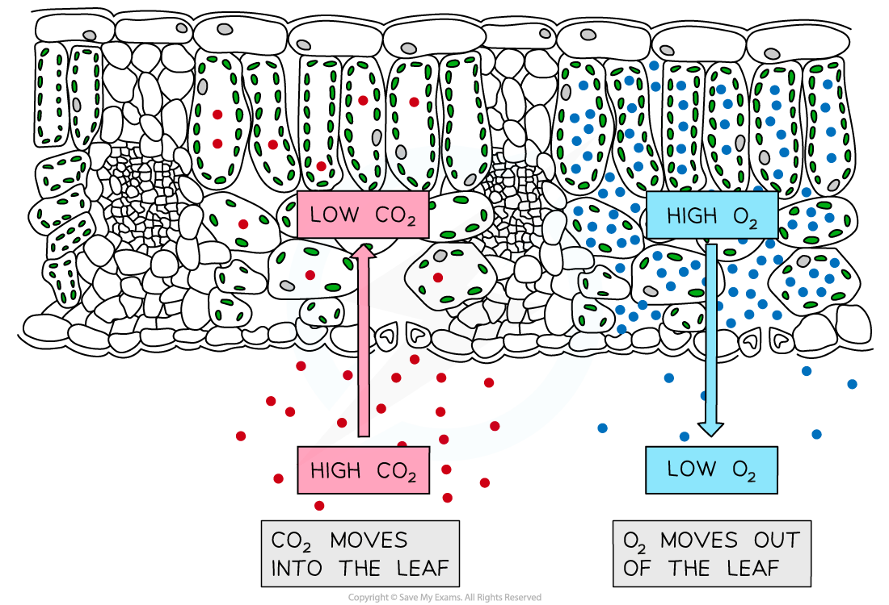

# Gas Exchange in Plants

## Diffusion in Gas Exchange

> **Spec point** — `spcpt_HKczMxbhPvdwyvHG` · understand the role of diffusion in gas exchange

## Diffusion in Gas Exchange

- Particles in a liquid and gas are in constant motion
- Diffusion is the **movement of particles** from a region of **higher** concentration to a region of **lower** concentration, **down a concentration gradient**
- Diffusion is important in living organisms. Substances that may move into and out of cells by diffusion include the molecules oxygen (O₂) and carbon dioxide (CO₂)

*If there is a higher concentration of a substance outside of the cell compared to the inside (or vice versa), then diffusion occurs*

#### Diffusion in organisms

- **Gas exchange **refers to the exchange of the gases oxygen (O₂)  and carbon dioxide (CO₂)  between a cell/organism and its environment
- **Single-celled organisms**, such as amoeba, can exchange gases sufficiently by simple diffusion through the cell membrane

*Gas exchange in single-celled organisms (such as amoeba) occurs by diffusion*

- Multicellular organisms (such as plants and animals), however, have **exchange surfaces and organ systems** that maximise the exchange of materials

  - Gills are the gas exchange organ in fish, **lungs** are the gas exchange organ in humans and **leaves** and **roots **are the gas exchange organ in plants
  - These organs **increase the efficiency** of exchange in several ways by:
  
    - Having a **large surface area**, providing more surface area relative to volume to allow sufficient diffusion
    - A **short diffusion distance** for substances to move across. This short distance is created because the barrier that separates two regions is as **thin** as possible
    - In addition, animals have gas exchange surfaces that are **well-ventilated** to maintain **steep concentration gradients**

## Gas Exchange: Photosynthesis & Respiration

> **Spec point** — `spcpt_NqrP8tPSVbtfpSkK` · understand gas exchange (of carbon dioxide and oxygen) in relation to respiration and photosynthesis

## Gas Exchange: Photosynthesis & Respiration

- The processes of **respiration** and **photosynthesis** in cells both rely on the exchange of the gases oxygen and carbon dioxide

### Gas exchange during respiration

- Plant cells, like all living cells, require energy for cellular processes. Energy is released when respiration occurs. Respiration occurs in plant cells all the time - both during the day and at night

  - In the daytime, if conditions are sufficient then photosynthesis will also occur in plants cells with chloroplasts
  - During the night when there is no light no photosynthesis occurs, but respiration will still be occurring
- Aerobic respiration requires **oxygen** and produces **carbon dioxide**
- At night, when no photosynthesis is occurring:

  - Oxygen diffuses down a concentration gradient from a** higher concentration** outside the leaf to a **lower concentration** inside the leaf
  
    - The cells in the leaf use oxygen in aerobic respiration so the concentration will remain low inside the respiring cells
  - Carbon dioxide diffuses down a concentration gradient from a** higher concentration** inside the leaf to a **lower concentration** outside the leaf

***At night, when no photosynthesis is occurring, oxygen diffuses into the leaf and carbon dioxide diffuses out of the leaf. This is an example of gas exchange. ***

### Gas exchange during photosynthesis

- Plant cells with chloroplasts can photosynthesise when there is enough **sunlight **
- Photosynthesis requires **carbon dioxide** and releases **oxygen**

  - Carbon dioxide diffuses down a concentration gradient from a region of **higher concentration** outside the leaf to a region of **lower concentration** inside the leaf
  
    - Cells with chloroplasts use carbon dioxide in photosynthesis so the concentration of carbon dioxide inside the photosynthesising cells is lower than outside
  - Oxygen diffuses down a concentration gradient from a** high concentration** (inside the leaf) to a **low concentration** (outside the leaf)
  
    - Note - some of the oxygen released in photosynthesis will be used in respiration!

***When photosynthesis occurs, carbon dioxide diffuses into the leaf and oxygen diffuses out of the leaf. ***
