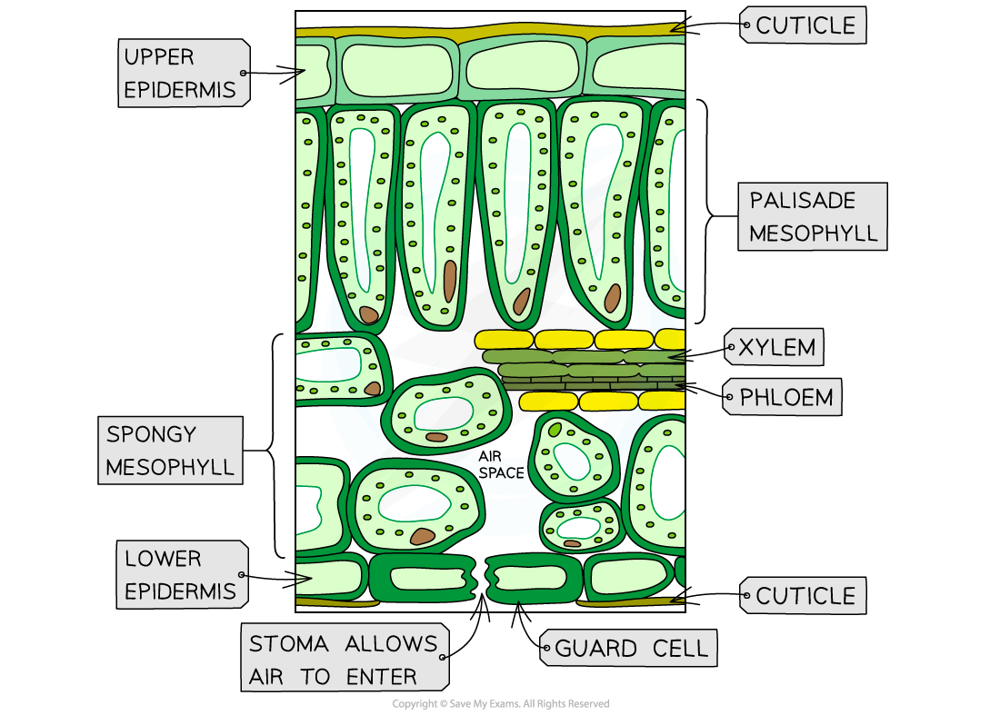
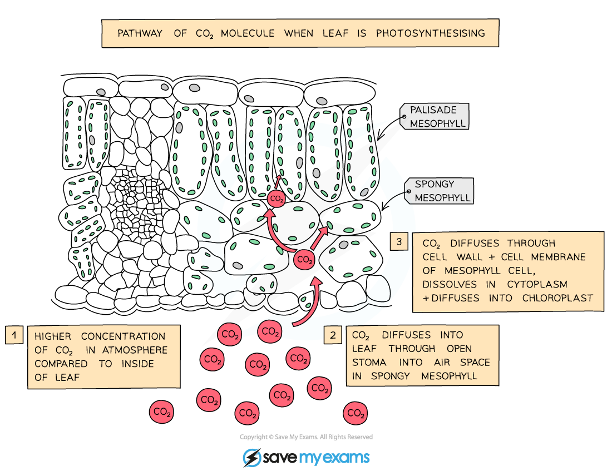
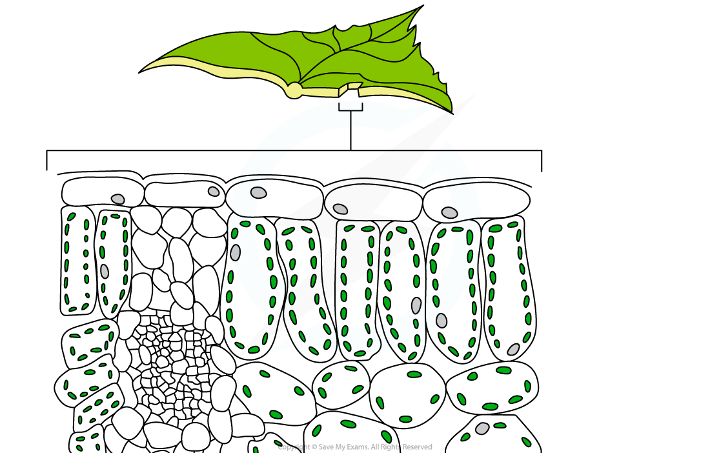
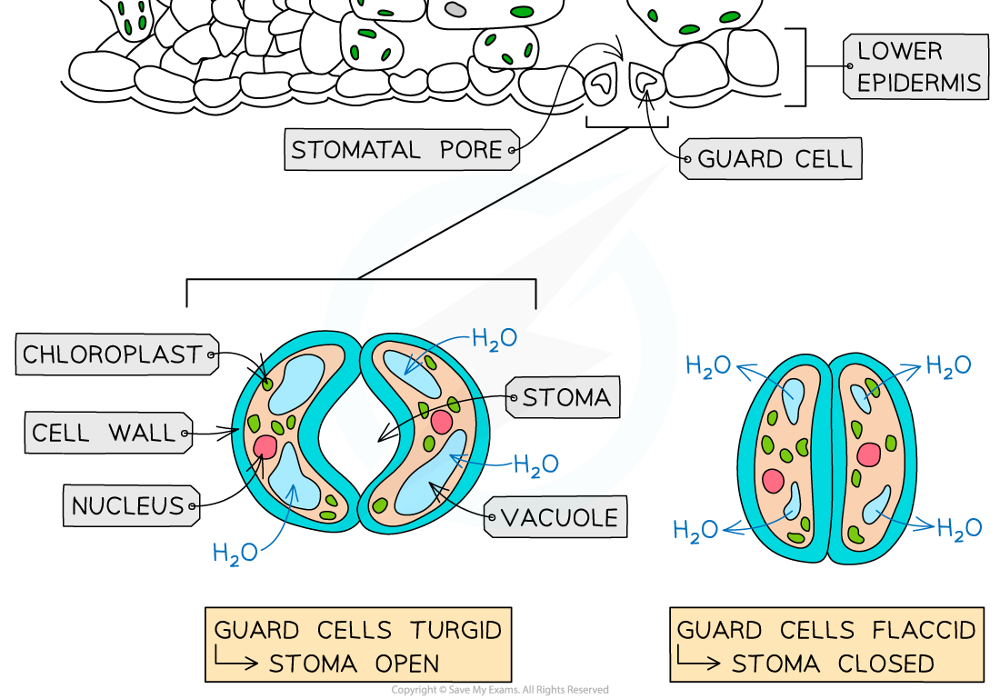

# Leaf Adaptations for Gas Exchange

## Leaf Structure

> **Spec point** — `spcpt_BBhvMktjYnR2pdWd` · understand how the structure of the leaf is adapted for gas exchange

## Leaf Structure

- The structure of the leaf is adapted to carry out both photosynthesis and gas exchange
- The different cell types (palisade mesophyll, spongy mesophyll etc.) and tissues are arranged in a specific way to facilitate these processes

***The cross-section of a leaf***

### Leaf structure and gas exchange

- Leaves are adapted to **maximise gas exchange**
- There are three key gases involved in gas exchange in the leaf:

  - **Carbon dioxide** - released in respiration but used in photosynthesis
  - **Oxygen** - released in photosynthesis but used in respiration
  - **Water vapour** - released in respiration and transpiration
- The route of diffusion of carbon dioxide **into** the leaf can be seen in the diagram below
- Gases will always diffuse down a concentration gradient (from where there is a high concentration to where there is a low concentration)

***Pathway of carbon dioxide from atmosphere to chloroplasts by diffusion.***

***atmosphere → air spaces around spongy mesophyll tissue → leaf mesophyll cells → chloroplast***

### Adaptations of the whole leaf for gas exchange

- Adaptations of leaves to maximise gas exchange:

  - They are thin which gives a **short diffusion distance**
  - They are flat which provides a **large surface area** to volume ratio
  - They have many stomata which allow movement of gases in and out of the air spaces by **diffusion**
- Other adaptations of the **internal** leaf structure/tissues include:

  - **Air spaces** to allow gas movement around the loosely packed **mesophyll cells**
  - Many **stomata** in the lower epidermis open in sunlight to allow gas movement in and out of the leaf
  - **Thin cell walls** allow gases to move into the cells easily
  - **Moist air** which gases can **dissolve** into for easier movement into and out of cells
  - The **close contact** between the cells and the air spaces allows efficient gas exchange for **photosynthesis** and **respiration**

## Stomata

> **Spec point** — `spcpt_pJRmctZz48kfx5wr` · describe the role of stomata in gas exchange 

## Stomata

- Stomata are spaces found between **two** **guard cells **predominantly on the** lower epidermis of the leaf**
- The guard cells open and close the **stomatal pore,** controlling** gas exchange and water loss**
- Stomata open when water moves (by **osmosis)** into the guard cells causing them to become ***turgid***

  - This allows **gases** to **diffuse** in and out of the leaf through the **stomatal pore**
  - Stomata tend to open when there is **plenty of water and sunlight**
- Stomata close when the guard cells lose water (by **osmosis)** to the neighbouring **epidermal cells** and they become ***flaccid***

  - This prevents any **diffusion** into or out of the leaf
  - Stomata tend to close due to** low water availability or low sunlight**

***The guard cells control the opening and closing of the stomata***
