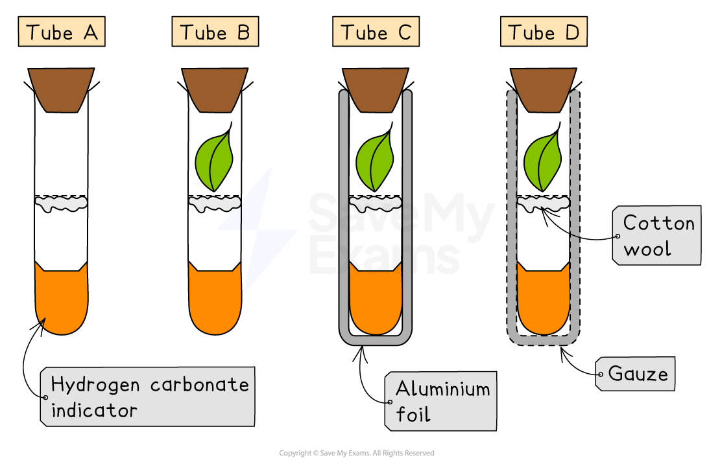
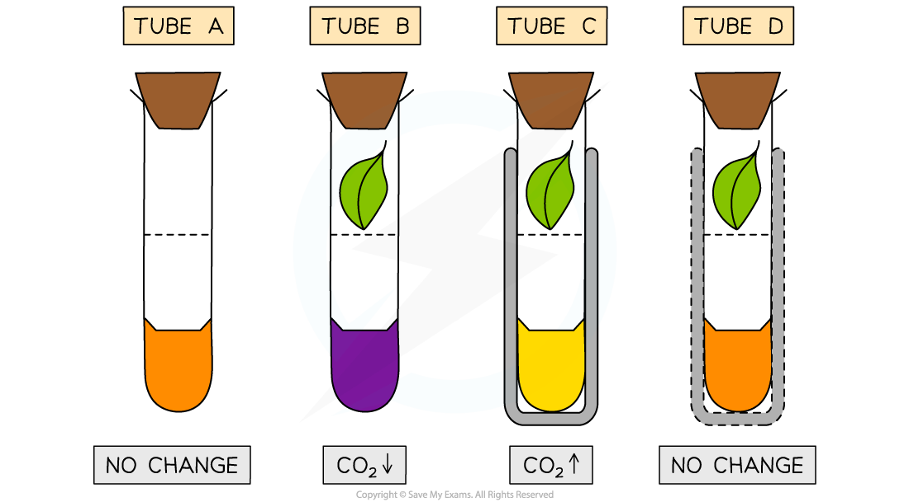

# Practical: The Effect of Light on Gas Exchange in Plants

## Practical: The Effect of Light on Gas Exchange in Plants

> **Spec point** — `spcpt_Ty9RzrjPnk7TjrtH` · practical: investigate the effect of light on net gas exchange from a leaf, using hydrogen-carbonate indicator

## Practical: The Effect of Light on Gas Exchange in Plants

- This experiment investigates how light affects photosynthesis and respiration by showing changes in carbon dioxide levels around a leaf:

  - Plants **photosynthesise in light**, using carbon dioxide
  - Plants **respire all the time**, producing carbon dioxide
  - By comparing leaves in different light conditions, we can see the **net gas exchange**
- **Hydrogen-carbonate indicator** changes colour depending on CO₂ concentration:

  - Yellow → high CO₂ (more acidic)
  - Orange/red → normal CO₂
  - Purple → low CO₂ (less acidic)

#### Apparatus

- Boiling tubes
- Cotton wool
- Aluminium foil
- Muslin (thin cotton cloth)
- Rubber bungs
- Hydrogen-carbonate indicator
- Leaves

#### Method

- Measure out 20 cm3 **hydrogen-carbonate indicator** into each of 4 boiling tubes
- Put some cotton wool into each boiling tube
- Label the boiling tubes A-D and set them up as follows:

  - **Tube A** - No leaf (control tube) left in bright light
  - **Tube B -** Place a leaf in the tube and leave in bright light
  - **Tube C** - Place a leaf in the tube and wrap the tube in aluminium foil to block out light (leaf will be in the dark)
  - **Tube D** - Place a leaf in the tube and wrap it in muslin (thin cotton cloth) to allow some light through
- Put a bung into the top of each tube
- Leave all 4 tubes in the light for several hours/overnight
- Observe any colour changes in the hydrogen-carbonate indicator

***Hydrogen-carbonate indicator can be used to study gas exchange in different light conditions - it is usually orange in normal atmospheric conditions***

#### Results

- After several hours/overnight, we would expect the following results:

  - **Tube A** - The control tube should remain an orange colour to show that the carbon dioxide is at **atmospheric levels**
  
    - There has been no net movement of carbon dioxide
  - **Tube B** - This tube was placed in the light with a leaf which is photosynthesising and respiring
  
    - Because the rate of photosynthesis is greater than the rate of respiration, the hydrogen-carbonate indicator will turn purple as there is **less carbon dioxide** than atmospheric levels
  - **Tube C** - This tube had a leaf inside, but was wrapped in aluminium foil meaning that no sunlight could reach the leaf
  
    - No light means that this leaf will not photosynthesise but will still be respiring, producing carbon dioxide. The indicator will turn yellow as **carbon dioxide levels increase** above atmospheric levels
  - **Tube D** - This tube had a leaf inside and was wrapped in muslin (cotton cloth) allowing some light through
  
    - This means that the rate of photosynthesis is roughly balanced with the rate of respiration, although usually the rate of photosynthesis is slightly greater so there may be a very small** net change in carbon dioxide levels** and the indicator either remains orange, but it could turn slightly purple.
    - Any colour change will be much less dramatic than the tube in bright light

***Hydrogen-carbonate indicator will change from orange to yellow with increasing carbon dioxide or purple with decreasing carbon dioxide***

#### The Effect of Light on Net Gas Exchange in Plants Table

| Boiling tube label | Conditions | Initial colour of hydrogen-carbonate indicator | Final colour of hydrogen-carbonate indicator | Conclusion |
|---|---|---|---|---|
| **Tube A** | No leaf (control) | Orange | Orange | No respiration or photosynthesis so no net movement of CO2  |
| **Tube B** | Leaf in sunlight | Orange | Purple | Photosynthesis > respiration.  There is a net intake of CO2 . The level of CO2  decreases.  |
| **Tube C** | Leaf wrapped in aluminium foil | Orange | Yellow | No photosynthesis due to lack of light, only respiration occurs.  There is a net release of CO2. The level of CO2 increases. |
| **Tube D** | Leaf wrapped in muslin (cotton cloth) | Orange | Orange/slightly purple | Photosynthesis and respiration are relatively balanced. Net exchange of gas is small, although photosynthesis may exceed respiration so a small net update of CO2 may happen (level of CO2 decreases) |

### Applying CORMS evaluation to practical work

- When designing or reviewing practical investigations, remember to consider the CORMS prompt

***The CORMS prompt***

- For this investigation into the effect of light on net gas exchange from a leaf using hydrogen-carbonate indicator, the following would apply:

  - **Change** - change the availability of light for each boiling tube (not wrapped, wrapped in foil, wrapped in muslin)
  - **Organisms** - the leaves should be from the same species/age of the plant, they should be approximately the same size
  - **Repeat** - repeat the investigation several times to ensure  results are reliable
  - **Measurement 1** - observe the change in the hydrogen-carbonate indicator
  - **Measurement 2** - after several hours/overnight
  - **Same** - control the volume of hydrogen-carbonate indicator, the number of leaves, the temperature of the environment
