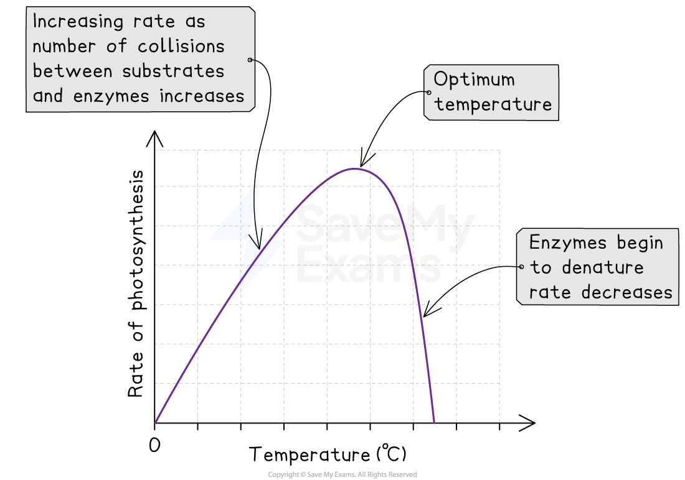
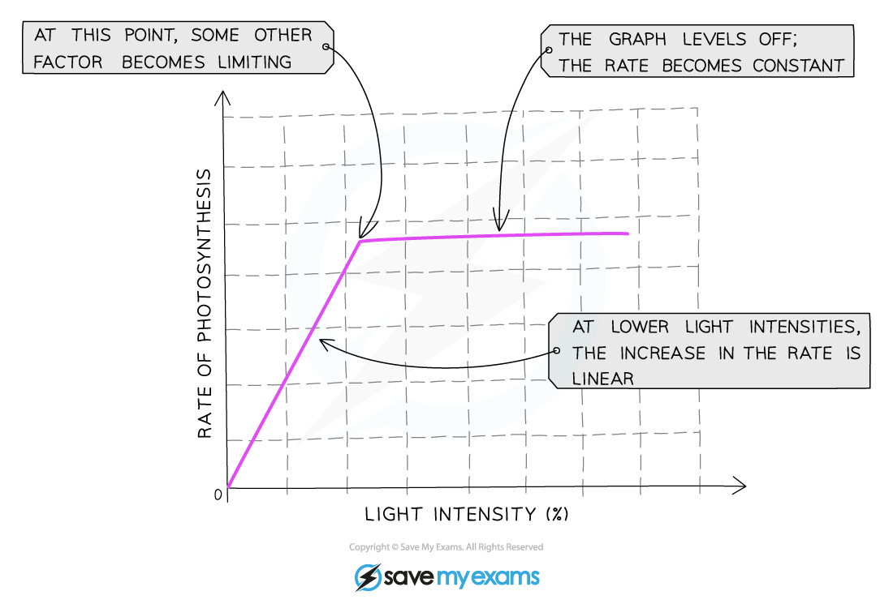
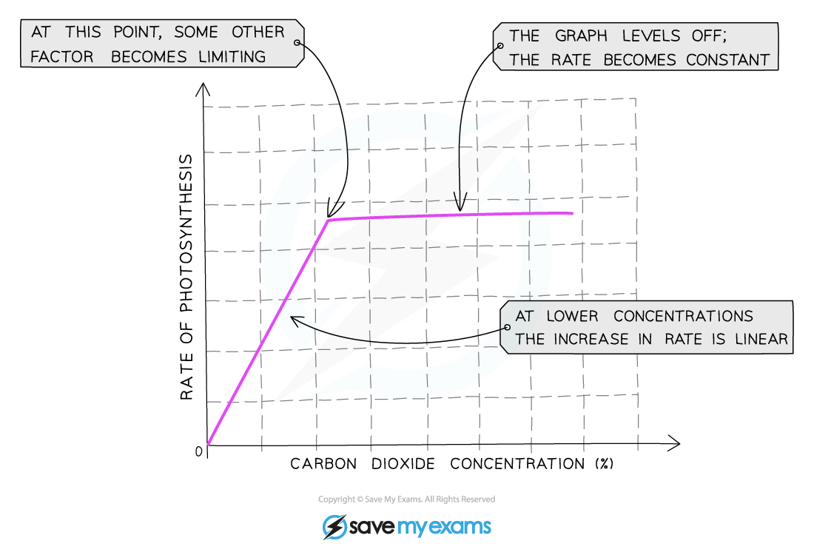

# Factors Affecting the Rate of Photosynthesis

## Limiting Factors

> **Spec point** — `spcpt_MzTkGzc99G7PcZ3x` · understand how varying carbon dioxide concentration, light intensity and temperature affect the rate of photosynthesis

## Limiting Factors

- Plants do not have unlimited supplies of their raw materials so their rate of photosynthesis is limited by whatever factor is the **lowest** at that time
- So a **limiting factor** can be defined as something present in the environment in such **short supply** that it **restricts life processes**
- There are three main factors that limit the rate of photosynthesis:

  - **Temperature**
  - **Light intensity**
  - **Carbon dioxide concentration**
- Although water is necessary for photosynthesis, it is not considered a limiting factor as the amount needed is relatively small compared to the amount of water transpired from a plant so there is hardly ever a situation where there is not enough water for photosynthesis
- The number of **chloroplasts** or the amount of chlorophyll in the chloroplasts can also affect the rate of photosynthesis

#### Temperature

- The temperature of the environment affects how much **kinetic energy** all particles have – so temperature affects the speed at which carbon dioxide and water move through a plant
- The lower the temperature, the less kinetic energy particles have, resulting in fewer **successful collisions** occurring over a period of time
- Increasing temperature increases the kinetic energy of particles, increasing the likelihood of collisions between reactants and enzymes which results in the formation of products
- At higher temperatures, however, **enzymes** that control the processes of photosynthesis can be **denatured** (where the active site changes shape and is no longer complementary to its substrate) – this reduces the overall rate of photosynthesis

***The effect of temperature on the rate of photosynthesis***

#### Light intensity

- The **intensity** of the light available to the plant will affect the amount of energy that it has to carry out photosynthesis
- The **more** **light** a plant receives, the **faster** the rate of photosynthesis
- This trend will continue until **some other factor** required for photosynthesis prevents the rate from increasing further because it is now in short supply, this factor becomes the **limiting factor**

***Graph showing the effect of light intensity on the rate of photosynthesis***

#### Carbon dioxide concentration

- Carbon dioxide is one of the raw materials required for photosynthesis
- This means the **more carbon dioxide** that is present, the **faster the reaction** can occur
- This trend will continue until some other factor required for photosynthesis prevents the rate from increasing further because it is now in short supply, this factor becomes the **limiting factor**

***A graph showing the effect of the concentration of carbon dioxide on the rate of photosynthesis***

#### Chlorophyll

- The **number of chloroplasts** (as they contain the pigment chlorophyll which absorbs light energy for photosynthesis) will affect the rate of photosynthesis
- The more chloroplasts a plant has, the faster the rate of photosynthesis
- The amount of chlorophyll can be affected by:

  - Diseases (such as tobacco mosaic virus)
  - Lack of nutrients (such as magnesium)
  - Loss of leaves (fewer leaves means fewer chloroplasts)
  - Genetic factors in the plants, such as whether they have variegated leaves

> **Exam Hint**
> Interpreting graphs of limiting factors can be confusing for many students, but it’s quite simple. In the section of the graph where the rate is increasing (the line is going up), the limiting factor is whatever the label on the x axis (the bottom axis) of the graph is. In the section of the graph where the rate is not increasing (the line is horizontal), the limiting factor will be something other than what is on the x axis – choose from temperature, light intensity or carbon dioxide concentration.
