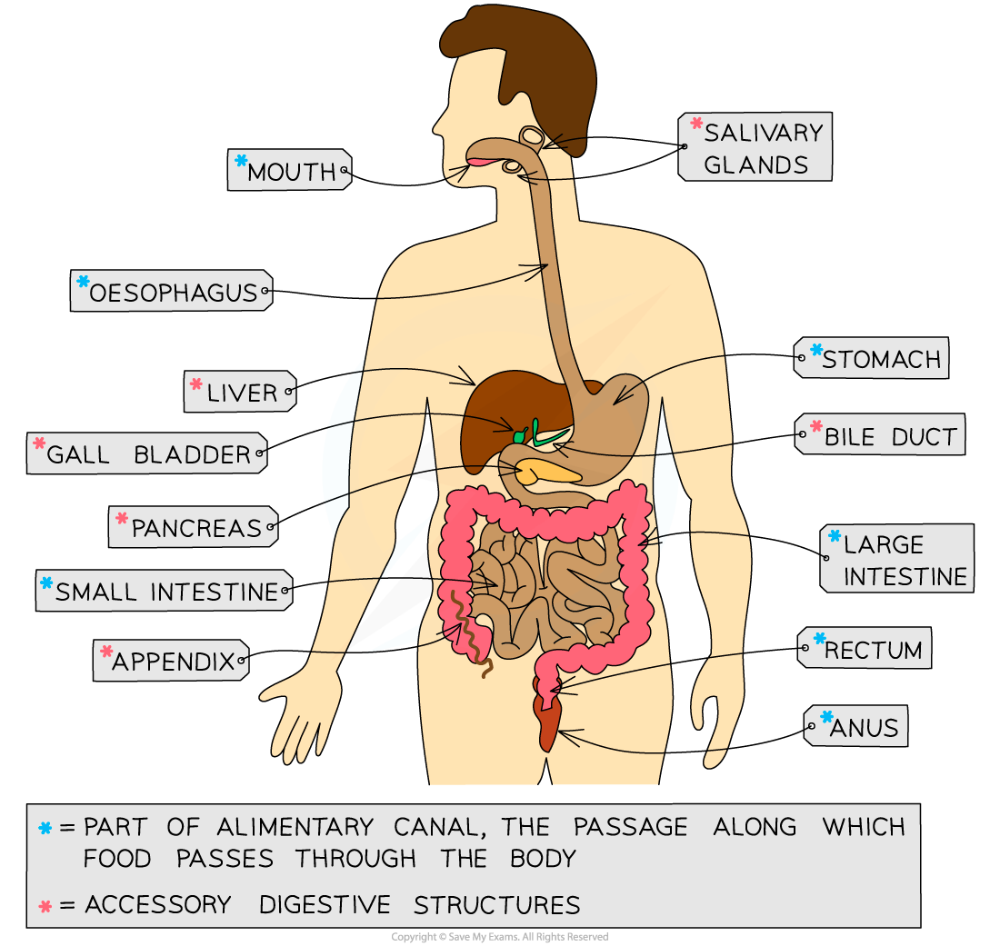

# Human Alimentary Canal: Structure & Function

## The Structure & Function of the Alimentary Canal

> **Spec point** — `spcpt_ZsD5cwHmxvxDXKZr` · describe the structure and function of the human alimentary canal, including the mouth, oesophagus, stomach, small intestine (duodenum and ileum), large intestine (colon and rectum) and pancreas

## The Structure & Function of the Alimentary Canal

- The digestive system is an example of an **organ system**
- Digestion is a process in which relatively **large, insoluble molecules** in food (such as starch, proteins) are broken down into **smaller, soluble molecules** that can be absorbed into the bloodstream and delivered to cells in the body
- These small soluble molecules (such as **glucose** and **amino acids**) are used either to provide cells with **energy** (via respiration), or with materials with which they can **build other molecules to grow, repair and function**
- The human digestive system is made up of the organs that form the **alimentary canal** and **accessory organs**

  - The alimentary canal is the channel or passage through which **food flows through the body**, starting at the **mouth** and ending at the **anus**
  - Digestion occurs within the alimentary canal
  - Accessory organs produce substances that are needed for digestion to occur (such as **enzymes** and **bile**) but **food does not pass directly through** these organs

***The human digestive system includes the organs of the alimentary canal and accessory organs that work together to break large insoluble molecules into small soluble molecules***

#### Alimentary canal and accessory structures table

| **Structure** | **Function** |
|---|---|
| **Mouth / salivary glands** | Mechanical digestion: teeth chew food to break it into smaller pieces and increase its surface area to volume ratio  Chemical digestion: amylase enzymes in saliva start digesting starch into maltose  The food is shaped into a bolus (ball) and lubricated by saliva so it can be swallowed easily |
| **Oesophagus** | The tube that connects the mouth to the stomach  Wave-like contractions take place to push the food bolus down without relying on gravity |
| **Stomach** | Food is mechanically digested by churning actions while protease enzymes start to chemically digest proteins.  Hydrochloric acid is present to kill bacteria in food and provide the optimum pH for protease enzymes to work. |
| **Small intestine** | The first section is called the duodenum; this is where digestion of the food exiting the stomach is completed by enzymes that are present in the duodenum lining and secreted by the pancreas  The pH of the small intestine is slightly alkaline; around pH 8-9.  The second section is called the ileum and is where the absorption of water and digested food molecules takes place; the ileum is long and lined with villi to increase the surface area over which absorption can take place |
| **Large intestine** | Water is absorbed from the remaining material in the colon to produce faeces  Faeces are stored in the rectum and exit the body via the anus |
| **Pancreas** | Produces all three types of digestive enzymes: amylase, protease and lipase  Secretes enzymes in an alkaline fluid into the duodenum for digestion; this raises the pH of fluid coming out of the stomach |
| **Liver** | Amino acids that are not used to make proteins are broken down here (deamination), producing urea  Produces bile to emulsify fats (break large droplets into smaller droplets), an example of mechanical digestion |
| **Gall bladder** | Stores bile to release into the duodenum |
