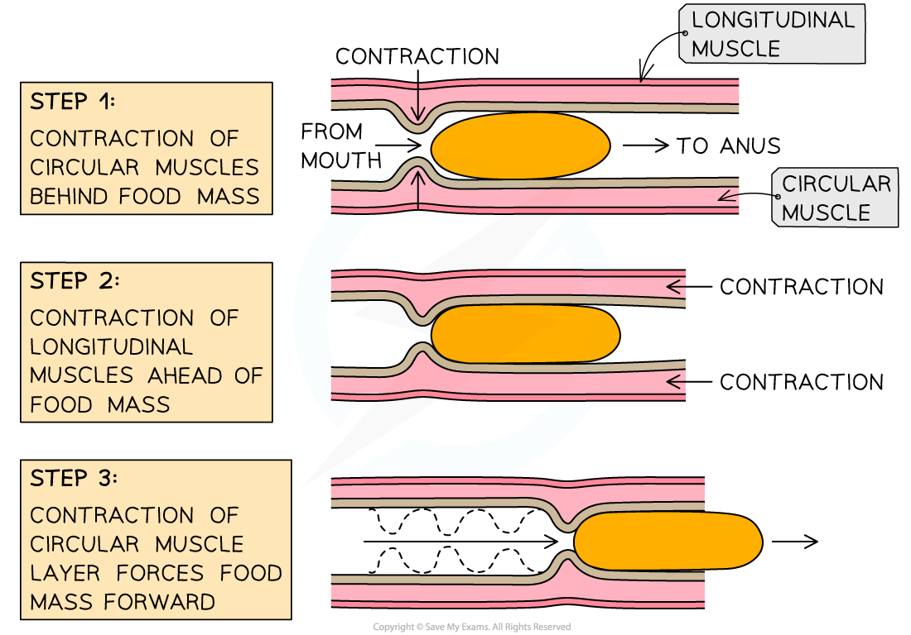

# Peristalsis

## Peristalsis

> **Spec point** — `spcpt_dYd5GJ8GR7WyrywN` · understand how food is moved through the gut by peristalsis

## Peristalsis

- Peristalsis is a mechanism that helps moves food along the ***alimentary canal***
- Firstly, muscles in the walls of the oesophagus create** waves of contractions** which force the ***bolus*** along
- Once the bolus has reached the stomach, it is churned into a less solid form, called chyme, which continues on to the **small intestine**
- Peristalsis is controlled by** circular** and **longitudinal** muscles

  - Circular muscles **contract **to reduce the **diameter** of the lumen of the oesophagus or small intestine
  - Longitudinal muscles **contract **to reduce the **length** of that section the oesophagus or the small intestine
- **Mucus** is produced to continually **lubricate** the food mass and reduce friction
- **Dietary fibre** provides the **roughage** required for the muscles to push against during peristalsis

***Muscles in the alimentary canal contract rhythmically to move the partially digested food along in a wave-like action***
