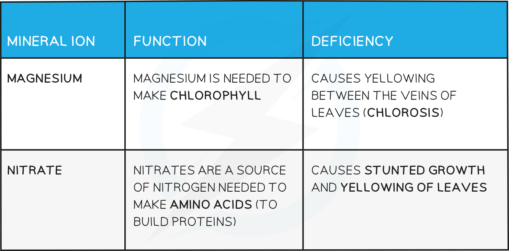

# Plants & Mineral Ions

## Mineral Ions

> **Spec point** — `spcpt_jmBDCBnmmxhzC7WN` · understand that plants require mineral ions for growth, and that magnesium ions are needed for chlorophyll and nitrate ions are needed for amino acids

## Mineral Ions

- Photosynthesis provides a source of carbohydrates, but plants contain and require many other types of biological molecule; such as proteins, lipids and nucleic acids (DNA)
- As plants do not eat, they need to **make these substances themselves**
- Carbohydrates contain the elements carbon, hydrogen and oxygen but proteins, for example, contain **nitrogen** as well (and certain amino acids contain other elements too)
- Two fundamental mineral ions required by plants are **nitrate and magnesium**, without a source of these elements, plants cannot photosynthesise or grow properly
- Plants obtain these elements in the form of **mineral ions actively absorbed from the soil by root hair cells**
- ‘Mineral’ is a term used to describe any naturally occurring inorganic substance

#### Mineral ion function and deficiencies in plants table

***The effect of mineral deficiencies on plants***
