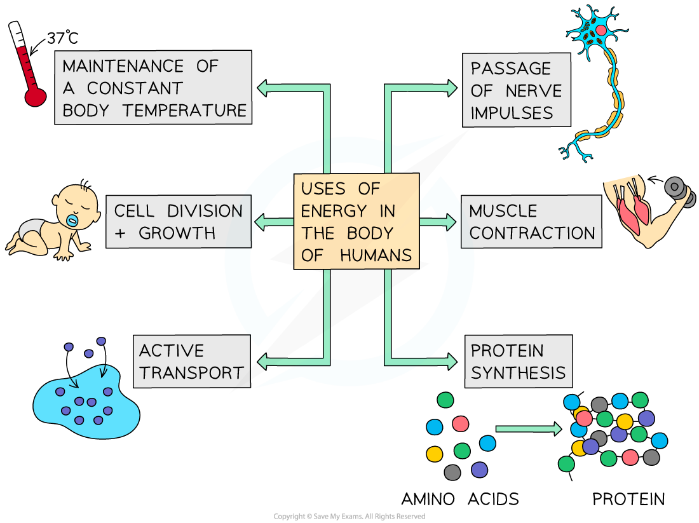

# Process of Respiration

## Respiration

> **Spec point** — `spcpt_9cH2dXsZGXS62Btq` · understand how the process of respiration produces ATP in living organisms

## Respiration

- **Respiration** is a **chemical reaction** carried out in **all** living organisms
- **Energy** is released from** glucose** either in the presence of oxygen (aerobic respiration) or the absence of oxygen (anaerobic respiration)
- The reactions ultimately result in the production of **carbon dioxide** and **water **as waste products
- Energy is transferred in the form of **ATP**

> **Exam Hint**
> Make sure not to confuse respiration with gas exchange. Gas exchange involves getting oxygen into the cells and carbon dioxide out. Respiration uses the oxygen supplied from gas exchange to release energy in the form of **ATP. **Remember energy is never made or produced!

## ATP

> **Spec point** — `spcpt_4KTmxr3YFY7BBgJn` · know that ATP provides energy for cells

## ATP

- During the process of** cellular respiration,** glucose is broken down and several molecules of **ATP** are produced
- The energy required by organisms is released via these ATP molecules
- ATP can be broken down to release **energy **for **living processes** to occur within cells and organisms
- Processes requiring energy from ATP might include:

  - **Chemical reactions** to build larger molecules from smaller molecules
  - **Muscle contraction** to allow movement
  - **Keeping warm** (to maintain a constant temperature suitable for enzyme activity)

***Uses of the energy released from respiration***
