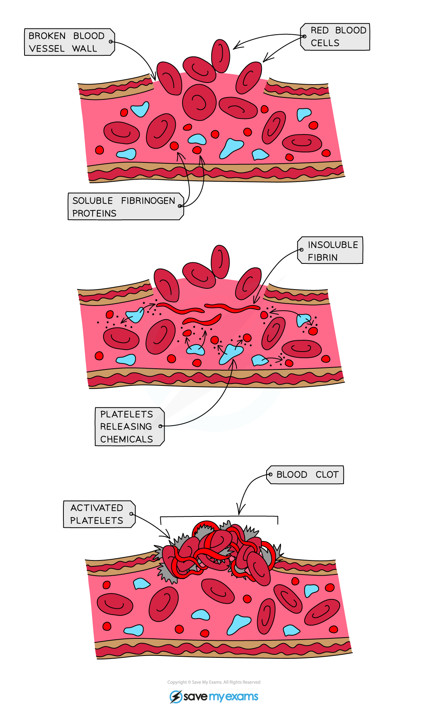

# Platelets & Blood Clotting

## Platelets

> **Spec point** — `spcpt_yYqgBWndc2pRDC6n` · understand how platelets are involved in blood clotting, which prevents blood loss and the entry of micro-organisms

## Platelets

- **Platelets** are fragments of cells that are involved in** blood clotting** and forming **scabs**

  - When the skin is broken (i.e. there is a wound) platelets arrive to stop the bleeding
  - A series of reactions occur within the blood plasma:
  
    - Platelets release chemicals that cause **soluble fibrinogen proteins** to convert into **insoluble fibrin**
    - This forms an **insoluble mesh** across the wound
    - Red blood cells become trapped, **forming a clot**
    - The clot eventually dries and develops into a **scab**
- This process helps to **prevent excessive blood loss** and protect the wound from **bacteria entering **until **new skin** has formed

***How the blood clots***
