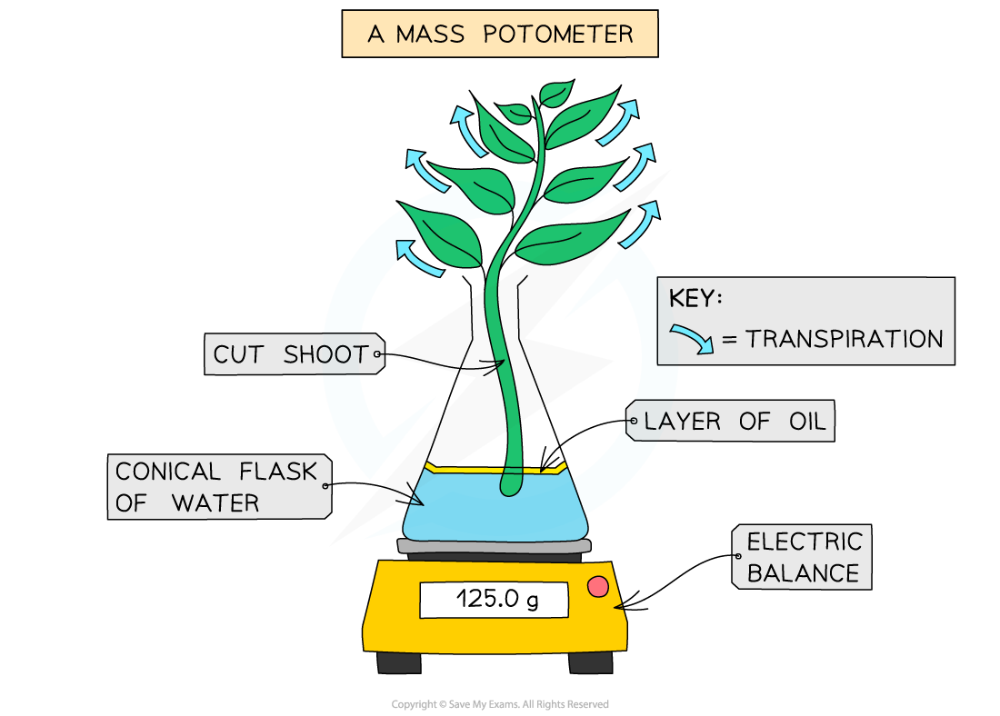
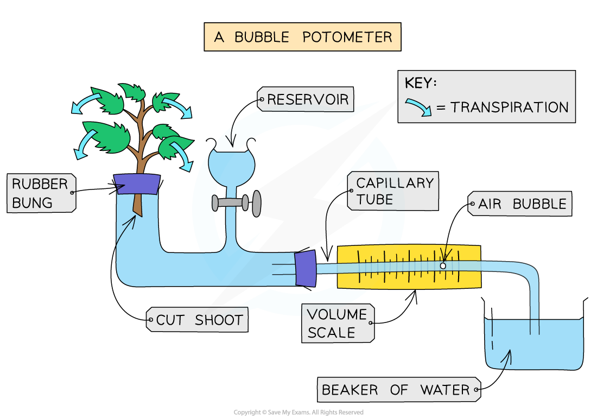
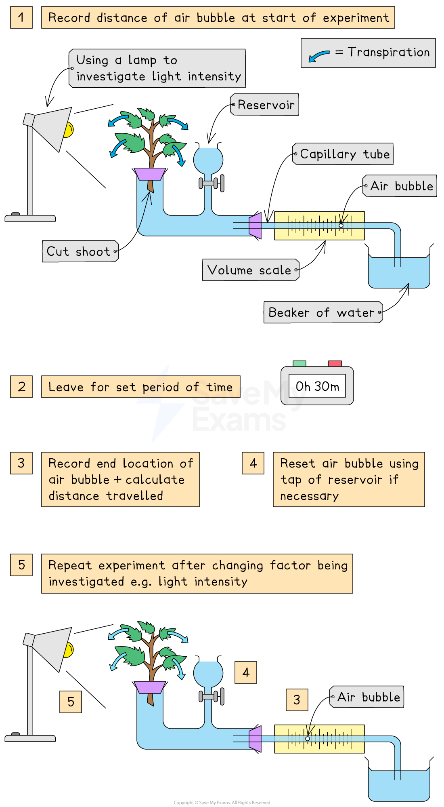

# Practical: Factors Affecting Transpiration

## Practical: Factors Affecting Transpiration

> **Spec point** — `spcpt_x72FWd4769WBBvFW` · practical: investigate the role of environmental factors in determining the rate of transpiration from a leafy shoot

## Practical: Factors Affecting Transpiration

- We can investigate the effect of different environmental conditions (such as temperature, humidity, light intensity and wind movement) on the **rate of transpiration** using a piece of apparatus called a** potometer**
- There are two types of potometer

  - A **mass potometer** measures a change in mass of a plant as a measure of the amount of water that has evaporated from the leaves and stem
  - A **bubble potometer** measures the uptake of water by a stem as a measure of the amount of water that is being lost by evaporation consequently pulling water up through the stem to replace it

***There are two different types of potometer that could be used to investigate the effect of environmental conditions on transpiration***

#### Investigating the effect of light intensity on transpiration using a bubble potometer

#### Apparatus

- Potometer (bubble or mass potometer)
- Timer
- Lamp
- Ruler
- Plant

#### Method

- Set up experiment:

  - Cut a shoot underwater (to prevent air entering the xylem) and place in potometer
  - Set up the apparatus as shown in the diagram and make sure it is airtight, using petroleum jelly to seal any gaps
  - Dry the leaves of the shoot (as wet leaves will affect the results)
  - Remove the capillary tube from the beaker of water to allow a single **air bubble** to form and place the tube back into the water
- Investigate light intensity:

  - Place a lamp 10 cm from the leaf
  - Allow the plant to adapt to the new environment for 5-10 minutes
  - Record the **starting position** of the air bubble (in mm)
  - Start a timer and leave for 30 minutes
  - Record the **end position** of the air bubble (in mm)
- Repeat:

  - Reset the air bubble by opening the tap of the reservoir to move the bubble back
  - Repeat for the same light distance two more times
- Change the light intensity by moving the lamp (eg. move lamp to 20 cm, 40 cm)

  - Repeat the steps above for the same shoot, adjusting the lamp and reseting the air bubble each time
- Calculate the rate of transpiration:

  - Calculate the distance moved by air bubble (mm) = end position - start position
  - Divide the distance the bubble travelled by the time period (30 minutes in this experiment)

***Investigating transpiration rates using a potometer***

#### Results

| Lamp distance (cm) | Distance moved by air bubble (mm) | Rate of transpiration |
|---|---|---|
| 10 | 32 | 1.07 |
| 20 | 24 | 0.80 |
| 40 | 12 | 0.40 |

- The closer the lamp (and the higher the **light intensity), the higher the rate of transpiration**
- This is shown by the bubble moving a** greater distance** in the 30-minute time period when the lamp was 10 cm from the plant (the highest light intensity)
- In bright light, more **stomata** **open** to allow more carbon dioxide into the leaf for photosynthesis
- The more stomata that are open, the **greater the evaporation** of** water** **vapour** from the leaf

#### Limitations

- The main limitation to this practical is the fact that the other factors that can affect the rate of transpiration (especially temperature) cannot be satisfactorily controlled

  - For example, the lamp will heat the plant when at the closest distance to the plant for the highest light intensity, which means both light intensity and temperature are affecting the rate of transpiration, rather than just light intensity
  - The air humidity and air movement in the room are likely to be variable
- Other limitations include:

  - Imperfect seals resulting in leaks
  
    - Solution: Ensure that all equipment fits together rightly around the rubber bungs and assemble underwater to help produce a good seal
  - The plant cutting has a blockage
  
    - Solution: Cut the stem underwater and assemble equipment underwater to minimise opportunities for air bubbles to enter the xylem

#### Further experiments:

- Other environmental factors can be investigated in the following ways:

  - **Airflow**: Set up a fan or hairdryer
  - **Humidity**: Spray water in a plastic bag and wrap around the plant
  - **Temperature**: Temperature of room (cold room or warm room)

#### Using CORMS

***The CORMS prompt***

- In this investigation, there are several different variations of the method depending on which **environmental factor** you are testing. However, if testing the effect of light intensity, the CORMS would look like this:

  - **Change** - change the intensity of the light
  - **Organisms** - plants used in each repeat should be the same species, size, age, number of leaves
  - **Repeat** - repeat the investigation several times to ensure  results are reliable
  - **Measurement 1** - measure the distance travelled by the bubble
  - **Measurement 2** - ...in 30 minutes (calculate the **rate of transpiration**)
  - **Same** - control the temperature, wind speed and humidity of the environment
