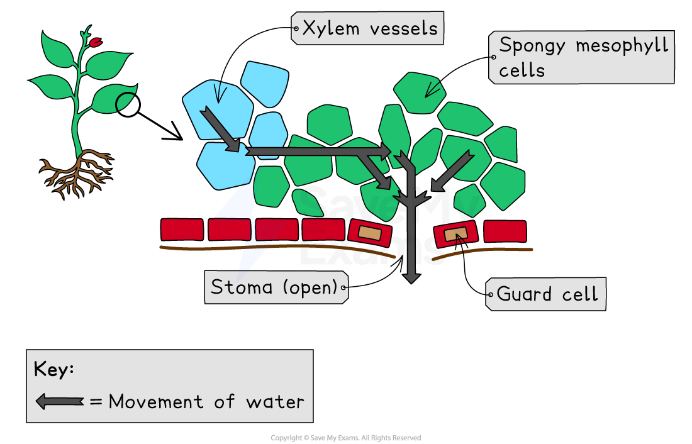

# Transpiration

## Transpiration

> **Spec point** — `spcpt_MpbJNC2PpcNSpVR6` · understand that transpiration is the evaporation of water from the surface of a plant

## Transpiration

- Transpiration is defined as

**The evaporation of water vapour from the surface of a plant**

- Transpiration is useful for plants, having several functions**:**

  - Drawing water up to the leaves from the roots
  - Keeping the **leaves cool as **heat energy is lost from the leaves when water **evaporates**
  - Transporting **mineral ions **(eg. nitrates)
  - Preventing wilting by providing **water to keep cells turgid**
  - Providing **water** for **photosynthesis**

***Transpiration mainly occurs on the underside of leaves through tiny pores called stomata (one pore is referred to as a stoma)***

## Factors Affecting Transpiration

> **Spec point** — `spcpt_W85K6cxvXJNHcCnq` · understand how the rate of transpiration is affected by changes in humidity, wind speed, temperature and light intensity

## Factors Affecting Transpiration

- There are several **environmental conditions** which have an impact on the **rate of** **transpiration:**

  - **Air movement**
  - **Humidity**
  - **Temperature**
  - **Light intensity**

#### Factors affecting transpiration rate table

- The table summarises the effects of these four factors on the rates of transpiration

| **Factor** | **Relationship to transpiration rate** | **Explanation** |
|---|---|---|
| Air movement | As wind speed increases, the transpiration rate increases | When it is windy, water molecules that have diffused out of the stomata are quickly blown away from the leaf. This creates a concentration gradient and more water vapour diffuses out of the leaf. |
| Temperature | As temperature increases, the transpiration rate increases | As temperature increases, the kinetic energy of water molecules increases. Water molecules with increased kinetic energy move around faster and more likely to diffuse out of the stomata. |
| Humidity | As humidity increases, the transpiration rate decreases | When it is humid, there is an increase in water molecules outside of the leaf. This affects the diffusion concentration gradient. As a result, there is a decrease in the rate of diffusion of water vapour out of the leaf. |
| Light intensity | As light intensity increases, the transpiration rate increases | Light intensity affects stomatal opening - the higher the light intensity the greater the number of stomata that are open, which increases the diffusion of water vapour out of the leaf. |

> **Exam Hint**
> You could be given a question about a transpiration experiment in your exam where some of the factors listed in the table above are being investigated. 
> 
> The table above explains how the factors influence transpiration when they're increased (eg. an increase in humidity results in a decrease in transpiration rate...) but you should also know the effects of each of them decreasing, which would be the opposite (eg. in less windy/still conditions, transpiration rate decreases as less of a diffusion gradient would exist between the leaf and the air).
