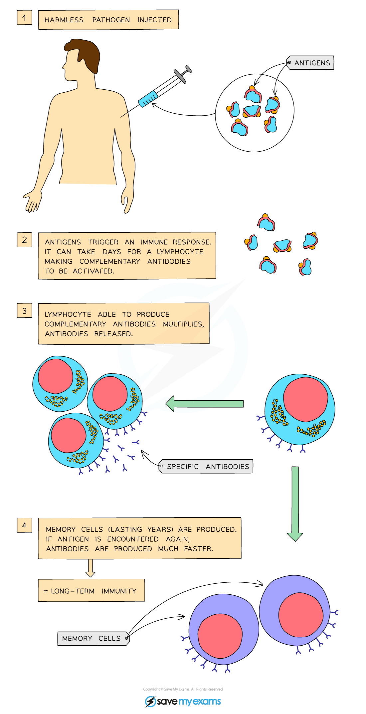
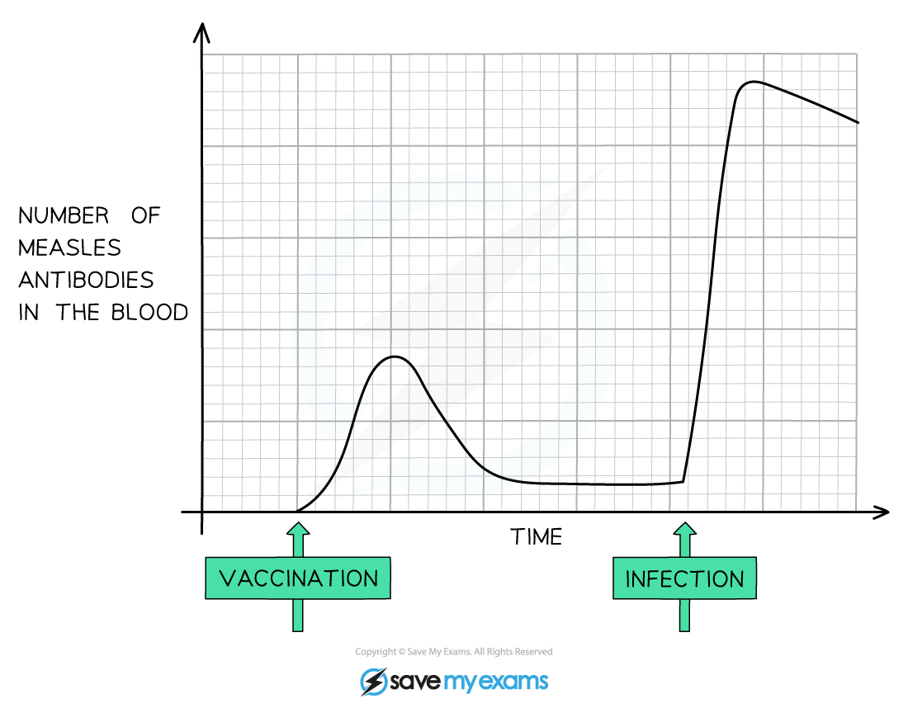

# Vaccinations

## Vaccinations

> **Spec point** — `spcpt_26YfpKJHHvg3wk5H` · understand how vaccination results in the manufacture of memory cells, which enable future antibody production to the pathogen to occur sooner, faster and in greater quantity

## Vaccinations

- Vaccines are used to help the body develop immunity to infectious diseases

  - Vaccines have **reduced the cases of certain diseases** drastically or even **eradicated** some diseases worldwide
- A vaccine contains** harmless** versions of a pathogen
- Scientists ensure that vaccines contain harmless pathogens by:

  - **Killing** the pathogen
  - Using a weakened version of a pathogen (**attenuated** vaccine)
  - Using** fragments** of pathogens
- A vaccine may be administered **orally, nasally** or via an** injection**

#### How vaccines work

- Once in the bloodstream, the pathogen's **antigens** contained within the vaccine can trigger an immune response in the following way:

  - **Lymphocytes** recognise the **antigens** in the bloodstream
  - The activated lymphocytes produce **antibodies specific** to the antigen encountered
  - **Memory cells are produced from the lymphocytes**
  - **Memory cells and antibodies** subsequently remain circulating in the blood stream

***The process of long-term immunity by vaccination***

- Future infection by the same pathogen that an individual has been vaccinated against will trigger an immune response that is much faster and larger than the initial one.
- This is because vaccination leads to the production of **memory cells** (a type of long-lasting lymphocyte) that remain in the body for many years. If the vaccinated individual is later infected by the same pathogen, these memory cells produce antibodies more quickly and in greater quantities
- Because the response is so rapid, the pathogen is unable to cause disease, and the individual is said to be **immune**.

***Graph showing the number of measles antibodies in the blood following vaccination. The immune response (production of antibodies) to the infection occurs much faster and is greater because of vaccination.***

> **Exam Hint**
> When explaining why an immune response to a real pathogen tends to be faster and stronger in someone who has been vaccinated, you must emphasise that vaccination results in the manufacture of **memory cells**, which enable **future antibody production** to the pathogen to occur **sooner, faster and in greater quantity, **before the pathogen can cause disease.
