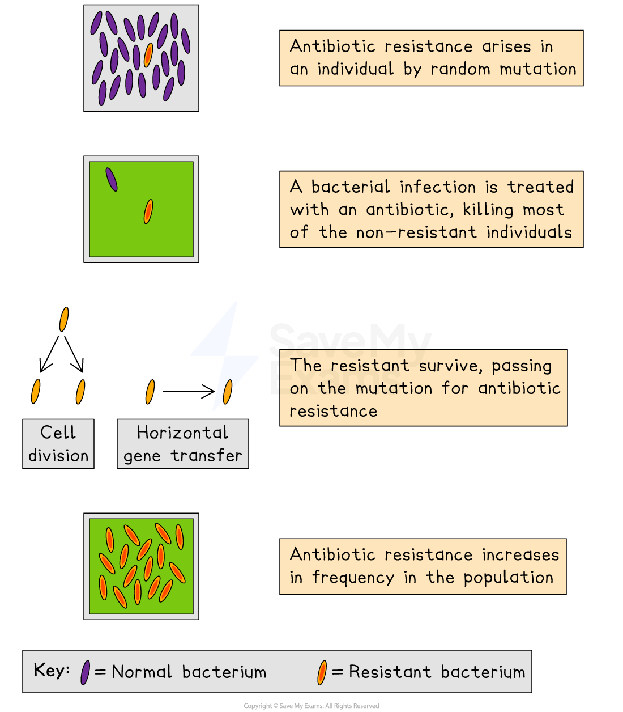

# Antibiotic Resistance

## Antibiotic Resistance

> **Spec point** — `spcpt_YsYd3fX99KjhYSyr` · understand how resistance to antibiotics can increase in bacterial populations, and appreciate how such an increase can lead to infections being difficult to control

## Antibiotic Resistance

- [Natural selection](https://www.savemyexams.com/igcse/biology/edexcel/19/revision-notes/3-reproduction--inheritance/inheritance/3-38-darwins-theory-of-evolution-by-natural-selection/) can give rise to bacterial populations that are resistant to ***antibiotics***
- Antibiotic resistance can increase in bacterial populations as follows:

  - a **random** **mutation** can give rise to a new bacterial ***allele*** that codes for **antibiotic resistance**
  - when the bacterial population is exposed to an antibiotic any individuals without the resistance allele die, while those **with the resistance allele survive**
  - the surviving bacteria are **more likely to reproduce**, **passing on their resistance alleles** to their offspring
  - over several generations the **frequency of the resistance allele increases**, eventually resulting in an antibiotic resistant strain of bacteria
- Once a bacterial population has developed resistance to a particular antibiotic, it can only be treated with the application of a different antibiotic; in some cases **several antibiotics** need to be used to treat a resistant infection
- Antibiotic resistance therefore makes bacterial infections **more difficult to control**

***Bacteria can develop resistance to commonly used antibiotics***

> **Exam Hint**
> Remember that antibiotic resistance arises by **natural selection**, so any description of how antibiotic resistance occurs must include the main steps of natural selection:
> 
> - **Variation**: random mutation gives rise to a resistance allele
> - **Increased survival**: individuals with the resistance allele are more likely to survive
> - **Increased** **reproduction**: the resistance allele is passed on
> - **Increased allele frequency**: the resistance allele becomes more common in the population
