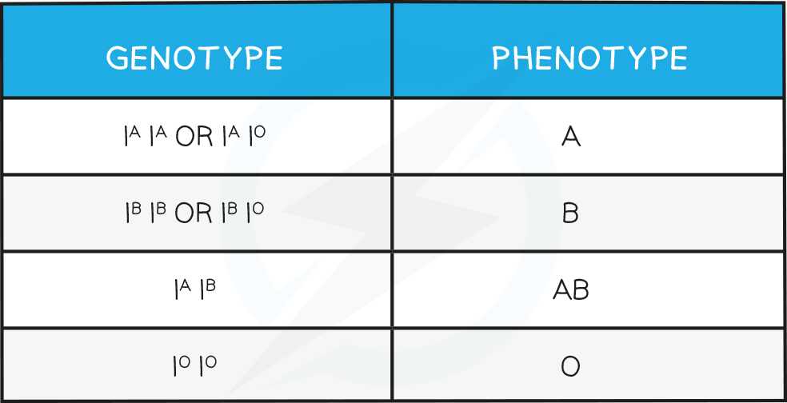
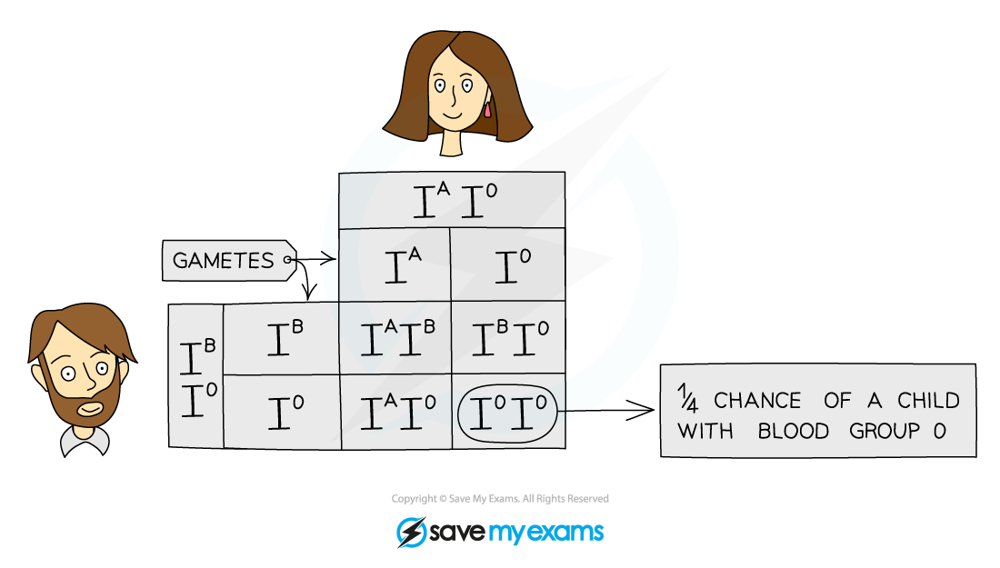

# Codominance

## Codominance

> **Spec point** — `spcpt_MDknpVCYhn4zMmpY` · understand the meaning of the term codominance

## Codominance

- On occasion, **both alleles within a genotype are expressed** in the phenotype of an individual - this is known as **codominance**
- Inheritance of blood group is an example of **codominance**

  - There are **three** alleles of the gene governing this instead of the usual two
  - I represents the **gene** and the superscript A, B and O represent the **alleles**
  - Alleles IA and IB are **codominant**, but both are dominant to IO
  - IA results in the production of **antigen A** in the blood
  - IB results in the production of **antigen B** in the blood
  - IO results in **no antigens** being produced in the blood
- These three possible alleles can give us the following genotypes and phenotypes

#### Codominance in blood types table

### Genetic diagrams for codominance

- We can use genetic diagrams to predict the outcome of crosses that involve codominant alleles:

**‘Show how a parent with blood group A and a parent with blood group B can produce offspring with blood group O’**

***Punnett square shows the inheritance of Blood Group***

#### Interpreting the genetic diagram

- The parent with blood group A has the genotype IAIO
- The parent with the blood group B has the genotype IBIO
- We know these are their genotypes (as opposed to both being homozygous) as they can produce a child with blood group O and so the child must have inherited an allele for group O from each parent
- Parents with these blood types have a 25% chance of producing a child with blood type O
