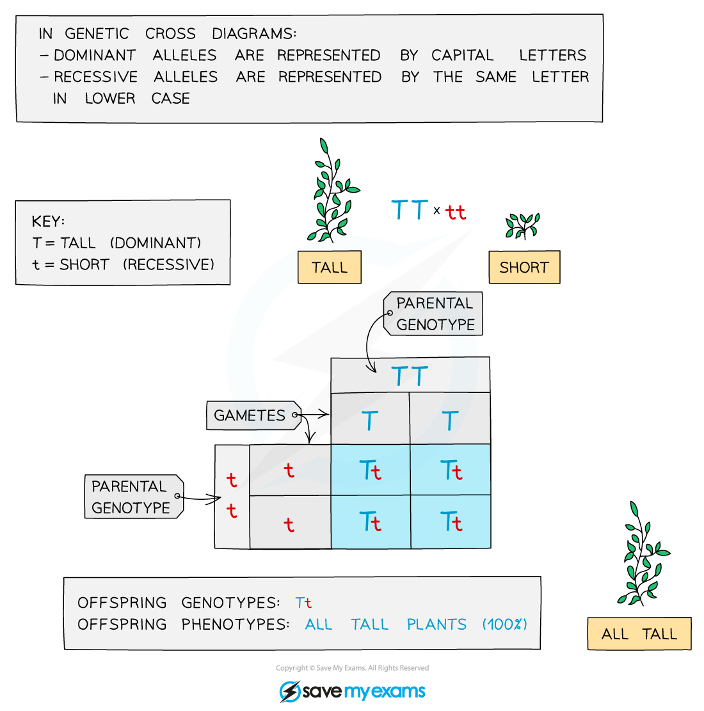
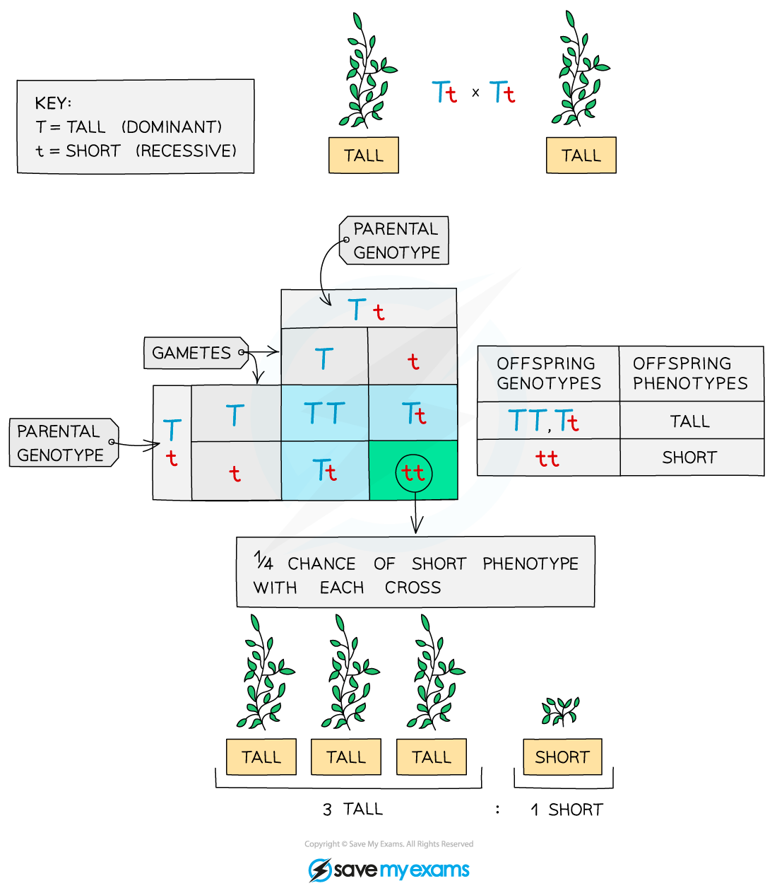
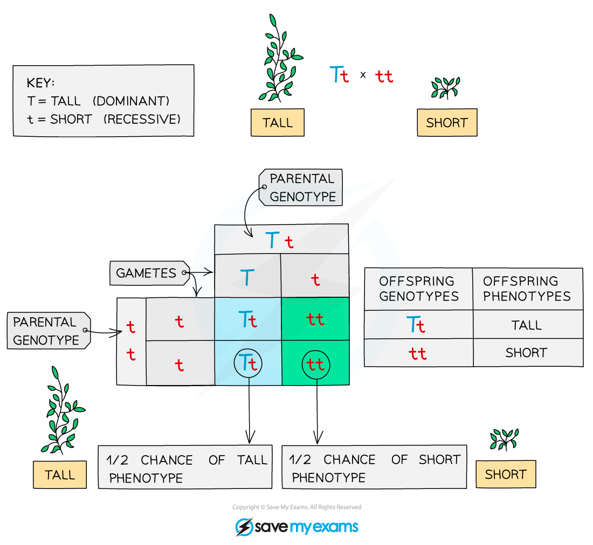

# Monohybrid Inheritance: Genetic Diagrams

## Monohybrid Crosses

> **Spec point** — `spcpt_2zpdcztP3yXd72R4` · describe patterns of monohybrid inheritance using a genetic diagram

## Monohybrid Crosses

- **Monohybrid inheritance** is the inheritance of characteristics controlled by a **single **gene
- This can be determined using a genetic diagram known as a **Punnett square**
- A Punnett square diagram shows the **possible combinations of alleles** that could be produced in the offspring
- From this, the **ratio** of these combinations can be worked out
- Remember the **dominant allele** is shown using a capital letter and the **recessive allele** is shown using the same letter but lowercase

### Constructing Punnett squares

- Determine the **parental genotypes**
- Select a letter that has a clearly different lowercase, for example, Aa, Bb, Dd (avoid letters such as Cc or Ss)
- Split the alleles for each parent and add them to the Punnett square around the outside
- Fill in the middle four squares of the Punnett square to work out the **possible genetic combinations in the offspring**
- You may be asked to comment on the **ratio** of different allele combinations in the offspring, **calculate percentage chances** of offspring showing a specific characteristic or just determine the phenotypes of the offspring
- Completing a Punnett square allows you to predict the probability of different outcomes from monohybrid crosses

### Example of monohybrid inheritance: Pea plants

- The height of pea plants is controlled by a **single** **gene** that has two alleles: tall and short

  - The tall allele is dominant and is shown as **T**
  - The short allele is recessive and is shown as **t**

#### A short plant is bred with a tall plant

***A pure-breeding genetic cross in pea plants. It shows that all offspring will be have the tall phenotype.***

#### Crossing the offspring from the first cross

***A genetic cross diagram (F2 generation). It shows a ratio of 3 tall : 1 short  for any offspring.***

#### Interpreting the results

- All of the offspring of the first cross have the same genotype, **Tt** (heterozygous), so the possible combinations of offspring bred from these are: **TT **(tall), **Tt **(tall), **tt** (short)
- There is more variation in the second cross, with a **3:1** ratio of tall : short
- The F2 generation is produced when the offspring of the F1 generation (pure-breeding parents) are allowed to interbreed

#### Crossing a heterozygous plant with a short plant

- The heterozygous plant will be tall with the genotype **Tt**
- The short plant is showing the recessive phenotype and so must be homozygous recessive – **tt**
- The results of this cross are as follows:

***A cross between a heterozygous plant with a short plant***

> **Exam Hint**
> You will NOT be expected to explain the polygenic inheritance of characteristics using a genetic diagram, you just need to be aware that many characteristics are controlled by groups of genes and that this is known as polygenic inheritance.If you are asked to use your own letters to represent the alleles in a Punnett square, try to choose a letter that is obviously different as a capital than the lower case so the examiner is not left in any doubt as to which is dominant and which is recessive.

## Predicting Probabilities of Outcomes from Monohybrid Crosses

> **Spec point** — `spcpt_RCkvMQDTfpRDwScs` · predict probabilities of outcomes from monohybrid crosses

## Predicting Probabilities of Outcomes from Monohybrid Crosses

- [Monohybrid inheritance](https://www.savemyexams.com/igcse/biology/edexcel/19/revision-notes/3-reproduction--inheritance/inheritance/3-23-monohybrid-inheritance-genetic-diagrams/) is the inheritance of characteristics controlled by a single gene
- This can be determined using a genetic diagram known as a **Punnett square**

### Punnett squares with pea plants

- The height of pea plants is controlled by a single gene that has two alleles: tall and short
- The tall allele is dominant and is shown as **T**
- The short allele is recessive and is shown as **t**

#### Crossing two heterozygous plants

***A genetic cross diagram crossing two heterozygous pea plants. It shows a ratio of 3 tall : 1 short  for any offspring.***

#### Interpreting the results

- The possible combinations of offspring bred from two parents with **Tt **genotype are: **TT **(tall), **Tt **(tall), **tt** (short)

  - The **Tt** parent plants would have been produced from an F1 cross of two homozygous plants: **TT** and **tt **(pure-breeding parents)
- The ratio for the offspring is **3:1** of tall : short

#### Calculating probabilities from Punnett squares

- A Punnett square diagram shows the **possible combinations of alleles** that could be produced in the offspring
- From this, the **ratio** of these combinations can be worked out
- However, you can also make **predictions** of the offsprings’ characteristics by calculating the **probabilities** of the different phenotypes that could occur

  - For example, in the genetic cross above, two plants with the genotype **Tt** (heterozygous) were bred together
  - The possible combinations of offspring bred from these two parent plants are: **TT **(tall), **Tt **(tall), **tt** (short
  - The offspring genotypes showed a **3:1** ratio of tall : short
  - Using this ratio, we can calculate the probabilities of the offspring phenotypes
  - The probability of an offspring being tall is 75%
  - The probability of an offspring being short is 25%
