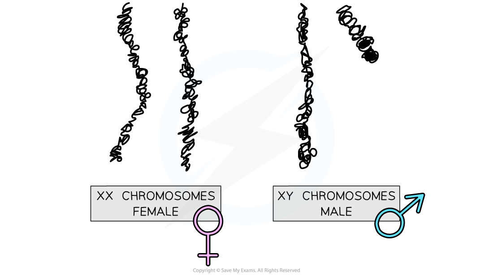
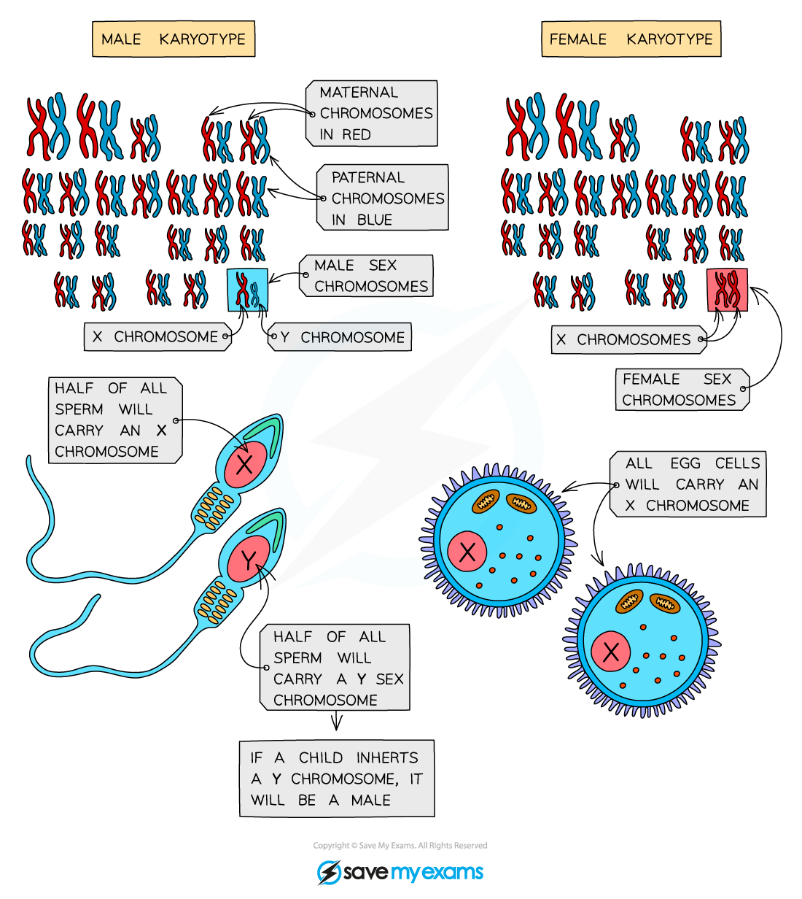
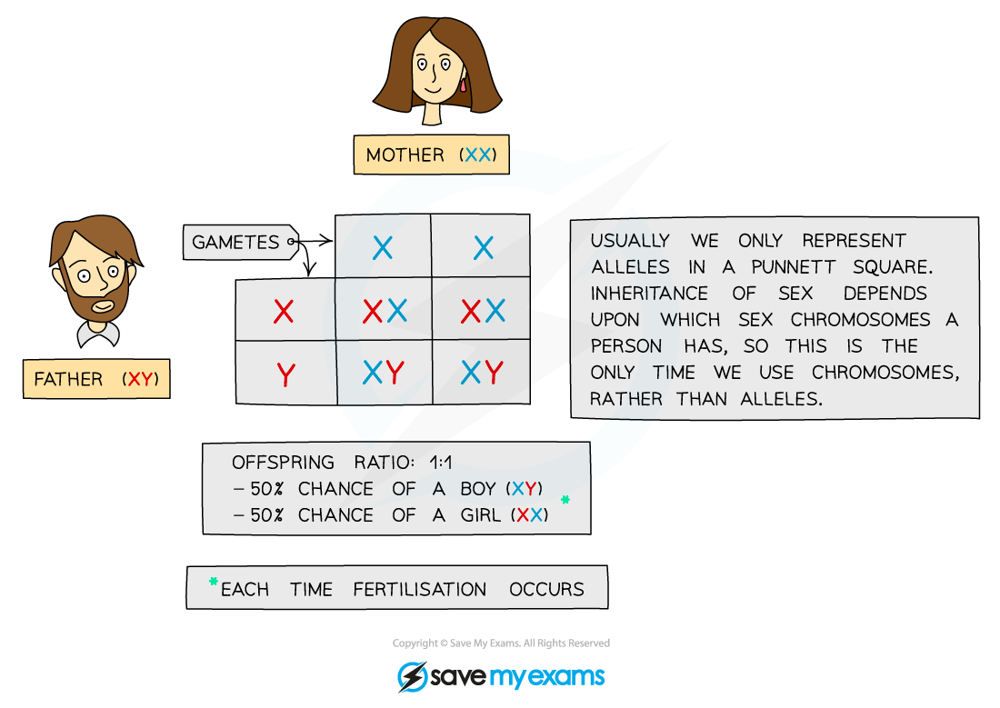

# Sex Chromosomes

## Sex Chromosomes

> **Spec point** — `spcpt_J9RDCvWjC4ccCbNg` · understand how the sex of a person is controlled by one pair of chromosomes, XX in a female and XY in a male

## Sex Chromosomes

- Sex is determined by an **entire chromosome pair** (as opposed to most other characteristics that are just determined by one or a number of genes)
- **Females** have the sex chromosomes **XX**
- **Males** have the sex chromosomes **XY**
- As only a father can pass on a Y chromosome, he is **responsible for determining the sex of the child**

***The sex chromosomes that a biological female and male possess.***

## Inheritance of Sex

> **Spec point** — `spcpt_3Mt9dr9qmC88Ddvr` · describe the determination of the sex of offspring at fertilisation, using a genetic diagram

## Inheritance of Sex

- Sex is determined by the two **sex chromosomes**, **X** and **Y**
- **Males **carry chromosomes** XY **and **females** **XX**
- Due to this it is the **male who determines the sex of offspring** as

  - The mother can **only pass on an X** chromosome
  - The father can pass on** either an X or a Y **chromosome
- Therefore the offspring can inherit:

  - An **X** from the mother and an **X **from the father: this child will be a **female**
  - An **X** from the mother and a **Y** from the father: this child will be a **male**

***Sperm cells determine the sex of offspring***

### Genetic diagrams showing determination of sex

- The inheritance of sex can be shown using a **genetic diagram** (known as a **Punnett square**), with the X and Y chromosomes taking the place of the alleles usually written in the boxes

***Punnett square showing the inheritance of sex***
