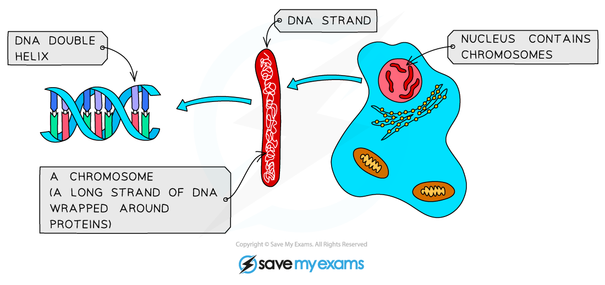

# The Genome & Genes

## The Genome

> **Spec point** — `spcpt_CkHqXRj2MgVMR6xZ` · understand that the genome is the entire DNA of an organism and that a gene is a section of a molecule of DNA that codes for a specific protein

## The Genome

- The entirety of an **organism's DNA **is known as its **genome**
- A **gene **is a section of a **molecule of DNA**
- Each **gene** within the genome codes for a **particular sequence of amino acids**
- These sequences of amino acids form **different types of proteins**
- Genes control our **characteristics** as they code for proteins that play important roles in what our cells do
- There are many different types of proteins e.g.

  - **Structural proteins** such as collagen found in skin cells
  - **Enzymes**
  - **Hormones**

## Chromosomes

> **Spec point** — `spcpt_HvfdJtbtpdwMz9PX` · understand that the nucleus of a cell contains chromosomes on which genes are located

## Chromosomes

- **In the nucleus** of a cell, the **DNA **double helix** **supercoils to form structures called **chromosomes**

  - Chromosomes are only visible during cell division
- Ordinary human body cells contain **23 pairs **of chromosomes, meaning that they contain **46 chromosomes** in total

  - This is a **diploid** number (often shown as **2n**)
  - One chromosome from a pair is **inherited from each parent**
  - Each chromosome pair is called a **homologous pair**
- **Genes** are found in **specific locations** on the chromosomes, these locations were identified in the **human genome project**

***Genes are short lengths of DNA that code for a protein. They are found on chromosomes.***

> **Exam Hint**
> Remember that the number of chromosomes found in each species differs, for example, humans have 23 pairs, dogs have 39 pairs and rice plants have 12 pairs
