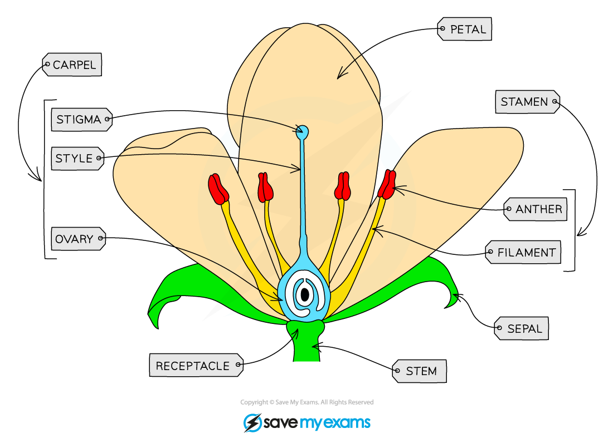
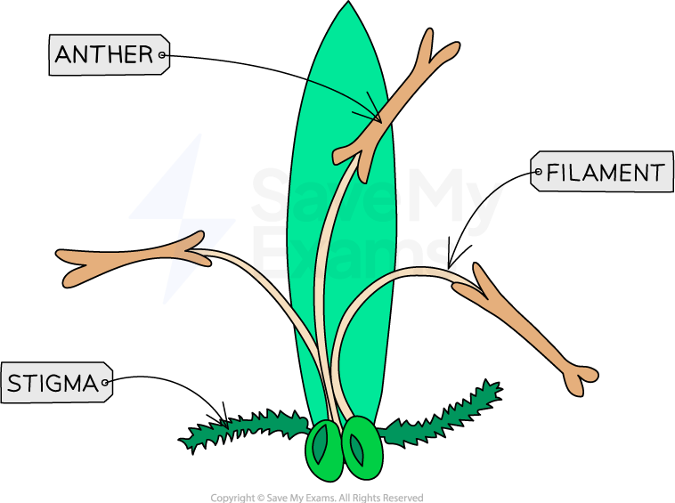

# Adaptations for Pollination

## Insect-Pollinated Flowers

> **Spec point** — `spcpt_D4rwBJ86NkJGCdSQ` · describe the structures of an insect-pollinated and a wind-pollinated flower and explain how each is adapted for pollination

## Insect-Pollinated Flowers

- Flowers are the **reproductive organs** of plants
- The role of flowers is to enable plant gametes to come together in **fertilisation**

  - The male gametes of plants are found in **pollen** grains
  - The female gametes of plants are in **ovules**
- The process by which pollen is transferred from the male part of a flower to the female part of a flower is known as **pollination**; this can be carried out in various ways, e.g. by insects or by wind

### Insect-pollinated flower structure

***Insect pollinated flowers are adapted to attract insects and aid insect pollination***

| **Structure** | **Description** |
|---|---|
| Sepal | Protects unopened flower |
| Petals | Brightly coloured in insect-pollinated flowers to attract insects |
| Anther | Produces and releases pollen |
| Filaments | Provides support to the anther |
| Stigma | Sticky top of the female part of the flower which collects pollen grains |
| Style | A tube that connects the stigma and ovary |
| Ovary | Contains the ovules |
| Ovule | Structures inside the ovary that contain the female gametes |

### Structural adaptations of insect-pollinated flowers

- Insect pollinated flowers are adapted to **allow insects to collect pollen** from one flower and easily **transfer it **to another flower

  - When an insect enters a flower in search of nectar it brushes against the **anthers**, which deposit **sticky pollen** onto the insect's **body**
  - When the insect visits another flower it brushes against the **stigma** and **deposits** some of the pollen from the **first flower**; this is **pollination**

| **Feature** | **Adaptations of an insect pollinated flower** |
|---|---|
| Petals | Large and brightly coloured to attract insects |
| Scent and nectar | Scent and nectar are produced to encourage insects to visit the flower and push past stamen to get to nectar |
| Anthers | Held on stiff filaments within the flower so that they brush against insects |
| Stigma | Sticky stigmas within the flowers catch pollen grains when insects brush past |

## Wind-Pollinated Flowers

> **Spec point** — `spcpt_JW2s3mPGZpNW226k` · describe the structures of an insect-pollinated and a wind-pollinated flower and explain how each is adapted for pollination

## Wind-Pollinated Flowers

### Wind pollinated flower structure

- Wind-pollinated flowers do not need to attract insects, so their structure differs from that of insect-pollinated flowers

***Wind pollinated flowers have anthers that hang outside the flower on long filaments, and feathery stigmas that can catch pollen easily***

### Structural adaptations of wind-pollinated flowers

- Wind pollinated flowers are adapted so that wind can easily catch pollen grains and carry them to the stigmas of other flowers
- The anthers and stigmas of wind pollinated flowers **hang outside the flower** so that:

  - pollen can easily be blown away by the wind
  - pollen can easily be caught by the stigmas of other flowers

| **Feature** | **Adaptations of a wind pollinated flower** |
|---|---|
| **Petals** | Small and dull, often green or brown in colour; producing colourful petals would be a waste of energy |
| **Scent and nectar** | Scent and nectar are not produced; this would be a waste of energy |
| **Anthers** | Held on long filaments outside the flower to release pollen grains easily into the wind |
| **Stigma** | Feathery stigmas outside the flower catch airborne pollen grains |
