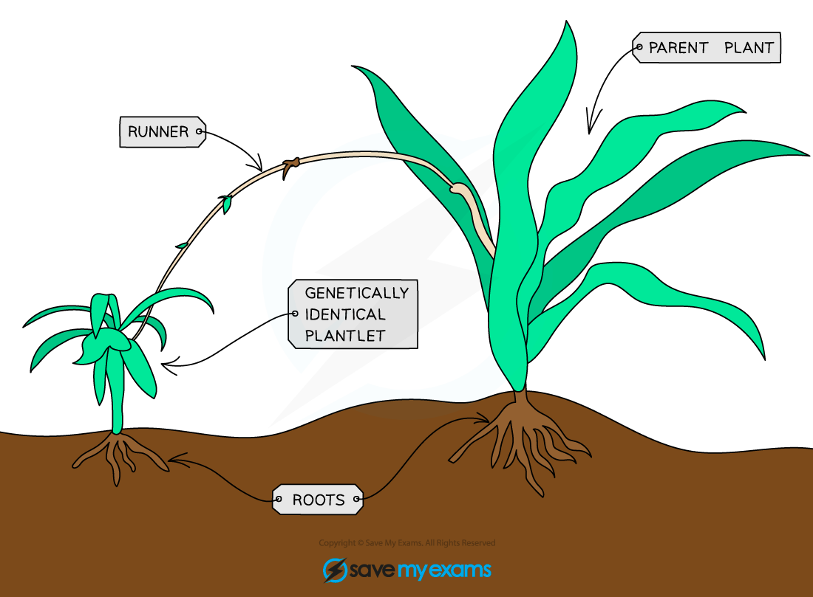
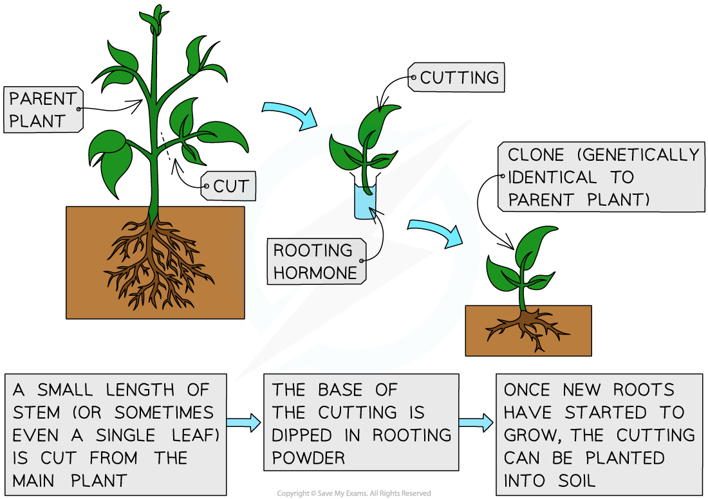

# Asexual Plant Reproduction

## Asexual Reproduction in Plants

> **Spec point** — `spcpt_9cwqy4qJDDMft6yF` · understand that plants can reproduce asexually by natural methods (illustrated by runners) and by artificial methods (illustrated by cuttings)

## Asexual Reproduction in Plants

- Plants can reproduce **asexually** as well as **sexually**

  - Asexual reproduction only involves **one parent** and all offspring produced are **exact genetic copies** of each other and the parent plant – they are **clones** (genetically identical)
- Asexual reproduction in plants can occur **naturally** or **humans** can** control asexual reproduction** in plants **artificially** for their own uses

### Natural asexual reproduction in plants – runners

- Some plants grow **side branches**, known as runners, that have **small plantlets** at their ends

  - Runners are **horizontal stems** that grow **sideways** out of the parent plant
- Once they touch the soil, these plantlets will **grow roots** and the new plantlets will grow and become **independent** from the parent plant

***Some plants grow side shoots called runners that contain tiny plantlets on them. These will grow roots and develop into separate plants.***

### Artificial asexual reproduction in plants – cuttings

- A simple method to **clone** plants (mainly used by gardeners) is by **taking cuttings**

  - This is an **artificial method of asexual reproduction**
- The method for taking cuttings is as follows:

  - Gardeners take cuttings from **good parent plants** (i.e. those that are healthiest and best-looking)
  - A section of the parent plant with a **new bud** is cut off
  - This cutting can either be placed into **water** until new roots grow or can sometimes be placed **directly into soil**
  - Sometimes, the stem of the cutting may first be dipped into '**rooting powder**', which contains **plant growth regulators** (rooting hormones) that encourage new root growth
  - These cuttings are then planted and eventually grow into adult plants that are **genetically identical** to the original plant
- Plants cloned by taking cuttings can be produced **cheaply** and **quickly**

***Artificial asexual reproduction in plants – cuttings***
