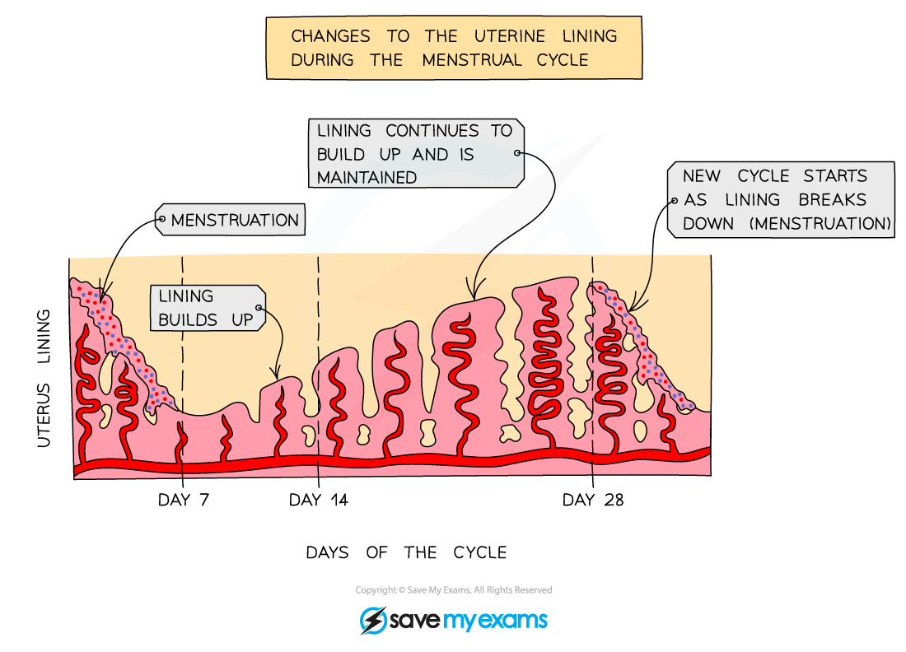
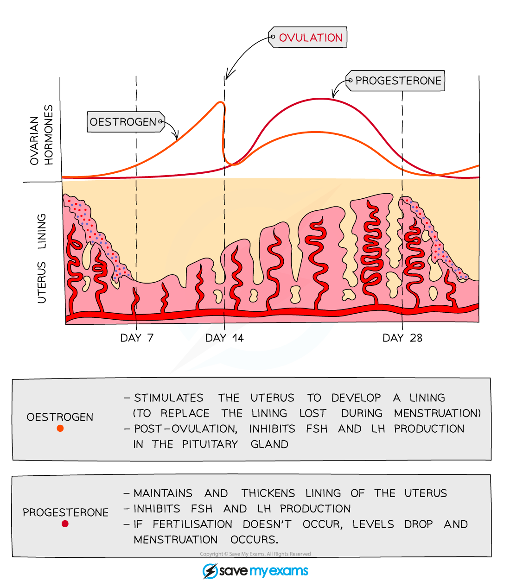

# Roles of Oestrogen & Progesterone in the Menstrual Cycle

## The Menstrual Cycle

> **Spec point** — `spcpt_KZDxQfqVTprMMHvz` · understand the roles of oestrogen and progesterone in the menstrual cycle

## The Menstrual Cycle

- **The** menstrual cycle begins after **puberty**, usually in early adolescence (around age 11–14)
- The average menstrual cycle lasts about **28 days**, though it can vary between individuals

  - **Ovulation **occurs around **day 14**, when an egg is released from an ovary and travels along the fallopian tube towards the uterus
  - If the egg is **not fertilised**, the **uterine lining (endometrium)** breaks down and is shed through the vagina — this is called **menstruation (a period)**
  - Menstruation usually lasts around **5 - 7 days** and marks the start of the next cycle
  - After menstruation, the uterine lining thickens again in response to hormones, preparing for the possible implantation of a fertilised egg

***Changes in the lining of the uterus during the menstrual cycle***

#### Hormonal control of the menstrual cycle

- The menstrual cycle is controlled by** hormones**, two of which are oestrogen and progesterone

  - **Oestrogen** levels rise from day 1 to peak just before **day 14**
  
    - This causes the **uterine wall to start thickening** and the **egg to mature**
    - The peak in oestrogen occurs just before the egg is released
  - **Progesterone** stays low from day 1 – 14 and starts to rise once ovulation has occurred
  
    - The increasing levels **cause the uterine lining to thicken further**; a fall in progesterone levels causes the uterine lining to break down (**menstruation / ‘period’**)

***Changes in the levels of oestrogen and progesterone in the blood during the menstrual cycle***
